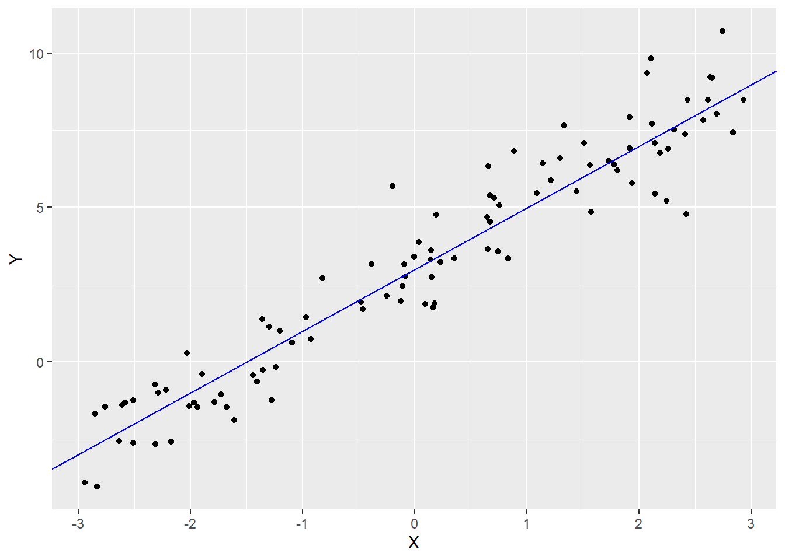
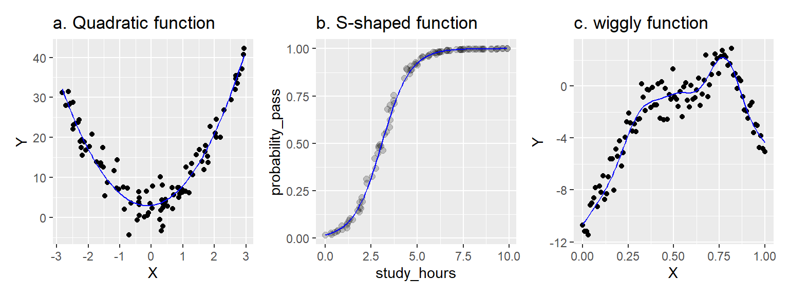

# 前言


## 课程目的

本课程的目的是教你如何分析(还有模拟!)作为心理学家你可能遇到的各种数据集。重点是行为数据------反应时、知觉判断、选择、决策、李斯特量表评分、眼动、睡眠时间等。这些数据通常是在有计划的研究或实验中收集到的。

本课程旨在教授**灵活**、**可推广**、**可重复**的分析技术。你将学习到的技术是灵活的，这意味着它们可以应用到各式各样的研究设计和不同类型的数据上。通过充分考虑抽样对统计推断的潜在偏倚影响，它们在最大程度上具有可推广性------这有助于支持超越特定被试和实验中涉及的刺激得出结论。最后，你将学习到的技术会尽可能地做到可完全重复，因为你的分析将以R代码的纯文本脚本形式明确记录从原始数据到研究结果的每一个步骤。

## 广义线性混合模型(Generalized Linear Mixed-Effects Models, GLMMs)

本课程强调一个灵活的回归模型框架而不是教授处理不同类型数据的"公式"。课程假设你需要分析的基本数据类型将是多层的(multilevel)，而且你不仅仅需要处理连续测量数据，还要处理有序测量数据（李克特量表评分）、计数数据（特定事件发生的次数）以及名义数据（某物所属的类别）。

本课程结束时，你将学会如何使用广义线性混合模型(GLMMs)来量化因变量和一组预测变量之间的关系。要理解GLMMs，你需要学习以下三部分：

1.  "线性模型"部分，包括如何捕捉不同类型的预测变量及其交互作用；
2.  "混合"部分，包括如何使用随机效应来表示通过对同一批被试或刺激进行重复测量而产生的多层次依赖关系；
3.  "广义"部分，包括拓展线性模型来表示非完全正态自变量，包括计数、有序和二元变量。

### 线性模型

GLMMs是一般线性模型的扩展。一般线性模型是方差分析(ANOVA)、t检验和古典回归等更简单方法的基础。本课程的主要观点是：**你可能遇到的几乎所有实验得到的数据都可以用GLMMs进行分析**。

一个线性模型的简单例子：

$$Y_i = \beta_0 + \beta_1 X_i + e_i$$

其中$Y_i$是样本$i$的因变量的观测值，由截距加上被系数$\beta_1$加权的预测值$X_i$以及误差项构成。表示线性关系$Y_i = 3 + 2X_i + e_i$的模拟数据如图\@ref(fig:basic-glm)所示。

<div class="figure">

<p class="caption">(\#fig:basic-glm)线性模型Y = 3 + 2X的模拟数据</p>
</div>


```r
library("tidyverse") # if needed

set.seed(62)

dat <- tibble(X = runif(100, -3, 3),
              Y = 3 + 2 * X + rnorm(100))

ggplot(dat, aes(X, Y)) +
  geom_point() +
  geom_abline(intercept = 3, slope = 2, color = "blue")
```

你可能会发现上述方程表示的是一条直线($y = mx + b$)，其中$\beta_0$是截距，$\beta_1$是斜率。$e_i$是样本$i$的模型误差，表示样本观测值$Y_i$与给定$X_i$的模型预测值之间的差距。

::: info 
**表示法惯例**

希腊字母($\beta$, $\rho$, $\tau$)表示总体参数，通常是未观测到的，需要从数据中估计得到的。当我们想要区分**估计**参数和真实值时，我们会使用"hat"：如$\hat{\beta}_0$表示从数据中估计得到的$\beta_0$的值。

大写拉丁字母($X$、$Y$)表示观测值------即你已经测量过的值，因此是已知的。你也会看到小写拉丁字母(如$e_i$)，表示统计误差或其他我将称之为派生量或虚拟量的东西(这将在课程后面进行解释)。 
:::

::: warning 
**线性模型中的"线性"并不像你想象的那样!**

许多人认为"线性模型"只能捕捉线性关系，即可以用直线(或平面)来描述的关系。这是错误的。

线性模型是各种项的加权和，每个项都有一个预测变量(或常数)乘上一个系数。在上述模型中，系数是$\beta_0$和$\beta_1$。你可以用线性模型拟合各种复杂的关系，包括非线性关系，如下所示。


```
## Warning: package 'patchwork' was built under R version 4.3.3
```

<div class="figure">

<p class="caption">(\#fig:tryptych)用线性模型建模的非线性关系</p>
</div>

在左边面板中，我们使用线性模型$Y = \beta_0 + \beta_1 X + \beta_2 X^2$捕捉了一个二次(抛物线)函数。X和Y之间的关系是非线性的，但模型本身是线性的。我们对预测变量$X$进行了平方处理，但系数$\beta_0$、$\beta_1$和$\beta_2$并没有被平方、立方或类似的处理(它们都是"一次幂")。

在中间面板中，我们使用线性模型捕捉了一个S形函数。在这里，Y变量表示某个事件的概率，例如基于学习时间来预测通过考试的概率。在这种情况下，我们通过在一个特殊的转换空间中估计线性模型来建模X和Y之间的关系，使得X-Y关系是线性的，然后将模型投影回非线性的概率空间(使用"链接函数")。非线性来自于"链接函数"，但模型本身是线性的。

最后，右边面板展示了一种略显任意的波动模式，由广义可加混合模型捕获------这是一种我们在本课程中不会学到的高级技术。但从根本上说，它仍然是一个线性模型，因为它还是一系列复杂事物(在这种情况下是"基础函数")的加权和，而系数提供了权重。

线性模型是一个在**系数是线性**的模型；模型中的每个系数($\beta_0$、$\beta_1$)只允许被设置为一次幂，并且每个项$\beta_i X_j$都只涉及单个系数。这些项只能与涉及其他系数的项相加，但不能相乘或相除(如$Y = \frac{\beta_1}{\beta_2} X$是不允许的)。
:::
