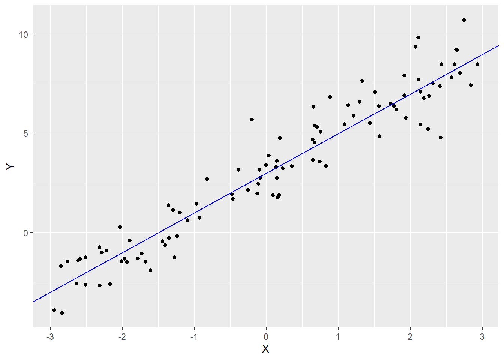
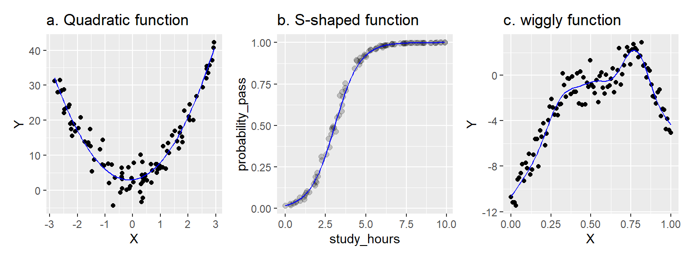

---
output:
  pdf_document: default
  html_document: default
---
# 前言


## 课程目的

本课程的目的是教你如何分析(还有模拟!)作为心理学家你可能遇到的各种数据集。重点是行为数据------反应时、知觉判断、选择、决策、李克特量表评分、眼动、睡眠时间等。这些数据通常是在有计划的研究或实验中收集到的。

本课程旨在教授**灵活**、**可推广**、**可重复**的分析技术。你将学习到的技术是灵活的，这意味着它们可以应用到各式各样的研究设计和不同类型的数据上。通过充分考虑抽样对统计推断的潜在偏倚影响，它们在最大程度上具有可推广性------这有助于支持超越特定被试和实验中涉及的刺激得出结论。最后，你将学习到的技术会尽可能地做到可完全重复，因为你的分析将以R代码的纯文本脚本形式明确记录从原始数据到研究结果的每一个步骤。

## 广义线性混合效应模型(Generalized Linear Mixed-Effects Models, GLMMs)

本课程强调一个灵活的回归模型框架而不是教授处理不同类型数据的"公式"。课程假设你需要分析的基本数据类型将是多层的(multilevel)，而且你不仅仅需要处理连续测量数据，还要处理有序测量数据（李克特量表评分）、计数数据（特定事件发生的次数）以及名义数据（某物所属的类别）。

本课程结束时，你将学会如何使用广义线性混合效应模型(GLMMs)来量化因变量和一组预测变量之间的关系。要理解GLMMs，你需要学习以下三部分：

1.  "线性模型"部分，包括如何捕捉不同类型的预测变量及其交互效应；
2.  "混合"部分，包括如何使用随机效应来表示通过对同一批被试或刺激进行重复测量而产生的多层次依赖关系；
3.  "广义"部分，包括拓展线性模型来表示非完全正态自变量，包括计数、有序和二元变量。

### 线性模型

GLMMs是一般线性模型的扩展。一般线性模型是方差分析(ANOVA)、t检验和古典回归等更简单方法的基础。本课程的主要观点是：**你可能遇到的几乎所有实验得到的数据都可以用GLMMs进行分析**。

一个线性模型的简单例子：

$$Y_i = \beta_0 + \beta_1 X_i + e_i$$

其中$Y_i$是样本$i$的因变量的观测值，由截距加上被系数$\beta_1$加权的预测值$X_i$以及误差项构成。表示线性关系$Y_i = 3 + 2X_i + e_i$的模拟数据如图\@ref(fig:basic-glm)所示。

<div class="figure">

<p class="caption">(\#fig:basic-glm)线性模型Y = 3 + 2X的模拟数据</p>
</div>


```r
library("tidyverse") # if needed

set.seed(62)

dat <- tibble(X = runif(100, -3, 3),
              Y = 3 + 2 * X + rnorm(100))

ggplot(dat, aes(X, Y)) +
  geom_point() +
  geom_abline(intercept = 3, slope = 2, color = "blue")
```

你可能会发现上述方程表示的是一条直线($y = mx + b$)，其中$\beta_0$是截距，$\beta_1$是斜率。$e_i$是样本$i$的模型误差，表示样本观测值$Y_i$与给定$X_i$的模型预测值之间的差距。

<div class = "yellowbox">

**表示法惯例**

希腊字母($\beta$, $\rho$, $\tau$)表示总体参数，通常是未观测到的，需要从数据中估计得到的。当我们想要区分**估计**参数和真实值时，我们会使用"hat"：如$\hat{\beta}_0$表示从数据中估计得到的$\beta_0$的值。

大写拉丁字母($X$、$Y$)表示观测值------即你已经测量过的值，因此是已知的。你也会看到小写拉丁字母(如$e_i$)，表示统计误差或其他我将称之为派生量或虚拟量的东西(这将在课程后面进行解释)。

</div>

<div class = "bluebox">

**线性模型中的"线性"并不像你想象的那样!**

许多人认为"线性模型"只能捕捉线性关系，即可以用直线(或平面)来描述的关系。这是错误的。

线性模型是各种项的加权和，每个项都有一个预测变量(或常数)乘上一个系数。在上述模型中，系数是$\beta_0$和$\beta_1$。你可以用线性模型拟合各种复杂的关系，包括非线性关系，如下所示。

<div class="figure">

<p class="caption">(\#fig:tryptych)用线性模型建模的非线性关系</p>
</div>

在左边面板中，我们使用线性模型$Y = \beta_0 + \beta_1 X + \beta_2 X^2$捕捉了一个二次(抛物线)函数。X和Y之间的关系是非线性的，但模型本身是线性的。我们对预测变量$X$进行了平方处理，但系数$\beta_0$、$\beta_1$和$\beta_2$并没有被平方、立方或类似的处理(它们都是"一次幂")。

在中间面板中，我们使用线性模型捕捉了一个S形函数。在这里，Y变量表示某个事件的概率，例如基于学习时间来预测通过考试的概率。在这种情况下，我们通过在一个特殊的转换空间中估计线性模型来建模X和Y之间的关系，使得X-Y关系是线性的，然后将模型投影回非线性的概率空间(使用"链接函数")。非线性来自于"链接函数"，但模型本身是线性的。

最后，右边面板展示了一种略显任意的波动模式，由广义可加混合模型捕获------这是一种我们在本课程中不会学到的高级技术。但从根本上说，它仍然是一个线性模型，因为它还是一系列复杂事物(在这种情况下是"基础函数")的加权和，而系数提供了权重。

线性模型是一个**系数是线性**的模型；模型中的每个系数($\beta_0$、$\beta_1$)只允许被设置为一次幂，并且每个项$\beta_i X_j$都只涉及单个系数。这些项只能与涉及其他系数的项相加，但不能相乘或相除(如$Y = \frac{\beta_1}{\beta_2} X$是不允许的)。

</div>

当前课程的一个局限性是主要关注单变量数据，即将单一响应变量作为分析的焦点。通常情况下，你会处理相同对象的多个响应变量，但是同时对它们进行建模在技术上是非常困难的，并且超出了本课程的范围。一种更简单的方法(也是这里采用的方法)是对每个响应变量进行单独的单变量分析。

### 混合模型

研究结果的推断或解释的可推广性指的是它能够被轻松应用于超出特定研究背景(对象、刺激、任务等)的情境的程度。最理想的情况是，我们的发现能够适用于人类物种的所有成员，涵盖各种各样的刺激和任务；最糟糕的情况是，它们只能适用于那些受到我们使用的特定刺激的特定的人，在我们研究的特定背景下才观察得到。

研究结果的可推广性取决于几个因素：研究的设计方式、所使用的材料、被试的招募方式、给予被试的任务的性质以及**数据分析的方式**。在这门课程中我们将重点关注最后一点。在分析一个数据集时，如果你想要提出具有推广性的论断，你必须决定哪些可以算作你研究的重复------关于哪些方面应该在复制中保持不变，以及哪些方面允许变化。

不幸的是，有时你会发现数据以一种不太支持广泛意义上的可推广性的方式进行分析，这往往是因为低估了刺激材料或实验任务的独特特征对观测结果的影响 [@yarkoni_2019]。

## 关于可重复性的说明

本课程的数据分析是使用R编写脚本进行的。

可重复性指的是在不同情况下重现研究结果的可能性程度。

如果我们能在给定原始数据的情况下得到相同的结果，我们会说这个发现在*分析(analytically)*或*计算(computationally)*上是可重复的。需要注意的是，这与说一个发现**可复制(replicable)**是不同的。可复制指的是能够在**新样本**中复制这一发现。对于这些术语并没有广泛的共识，但方便起见，我们可以将分析上的可重复性(reproducibility)和可复制性(replicability)视为两种不同但相关的可重复性(reproducibility)类型，前者反映分析员之间(或同一分析员随时间变化)的可重复性，而后者反映了在被试样本或亚群体之间的可重复性。

确保分析可重复性是一个难题。如果你未能正确记录自己的分析过程，或者你使用的软件被修改或过时并且变得不可用，你可能会在重现自己的发现时遇到麻烦！

分析的另一个重要属性是透明度——在某种研究中所有步骤都可以公开的程度。一项研究可能是透明的但不可重复，反之亦然。使用促进透明度的工作流程非常重要。这使得脚本编程的“编辑–执行”工作流程对于数据分析来说是理想的选择，远远优于大多数商业统计软件的“指向–点击”的工作流程。通过编写代码，你可以使逻辑和决策过程对他人明确，并易于重建。

## 基于模拟的方法

本课程最后一个重要特点是采用了**基于模拟的方法**来学习统计模型。通过数据模拟，我们定义一个特定模型来描述感兴趣的总体，然后利用计算机的随机数生成器来模拟从该总体中抽样的过程。我们将在下面看一个简单的例子。

在分析数据时，你会面临的经典问题是你不知道你正在研究的总体的“真实情况”。你从该总体中抽取一个样本，对观测到的数据获取方式做出一些假设，然后利用观察到的数据来估计未知的总体参数及这些参数的不确定性。

数据模拟颠倒了这个过程。你会定义一个模型的参数，代表关于(假设的)总体的真实情况，从中获取数据。然后，你可以像平常一样分析获得的数据，并考察参数估计与真实值之间的对应程度。

让我们看一个例子。假设你对以下问题感兴趣：作为学步幼儿的父母是否会“提高”你的反应能力。如果你曾经照顾过一个幼儿，你就会知道身体危险似乎总是在即——他们可能从刚刚爬上的椅子上摔下来，被门里夹到，头撞在桌子角上等等——所以你需要保持警惕并准备迅速行动。你假设这种警惕会转化为在幼儿不在场的其他情况下的更快反应时间，比如在心理实验室里。因此，你招募了一组有幼儿的父母来实验室。你让每个父母在闪烁的灯光出现时尽快按下按钮，并测量他们的反应时(以毫秒为单位)。对于每个父母，你计算了他们在所有试验中的平均反应时。我们可以使用R中的`rnorm()`函数模拟50个父母的平均反应时。但在我们开始之前，我们将加载我们需要的包（tidyverse）并设置随机种子(random seed)，以确保你(读者)得到和我(作者)相同的随机值。


```r
library("tidyverse")

set.seed(2021)  # 可以是任意整数
```


```r
parents <- rnorm(n = 50, mean = 480, sd = 40)
```


```
##  [1] 475.1016 502.0983 493.9460 494.3853 515.9221 403.0972 490.4698 516.6227
##  [9] 480.5509 549.1985 436.7118 469.0870 487.2798 540.3417 544.1788 406.3410
## [17] 544.9324 485.2556 539.2449 540.5327 442.3023 472.5726 435.9550 528.3246
## [25] 415.0025 484.2151 421.7823 465.8394 476.2520 524.0267 401.4470 422.0822
## [33] 520.7777 423.1433 455.8187 416.6610 428.5627 421.8126 476.5172 500.1895
## [41] 484.6555 550.4085 466.1953 564.8000 478.6249 448.3138 539.0206 450.9777
## [49] 492.4952 507.6786
```

我们选择使用`rnorm()`来生成数据，这是一个从正态分布中生成随机数的函数，这反映了我们的假设——平均反应时在总体中呈正态分布。正态分布由两个参数定义，一个是均值(通常用希腊字母$\mu$表示，发音为"myoo")，另一个是标准差(通常用希腊字母$\sigma$表示，发音为"sigma")。由于我们自己生成了数据，所以$\mu$和$\sigma$都是已知的，在调用`rnorm()`时，我们将它们分别设置为480和40。

当然，为了验证我们的假设，我们需要一个对照组，所以我们定义了一个非父母的对照组。我们用相同的方式从这个对照组生成数据，但改变了平均值。


```r
control <- rnorm(n = 50, mean = 500, sd = 40)
```

让我们将它们放入数据框(tibble)中，以便更容易绘制和分析数据。该数据框中的每一行表示来自特定被试的平均反应时。


```r
dat <- tibble(group = rep(c("parent", "control"), each = 50),
              rt = c(parents, control))

dat
```

```
## # A tibble: 100 × 2
##    group     rt
##    <chr>  <dbl>
##  1 parent  475.
##  2 parent  502.
##  3 parent  494.
##  4 parent  494.
##  5 parent  516.
##  6 parent  403.
##  7 parent  490.
##  8 parent  517.
##  9 parent  481.
## 10 parent  549.
## # ℹ 90 more rows
```

下面是对模拟数据的一些尝试。

1. 以某种合理的方式绘制数据。
2. 计算平均值和标准差。它们与总体参数相比如何?
3. 对这些数据进行t检验。群组效应显著吗?

做完这些后，再做一次，但改变样本量、总体参数或两者都改变。
