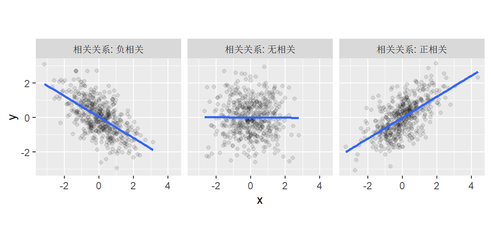
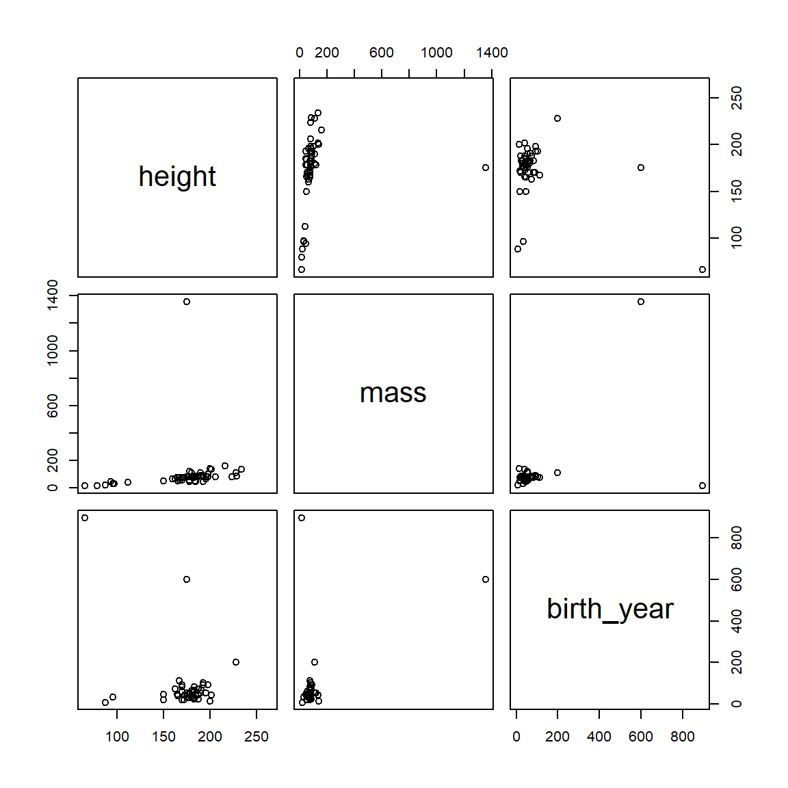
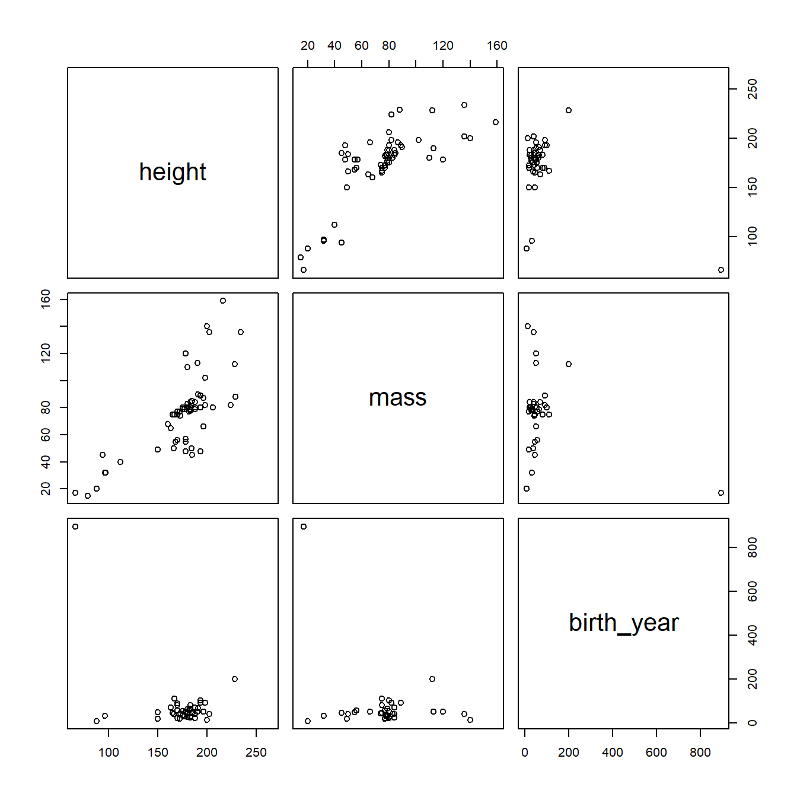
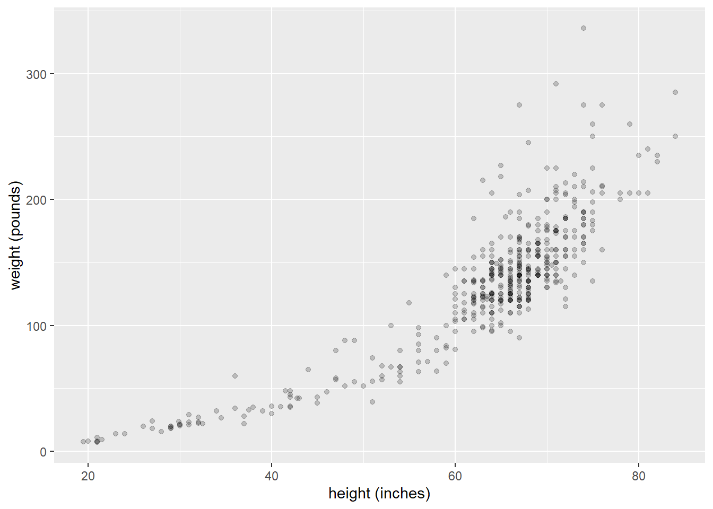

# 相关和回归


## 相关矩阵(Correlation matrices)

你可能已经通过阅读心理学论文对**相关矩阵**这个概念有所了解。相关矩阵是总结同一个体的多个测量值之间关系的常用方法。

假设你用多个量表测量了心理幸福感。一个问题是这些量表在多大程度上测量了相同的东西。通常，你会查看相关矩阵来探索测量之间所有成对关系。

回忆一下，相关系数量化了两个变量之间关系的**强度**和**方向**。它通常用符号$r$或$\rho$(希腊字母"rho")表示。相关系数的范围在-1到1之间，其中0表示没有关系，正值反映正相关(一个变量增加，另一个也增加)，负值反映负相关(一个变量增加，另一个减少)。

<div class="figure">

<p class="caption">(\#fig:correlation-relationships)不同类型的二元关系</p>
</div>

如果你有$n$个测量值，你可以计算多少个成对相关？你可以用下面蓝框中的公式来计算，也可以更简单地通过R中的`choose(n, 2)`函数直接计算。例如，要获得6个测量值之间可能的成对相关数量，你可以输入`choose(6, 2)`，这会告诉你有15对组合。

<div class = "bluebox">

对于任意$n$个测量值，你可以计算$\frac{n!}{2(n - 2)!}$个各值之间的成对相关。符号$!$称为**阶乘(factorial)**运算符，定义为从1到$n$所有数字的乘积。因此，如果你有6个测量值，你可以得到

$$
\frac{6!}{2(6-2)!} = \frac{1 \times 2 \times 3 \times 4 \times 5 \times 6}{2\left(1 \times 2 \times 3 \times 4\right)} = \frac{720}{2(24)} = 15
$$

</div>

你可以使用R中的`base::cor()`或`corrr::correlate()`来创建相关矩阵。我们更喜欢后者函数，因为`cor()`要求你的数据存储在矩阵中，而我们将处理的大多数数据是存储在数据框中的表格数据。`corrr::correlate()`函数将数据框作为第一个参数，并提供"整洁"的输出，因此它可以更好地与tidyverse系列函数和管道操作符(`%>%`)联动。

让我们创建一个相关矩阵来看看它是如何工作的。首先加载我们需要的包。


```r
library("tidyverse")
library("corrr")  # 如缺失(missing)，在控制台(console)中输入install.packages("corrr")
```

我们将使用`starwars`数据集，这是在加载tidyverse包后可用的内置数据集。该数据集包含了出现在星球大战电影系列中的各种角色的信息。让我们来看看之间的相关性


```r
starwars %>%
  select(height, mass, birth_year) %>%
  correlate()
```

```
## Correlation computed with
## • Method: 'pearson'
## • Missing treated using: 'pairwise.complete.obs'
```

```
## # A tibble: 3 × 4
##   term       height   mass birth_year
##   <chr>       <dbl>  <dbl>      <dbl>
## 1 height     NA      0.131     -0.404
## 2 mass        0.131 NA          0.478
## 3 birth_year -0.404  0.478     NA
```

你可以在任意给定的行或列的交叉处查找任何双变量相关系数。因此，`height`和`mass`之间的相关系数是.131，你可以在第1行，第2列或第2行，第1列找到它------它们是相同的。请注意，这里只有`choose(3, 2)` = 3个唯一的双变量关系，但每个关系在表中出现了两次。我们可能只想显示唯一的组合，这可以通过在管道中附加`corrr::shave()`来实现。


```r
starwars %>%
  select(height, mass, birth_year) %>%
  correlate() %>%
  shave()
```

```
## Correlation computed with
## • Method: 'pearson'
## • Missing treated using: 'pairwise.complete.obs'
```

```
## # A tibble: 3 × 4
##   term       height   mass birth_year
##   <chr>       <dbl>  <dbl>      <dbl>
## 1 height     NA     NA             NA
## 2 mass        0.131 NA             NA
## 3 birth_year -0.404  0.478         NA
```

现在我们只有相关矩阵的下三角部分，但`NA`看起来很难看，前导0也不美观。**`corrr`**包还提供了`fashion()`函数，可以对其进行清理(更多选项请查阅`?corrr::fashion`)。


```r
starwars %>%
  select(height, mass, birth_year) %>%
  correlate() %>%
  shave() %>%
  fashion()
```

```
## Correlation computed with
## • Method: 'pearson'
## • Missing treated using: 'pairwise.complete.obs'
```

```
##         term height mass birth_year
## 1     height                       
## 2       mass    .13                
## 3 birth_year   -.40  .48
```

相关性只有在关系(大致)线性且没有严重的异常值对结果产生过大影响时才能很好地描述关系。因此，可视化相关性通常和量化它们一样是个好主意。`base::pairs()`函数可以实现这一点。`pairs()`的第一个参数形式为`~ v1 + v2 + v3 + ... + vn`，其中`v1`、`v2`等是你想要进行相关分析的变量名。


```r
pairs(~ height + mass + birth_year, starwars)
```

<div class="figure">

<p class="caption">(\#fig:pairs)星球大战数据集相关关系</p>
</div>

我们会发现一个巨大的离群值影响了我们的数据。具体来说是有个体重超过1200kg的生物。让我们找出它并从数据集里面删掉它。


```r
starwars %>%
  filter(mass > 1200) %>%
  select(name, mass, height, birth_year)
```

```
## # A tibble: 1 × 4
##   name                   mass height birth_year
##   <chr>                 <dbl>  <int>      <dbl>
## 1 Jabba Desilijic Tiure  1358    175        600
```

好了，让我们看看没有了这个庞然大物的数据会是什么样子。


```r
starwars2 <- starwars %>%
  filter(name != "Jabba Desilijic Tiure")

pairs(~height + mass + birth_year, starwars2)
```

<div class="figure">

<p class="caption">(\#fig:massive-creature)去除体重离群值后星球大战数据集相关关系</p>
</div>

好多了，但还有个生物的离群出生年份可能是我们不想要的。


```r
starwars2 %>%
  filter(birth_year > 800) %>%
  select(name, height, mass, birth_year)
```

```
## # A tibble: 1 × 4
##   name  height  mass birth_year
##   <chr>  <int> <dbl>      <dbl>
## 1 Yoda      66    17        896
```

是尤达大师！他和宇宙一样古老。让我们抛开他看看图会怎么样。


```r
starwars3 <- starwars2 %>%
  filter(name != "Yoda")

pairs(~height + mass + birth_year, starwars3)
```

<div class="figure">

<p class="caption">(\#fig:bye-yoda)去除体重和出生年份离群值后星球大战数据集相关关系</p>
</div>

看起来更好了。让我们看看它是怎样改变我们的相关矩阵的。


```r
starwars3 %>%
  select(height, mass, birth_year) %>%
  correlate() %>%
  shave() %>%
  fashion()
```

```
## Correlation computed with
## • Method: 'pearson'
## • Missing treated using: 'pairwise.complete.obs'
```

```
##         term height mass birth_year
## 1     height                       
## 2       mass    .73                
## 3 birth_year    .44  .24
```

请注意，这些值与我们开始时的值有很大不同。

有时移除离群值不是一个好办法。处理离群值的另一个办法是使用一种更稳健(robust)的方法。使用`corrr::correlate()`默认计算的相关系数是Pearson积差相关(Pearson product-moment correlation)系数。我们也能通过改变`correlate()`的`method()`参数来计算Spearman相关系数。这将在计算相关性之前用排名替换原始值，因此仍会包括离群值，但影响将大大减小。


```r
starwars %>%
  select(height, mass, birth_year) %>%
  correlate(method = "spearman") %>%
  shave() %>%
  fashion()
```

```
## Correlation computed with
## • Method: 'spearman'
## • Missing treated using: 'pairwise.complete.obs'
```

```
##         term height mass birth_year
## 1     height                       
## 2       mass    .72                
## 3 birth_year    .15  .15
```

顺便一提，如果你用R Markdown生成报告，并希望你的表格有个好看的格式，可以使用`knitr:: able()`。


```r
starwars %>%
  select(height, mass, birth_year) %>%
  correlate(method = "spearman") %>%
  shave() %>%
  fashion() %>%
  knitr::kable()
```


|term       |height |mass |birth_year |
|:----------|:------|:----|:----------|
|height     |       |     |           |
|mass       |.72    |     |           |
|birth_year |.15    |.15  |           |

## 模拟二元数据

你已经学会了使用`rnorm()`函数从正态分布中模拟数据。回忆一下，`rnorm()`允许你指定单个变量的均值和标准差。那我们怎么模拟相关变量呢？

应该很明确，你不能仅仅运行两次`rnorm()`后组合变量就完事。因为这会得到两个不相关的变量，即相关性为零。

**`MASS`**包提供`mvrnorm()`函数，这是rnorm的"多元"(multivariate)版(因此函数的名字是'mv' + 'rnorm'，这样更容易记住)。

<div class = "blueborder">

R预装了**`MASS`**包。但**`MASS`**包中你唯一可能会用到的函数只是`mvrnorm()`，因此相比于使用`library("MASS")`加载包，使用`MASS::mvrnorm()`是更好的办法，尤其是在**`MASS`**和**`tidyverse`**里的**`dplyr`**包不太合得来的情况下(因为两个包都有`select()`函数)。因此，如果在加载**`tidyverse`**之后加载**`MASS`**，那么最终得到的`select()`是**`MASS`**版本，而不是**`dplyr`**版本。这会让你绞尽脑汁来找出代码的问题所在，所以总在不加载的情况下使用`MASS::mvrnorm()`吧。

注：这里作者贴了一则他在Twitter(现X)上吐槽**`MASS`**的打油诗，不过现在已经查不到了QwQ，考虑到翻译水平不佳，附上原文！

> MASS before dplyr, clashes not dire; <br> dplyr before MASS, pain in the ass.
>
> ------ Dale Barr(September 30, 2014)

</div>

请查看`mvrnorm()`函数的文档(在控制台输入`?MASS::mvrnorm`)。

有3个参数需要注意：

| 参数  | 描述                                       |
|:------|:-------------------------------------------|
| n     | 所需样本数                                 |
| mu    | 一个给出变量均值的向量                     |
| Sigma | 一个正定对称矩阵，用于指定变量的协方差矩阵 |

对`n`和`mu`的描述可以理解，但“一个正定对称矩阵(positive-definite symmetric matrix)，用于指定变量的协方差矩阵”是什么意思呢？

当你有个多层数据时，**协方差矩阵**(也叫**方差-协方差矩阵**)反映了各个变量的方差及其相互关系。它类似于**标准差**的多维版本。要充分描述单变量正态分布，你只需要知道均值和标准差；要描述双变量正态分布，你需要分别知道两个变量的均值、标准差和他们的相关性；对于包含两个以上变量的多元分布，你需要知道所有变量的均值、它们的标准差以及所有可能的成对相关性。**这些概念在我们开始讨论混合效应模型时会变得非常重要。**

你可以将协方差矩阵看作类似于之前见过的相关矩阵；实际上，通过一些计算，你可以将协方差矩阵转换为相关矩阵。

<div class = "bluebox">

**你在说什么《黑客帝国(Matrix)》？那不是从上世纪90年代开始的科幻电影系列吗？**

在数学中，矩阵只是向量概念的推广:向量被认为只有一个维度，而矩阵可以是任意数量的维度。

那么矩阵

$$
\begin{pmatrix}
1 & 4 & 7 \\
2 & 5 & 8 \\
3 & 6 & 9 \\
\end{pmatrix}
$$

是一个3(行) x 3(列)矩阵，包括了列向量$\begin{pmatrix} 1 \\ 2 \\ 3 \\ \end{pmatrix}$，$\begin{pmatrix} 4 \\ 5 \\ 6 \\ \end{pmatrix}$和$\begin{pmatrix} 7 \\ 8 \\ 9 \\ \end{pmatrix}$。通常我们用$i$ x $j$的形式表示矩阵，$i$是行数，$j$是列数。因此，一个3x2矩阵有3行2列，像这样：

$$
\begin{pmatrix}
a & d \\
b & e \\
c & f \\
\end{pmatrix}
$$

**方阵**是行数等于列数的矩阵。

你可以用`matrix()`函数在R中创建一个方阵，或者使用base R的 `cbind()`和`rbind()`将向量连接在一起，它们分别将向量按列和按行连接在一起。在控制台试试`cbina(1:3, 4:6, 7:9)`吧。

</div>

那么“正定”和“对称”是什么呢？这是对可以表示多元正态分布的这类矩阵的数学要求。换句话说，你提供的协方差矩阵必须表示一个合法的多元正态分布。在这点上，你真的不需要知道再多了。

<iframe src="https://dalejbarr.github.io/bivariate/index.html" width="420" height="620" class = "noborder">

</iframe>

让我们从模拟假设的人类身高和体重的数据开始。我们知道这些是相关的。为了能够模拟数据，我们需要这两个变量的均值和标准差以及它们的相关性。

我找到了一些[数据](https://www.geogebra.org/m/RRprACv4)并把它转换为CSV文件。如果你想跟上，可以下载这个文件[heights_and_weights.csv](data/heights_and_weights.csv){download="heights_and_weights.csv"}。这是散点图：


```r
handw <- read_csv("data/heights_and_weights.csv", col_types = "dd")

ggplot(handw, aes(height_in, weight_lbs)) + 
  geom_point(alpha = .2) +
  labs(x = "height (inches)", y = "weight (pounds)") 
```

<div class="figure">

<p class="caption">(\#fig:heights-and-weights)475人的身高和体重(包括婴儿)</p>
</div>

这不是一个线性关系。我们可以先对每个变量进行对数(log)变换。


```r
handw_log <- handw %>%
  mutate(hlog = log(height_in),
         wlog = log(weight_lbs))
```

<div class="figure">

<p class="caption">(\#fig:handw-log)对数变换后的身高和体重</p>
</div>

散点图右上侧尾部有一个大的点簇，这可能表示在这个样本中成年人比儿童更多，因为成年人更高和更重。

对数身高的均值是4.11 (SD = 0.26)，而对数体重的均值是4.74 (SD = 0.65)。对数身高和对数体重之间的相关性我们可以用`cor()`函数获得，高达0.96。

我们现在有了模拟500人身高和体重所需的所有信息。但我们如何将这些信息输入到`MASS::mvrnorm()`呢？我们知道函数调用的第一部分是`MASS::mvrnorm(500, c(4.11,4.74), ...)`，但`Sigma`——那个协方差矩阵呢？我们从上面知道$\hat{\sigma}_x = 0.26$和$\hat{\sigma}_y = 0.65$，以及$\hat{\sigma}_y = 0.65$, and $\hat{\rho}_{xy} = 0.96$。

表示二元数据`Sigma` ($\mathbf{\Sigma}$)的协方差矩阵如下：

$$
\mathbf{\Sigma} =
\begin{pmatrix}
{\sigma_x}^2                & \rho_{xy} \sigma_x \sigma_y \\
\rho_{yx} \sigma_y \sigma_x & {\sigma_y}^2 \\
\end{pmatrix}
$$

方差（标准差的平方，${\sigma_x}^2$和${\sigma_y}^2$）位于对角线上，协方差(相关系数乘以两个标准差，$\rho_{xy} \sigma_x \sigma_y$)位于非对角线上。记住协方差就是相关系数与两个标准差的积，这是很有用的。正如我们在上面的相关矩阵中看到的，表格中存在额外信息；也就是说，协方差同时出现在矩阵的右上角单元格和左下角单元格。

代入之前的值，协方差矩阵应该是：

$$
\begin{pmatrix}
.26^2 & (.96)(.26)(.65) \\
(.96)(.65)(.26) & .65^2 \\
\end{pmatrix} =
\begin{pmatrix}
.067 & .162 \\
.162 & .423 \\
\end{pmatrix}
$$

很好，那么我们如何在R中形成`Sigma`以便我们可以将它传递给`mvrnorm()`函数呢？我们将使用`matrix()`函数，如下所示。

首先，让我们定义协方差并将其存储在变量`my_cov`中。


```r
my_cov <- .96 * .26 * .65
```

现在我们将使用`matrix()`来定义我们的`Sigma`为`my_Sigma`。


```r
my_Sigma <- matrix(c(.26^2, my_cov, my_cov, .65^2), ncol = 2)
my_Sigma
```

```
##         [,1]    [,2]
## [1,] 0.06760 0.16224
## [2,] 0.16224 0.42250
```

<div class = "bluebox">

**对`matrix()`函数感到困惑吗?**

通过运行下面的代码，你可以发现`matrix()`是逐列填充矩阵元素，而不是逐行填充:

`matrix(c("a", "b", "c", "d"), ncol = 2)`

如果你想改变这种行为，将`byrow`参数设置为`TRUE`。

`matrix(c("a", "b", "c", "d"), ncol = 2, byrow = TRUE)`

</div>

太好了！现在我们得到了`my_Sigma`，我们已经准备好使用`MASS::mvrnorm()`了。让我们通过创建6个模拟的人的数据来测试一下。


```r
set.seed(62) # 为了可重复性

# 传递*命名的*向量c(height = 4.11, weight = 4.74)给mu可以在输出中得到列名
log_ht_wt <- MASS::mvrnorm(6, 
                           c(height = 4.11, weight = 4.74), 
                           my_Sigma)

log_ht_wt
```

```
##        height   weight
## [1,] 4.254209 5.282913
## [2,] 4.257828 4.895222
## [3,] 3.722376 3.759767
## [4,] 4.191287 4.764229
## [5,] 4.739967 6.185191
## [6,] 4.058105 4.806485
```

那么`MASS::mvrnorm()`会返回一个矩阵，每个模拟的人对应一行，其中第一列表示对数身高，第二列表示对数体重。但是对数身高和对数体重对我们来说并不是很有用，所以让我们使用`exp()`函数来进行转换，它是`log()`转换的逆操作。


```r
exp(log_ht_wt)
```

```
##         height    weight
## [1,]  70.40108 196.94276
## [2,]  70.65632 133.64963
## [3,]  41.36254  42.93844
## [4,]  66.10779 117.24065
## [5,] 114.43045 485.50576
## [6,]  57.86453 122.30092
```

那么我们第一个模拟的人的身高是70.4英寸(大约是5'5"或者178.816 cm)，体重是196.94磅(约89.32 kg)。听起来感觉不错吧！(还是要注意，它会生成超出我们原始数据范围的观测值：我们会得到超高的人，例如第5个观测值，但至少体重/身高的关系会被保留)。

好的，让我们随机生成一群人的数据，将它们从对数转换为英寸和磅，然后将它们与我们的原始数据进行比较，看看效果如何。


```r
## 模拟新的人
new_humans <- MASS::mvrnorm(500, 
                            c(height_in = 4.11, weight_lbs = 4.74),
                            my_Sigma) %>%
  exp() %>% # 从对数转换回英寸和磅
  as_tibble() %>% # 为绘图转换为tibble格式
  mutate(type = "simulated") # 将他们标记为模拟(simulated)

## 合并真实和模拟的数据集，其中handw是来自heights_and_weights.csv的变量
alldata <- bind_rows(handw %>% mutate(type = "real"), 
                     new_humans)

ggplot(alldata, aes(height_in, weight_lbs)) +
  geom_point(aes(colour = type), alpha = .1)
```

<div class="figure">

<p class="caption">(\#fig:plot-together)真实和模拟的人</p>
</div>

你可以看到，我们模拟的人与正常的人非常相似，只是我们创建了一些身高和体重超出正常范围的人。

## 相关和回归的关系

好的，我们知道如何估计相关了，但如果我们想要根据身高来预测体重该怎么办呢？这可能听起来像一个不切实际的问题。但事实上，在使用或进行安全性取决于患者体重的药物或程序，但没时间称量患者体重时，[急救医护人员可以使用这种技术，在紧急情况下迅速估算人们的体重](https://link.springer.com/article/10.1186/s12245-018-0212-9)。

回忆一下，简单回归模型的GLM是：

$$Y_i = \beta_0 + \beta_1 X_i + e_i.$$

在这里，我们尝试根据他们观测到的身高($X_i$)来预测体重($Y_i$)。在这个方程里，$\beta_0$和$\beta_1$分别是y轴截距和斜率的参数，$e_i$是残差。传统上假设$e_i$的值来自均值为0、方差为$\sigma^2$的正态分布；数学上的表述是$e_i \sim N(0, \sigma^2)$，其中$\sim$表示“按照分布”，$N(0, \sigma^2)$表示“均值为0、方差为$\sigma^2$的正态分布($N$)”。

这表明如果我们有X和Y的均值估计值(分别标记为$\mu_x$和$\mu_y$)、标准差估计值($\hat{\sigma}_x$和$\hat{\sigma}_y$)、X和Y之间相关系数的估计值($\hat{\rho}$)，我们就有了估计回归方程参数$\beta_0$和$\beta_1$所需要的所有信息。下面是具体做法。(译者注：这里的估计值是指根据样本信息来估计总体情况的估计值，是总体的估计值、样本的观测值)

首先，回归线的斜率$\beta_1$等于相关系数$\rho$乘以$Y$和$X$的标准差之比。

$$\beta_1 = \rho \frac{\sigma_Y}{\sigma_X}$$

根据上面对数身高和对数体重的估计值，你能算出$\beta_1$吗?


```r
b1 <- .96 * (.65 / .26)
b1
```

```
## [1] 2.4
```

下一个要注意的点是，基于数学原理，回归线必须通过与$X$和$Y$均值对应的点，即点$(\mu_x, \mu_y)$(你可以想象回归线根据斜率围绕该点“旋转”)。你也知道$\beta_0$是y轴截距，即在$X = 0$处与纵轴相交的点。根据这些信息和上面的估计值，你能推断出$\beta_0$的值吗？

下面是你求解$\beta_0$的推理过程。

想象一下，从$X = \mu_x$逐步一个一个单位后退到$X = 0$。在$X = \mu_x$处，$Y = 4.74$，每在X轴后退一个单位，$Y$将下降$\beta_1 = 2.4$个单位。当你到0时，$Y$将从$\mu_y$下降到$\mu_y - \mu_x \beta_1$。

因此通解是：$\beta_0 = \mu_y - \mu_x\beta_1$。

因为$\beta_1 = 2.4$、$\mu_x = 4.11$、$\mu_y = 4.74$，所以$\beta_0 = -5.124$。因此，我们的回归方程是：

$$Y_i =  -5.124 + 2.4X_i + e_i.$$

为了验证我们的结果，我们先对对数转换后的数据进行回归，使用`lm()`函数，它采用最小二乘法(ordinary least squares regression)来估计参数。


```r
summary(lm(wlog ~ hlog, handw_log))
```

```
## 
## Call:
## lm(formula = wlog ~ hlog, data = handw_log)
## 
## Residuals:
##      Min       1Q   Median       3Q      Max 
## -0.63296 -0.09915 -0.01366  0.09285  0.65635 
## 
## Coefficients:
##             Estimate Std. Error t value Pr(>|t|)    
## (Intercept) -5.26977    0.13169  -40.02   <2e-16 ***
## hlog         2.43304    0.03194   76.17   <2e-16 ***
## ---
## Signif. codes:  0 '***' 0.001 '**' 0.01 '*' 0.05 '.' 0.1 ' ' 1
## 
## Residual standard error: 0.1774 on 473 degrees of freedom
## Multiple R-squared:  0.9246,	Adjusted R-squared:  0.9245 
## F-statistic:  5802 on 1 and 473 DF,  p-value: < 2.2e-16
```

看起来非常接近。不完全匹配的原因仅仅是我们将估计值四舍五入到小数点后两位以方便计算。

作为另一个检查，让我们将手动计算的回归线叠加在对数转换后数据的散点图上。


```r
ggplot(handw_log, aes(hlog, wlog)) +
  geom_point(alpha = .2) +
  labs(x = "log(height)", y = "log(weight)") +
  geom_abline(intercept = -5.124, slope = 2.4, colour = 'blue')
```

<div class="figure">

<p class="caption">(\#fig:scatter-with-line)对数值和叠加的回归线</p>
</div>

看起来是对的。

最后，以下是相关性和回归之间关系的一些影响：

-   当$\beta_1 = 0$时，与$\rho = 0$相同。
-   当$\beta_1 > 0$时， $\rho > 0$，因为标准差不能为负。
-   当$\beta_1 < 0$时， $\rho < 0$，原因同上。
-   拒绝零假设$\beta_1 = 0$与拒绝零假设$\rho = 0$是相同的。在`lm()`中得到的$\beta_1$的p值与使用`cor.test()`得到的$\rho$的p值相同。

## 练习

<iframe src="https://rstudio-connect.psy.gla.ac.uk/covariance/?showcase=0" width="530px" height="480px" data-external="1"></iframe>
