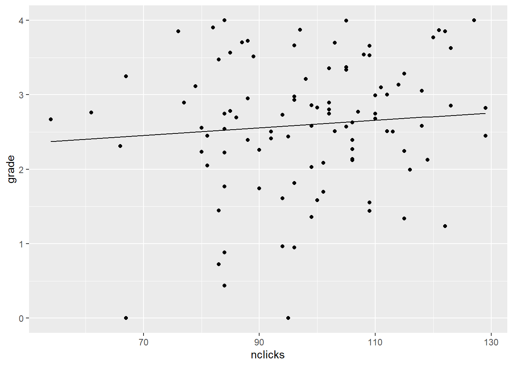

# 多元回归


单层数据包含$m$个预测变量的一般模型是：

$$
Y_i = \beta_0 + \beta_1 X_{1i} + \beta_2 X_{2i} + \ldots + \beta_m X_{mi} + e_i
$$

其中$e_i \sim \mathcal{N}\left(0, \sigma^2\right)$，换句话说，我们假设误差来自一个均值为0，方差为$\sigma^2$的正态分布。

注意，这里的关键假设**不是**响应变量($Y$)服从正态分布，**也不是**单个预测变量($X$)服从正态分布；而是**仅**模型残差服从正态分布(详细讨论见这篇[博客](https://datahowler.wordpress.com/2018/08/04/checking-model-assumptions-look-at-the-residuals-not-the-raw-data/))。单个$X$预测变量可以是任意组合的连续变量和/或分类变量，包括变量之间的交互。这个特定模型背后的进一步假设是，关系是"平面的"(可以用一个平面描述，类似于简单回归中的线性假设)，且误差方差与预测变量无关。

$\beta$的值被称为**回归系数(regression coefficient)**。每个$\beta_h$被解释为**在保持其他所有预测变量不变的情况下**$\beta_h$的偏效应(partial effect)。如果你有$m$个预测变量，你将有$m+1$个回归系数：一个用于截距，每个预测变量各一个

尽管在统计教科书中对多元回归的讨论很常见，但你很少有机会应用到上述的精确模型。因为上述模型假设的是单层数据，而大多数心理学数据是多层的。然而，这两种数据集的基本原理是相同的，因此先学习比较简单的案例是值得的。

## 一个例子：如何在统计学上取得好成绩

让我们来看一些(虚构但基于现实的)数据，看看我们如何使用多元回归来回答各种研究问题。在这个假设的研究中，你有一个包含100名统计学学生的数据集，其中包括他们的最终课程成绩(`grade`)、每个学生参加讲座的次数(`lecture`，一个范围为0-10的整数)、每个学生点击下载在线资料的次数(`nclicks`)以及每个学生在修这门课程之前的平均绩点(`GPA`)，其范围从0(不及格)到4(最高可能成绩)。

### 数据导入和可视化

让我们加载数据[grades.csv](https://raw.githubusercontent.com/PsyTeachR/stat-models-v1/master/data/grades.csv){target="_download"}并看一看。


```r
library("corrr") # 相关矩阵
library("tidyverse")

grades <- read_csv("data/grades.csv", col_types = "ddii")

grades
```

```
## # A tibble: 100 × 4
##    grade   GPA lecture nclicks
##    <dbl> <dbl>   <int>   <int>
##  1  2.40 1.13        6      88
##  2  3.67 0.971       6      96
##  3  2.85 3.34        6     123
##  4  1.36 2.76        9      99
##  5  2.31 1.02        4      66
##  6  2.58 0.841       8      99
##  7  2.69 4           5      86
##  8  3.05 2.29        7     118
##  9  3.21 3.39        9      98
## 10  2.24 3.27       10     115
## # ℹ 90 more rows
```

首先，让我们看一看所有的两两相关。


```r
grades %>%
  correlate() %>%
  shave() %>%
  fashion()
```

```
## Correlation computed with
## • Method: 'pearson'
## • Missing treated using: 'pairwise.complete.obs'
```

```
##      term grade  GPA lecture nclicks
## 1   grade                           
## 2     GPA   .25                     
## 3 lecture   .24  .44                
## 4 nclicks   .16  .30     .36
```


```r
pairs(grades)
```

<div class="figure">

<p class="caption">(\#fig:pairs)`grades`数据集中的所有成对关系</p>
</div>

### 估计和解释

我们将使用`lm()`函数来估计回归系数($\beta$s)。针对一个有$m$个预测变量的GLM：

$$
Y_i = \beta_0 + \beta_1 X_{1i} + \beta_2 X_{2i} + \ldots + \beta_m X_{mi} + e_i
$$

对base R的`lm()`调用如下：

`lm(Y ~ X1 + X2 + ... + Xm, data)`

变量`Y`是你的响应变量，变量`X`是预测变量。注意，你不需要明确指定截距或残差项;这些是默认包含的。

对于当前数据，让我们通过`lecture`和`nclicks`来预测`grade`。


```r
my_model <- lm(grade ~ lecture + nclicks, grades)

summary(my_model)
```

```
## 
## Call:
## lm(formula = grade ~ lecture + nclicks, data = grades)
## 
## Residuals:
##      Min       1Q   Median       3Q      Max 
## -2.21653 -0.40603  0.02267  0.60720  1.38558 
## 
## Coefficients:
##             Estimate Std. Error t value Pr(>|t|)  
## (Intercept) 1.462037   0.571124   2.560   0.0120 *
## lecture     0.091501   0.045766   1.999   0.0484 *
## nclicks     0.005052   0.006051   0.835   0.4058  
## ---
## Signif. codes:  0 '***' 0.001 '**' 0.01 '*' 0.05 '.' 0.1 ' ' 1
## 
## Residual standard error: 0.8692 on 97 degrees of freedom
## Multiple R-squared:  0.06543,	Adjusted R-squared:  0.04616 
## F-statistic: 3.395 on 2 and 97 DF,  p-value: 0.03756
```


我们通常会在参数符号的顶部加上一个帽子(hat)，以明确我们正在处理样本的估计值，而不是(未知的)真实总体值。由上可知:

-   $\hat{\beta}_0$ = 1.46
-   $\hat{\beta}_1$ = 0.09
-   $\hat{\beta}_2$ = 0.01

这告诉我们，一个人的预期成绩与他们的参加讲座的次数和点击下载在线资料的次数通过以下公式相关联：

`grade` = 1.46 + 0.09 $\times$ `lecture` + 0.01 $\times$ `nclicks`

因为$\hat{\beta}_1$和$\hat{\beta}_2$都是正数，所以我们知道`lecture`和`nclicks`的值越高，成绩越好。

因此，如果有人问你，你预测一个参加了3次讲座并下载了70次的学生成绩是多少，你可以通过代入相应的值轻松算出来。

`grade` = 1.46 + 0.09 $\times$ 3 + 0.01 $\times$ 70

相当于：

`grade` = 1.46 + 0.27 + 0.7

可化简为：

`grade` = 2.43

### 使用`predict()`通过线性模型进行预测

如果我们想通过新的预测变量值来预测响应变量值，我们可以使用base R 的`predict()`函数。

`predict()`函数有两个主要参数。第一个参数是拟合的模型对象(即上面的my_model)，第二个参数是包含预测变量新值的数据框(或tibble，R中和数据框data frame类似的一种数据格式)。

::: yellowbox
在新表中，你需要包含**所有的**预测变量。如果您的tibble缺少任何预测变量，你将收到错误消息(error message)。您还需要确保新表中的变量名与模型中的变量名**完全**匹配。
:::

让我们创建一个带有新值的tibble并进行测试。


```r
## “tribble”是一种按行而不是按列创建tibble的方法。有时这样做会很有用。
new_data <- tribble(~lecture, ~nclicks,
                    3, 70,
                    10, 130,
                    0, 20,
                    5, 100)
```

::: bluebox
`tribble()`函数提供了一种按行而不是按列逐步构建tibble的方法，而使用`tibble()`函数则是按列逐步构建表格。

`tribble()`的第一行包含列名，每个列名前面都有一个波浪号(`~`)。

有时这种方法比逐行构建更容易阅读，尽管结果是相同的。考虑到这些，我们也可以使用以下方式创建上述表格：


```r
new_data <- tibble(lecture = c(3, 10, 0, 5),
                   nclicks = c(70, 130, 20, 100))
```
:::

现在我们已经创建了表`new_data`，只需将其传递给`predict()`函数，这会返回一个关于$Y$(grade)预测值的向量。


```r
predict(my_model, new_data)
```

```
##        1        2        3        4 
## 2.090214 3.033869 1.563087 2.424790
```

这很好，但也许我们希望将预测值和预测变量对应起来。我们可以通过将预测值作为新列添加到`new_data`中来实现这一点。


```r
new_data %>%
  mutate(predicted_grade = predict(my_model, new_data))
```

```
## # A tibble: 4 × 3
##   lecture nclicks predicted_grade
##     <dbl>   <dbl>           <dbl>
## 1       3      70            2.09
## 2      10     130            3.03
## 3       0      20            1.56
## 4       5     100            2.42
```

想查看`predict()`的更多操作吗？使用`?predict.lm`来获得帮助。

### 偏效应可视化

如上所述，每个回归系数的参数估计值告诉我们该变量的**偏**效应；即保持其他所有变量不变时它的效应。有办法可视化这个偏效应吗？是的，你可以使用`predict()`函数来实现，通过创建一个表，其中焦点预测变量(focal predictor)的值是多样的，其他所有预测变量用均值填充。

例如，我们要可视化`lecture`对`grade`的偏效应，同时将`nclicks`的值保持在其均值不变。


```r
nclicks_mean <- grades %>% pull(nclicks) %>% mean()

## 预测用的新数据
new_lecture <- tibble(lecture = 0:10,
                      nclicks = nclicks_mean)

## 将预测值添加到new_lecture
new_lecture2 <- new_lecture %>%
  mutate(grade = predict(my_model, new_lecture))

new_lecture2
```

```
## # A tibble: 11 × 3
##    lecture nclicks grade
##      <int>   <dbl> <dbl>
##  1       0    98.3  1.96
##  2       1    98.3  2.05
##  3       2    98.3  2.14
##  4       3    98.3  2.23
##  5       4    98.3  2.32
##  6       5    98.3  2.42
##  7       6    98.3  2.51
##  8       7    98.3  2.60
##  9       8    98.3  2.69
## 10       9    98.3  2.78
## 11      10    98.3  2.87
```

现在让我们作图。


```r
ggplot(grades, aes(lecture, grade)) + 
  geom_point() +
  geom_line(data = new_lecture2)
```

<div class="figure">

<p class="caption">(\#fig:partial-lecture-plot)nclicks固定在均值，`lecture`对成绩的偏效应</p>
</div>

::: yellowbox
偏效应图只有在模型中焦点预测变量与其他预测变量之间没有交互作用时才有意义。

原因是当存在交互作用时，焦点预测变量$X_i$的偏效应会随着与其交互的变量的变动而变动。
:::

现在你能可视化`nclicks`对`grade`的偏效应吗?

本页最后给出解决方法。

### 标准化系数

我们经常用多元回归来解决的一类问题是，**哪个预测变量对预测Y最重要？**

现在，你不能简单地读取$\hat{\beta}$值并选择绝对值最大的一个，因为这些预测变量都在不同的尺度上。为了回答这个问题，你需要对预测变量进行**中心化(center)**和**比例化(scale)**。

还记得$z$分数吗？

$$
z = \frac{X - \mu_x}{\sigma_x}
$$

$z$分数($z$-score)表示$X$与样本均值($\mu_x$)之间的标准差单位距离($\sigma_x$)。因此，$z$分数为1意味着该值高于均值1个标准差；$z$分数为-2.5意味着低于均值2.5个标准差。$Z$分数通过将它们校准为标准正态分布(均值为0，标准差为1的分布)给了我们一种比较来自不同总体的事物的办法。

那么我们通过将预测变量转换为$z$分数来重新缩放它们。这是相当容易做到的。


```r
grades2 <- grades %>%
  mutate(lecture_c = (lecture - mean(lecture)) / sd(lecture),
         nclicks_c = (nclicks - mean(nclicks)) / sd(nclicks))

grades2
```

```
## # A tibble: 100 × 6
##    grade   GPA lecture nclicks lecture_c nclicks_c
##    <dbl> <dbl>   <int>   <int>     <dbl>     <dbl>
##  1  2.40 1.13        6      88  -0.484     -0.666 
##  2  3.67 0.971       6      96  -0.484     -0.150 
##  3  2.85 3.34        6     123  -0.484      1.59  
##  4  1.36 2.76        9      99   0.982      0.0439
##  5  2.31 1.02        4      66  -1.46      -2.09  
##  6  2.58 0.841       8      99   0.493      0.0439
##  7  2.69 4           5      86  -0.972     -0.796 
##  8  3.05 2.29        7     118   0.00488    1.27  
##  9  3.21 3.39        9      98   0.982     -0.0207
## 10  2.24 3.27       10     115   1.47       1.08  
## # ℹ 90 more rows
```

现在让我们用居中和缩放后的预测变量重新拟合模型。


```r
my_model_scaled <- lm(grade ~ lecture_c + nclicks_c, grades2)

summary(my_model_scaled)
```

```
## 
## Call:
## lm(formula = grade ~ lecture_c + nclicks_c, data = grades2)
## 
## Residuals:
##      Min       1Q   Median       3Q      Max 
## -2.21653 -0.40603  0.02267  0.60720  1.38558 
## 
## Coefficients:
##             Estimate Std. Error t value Pr(>|t|)    
## (Intercept)  2.59839    0.08692  29.895   <2e-16 ***
## lecture_c    0.18734    0.09370   1.999   0.0484 *  
## nclicks_c    0.07823    0.09370   0.835   0.4058    
## ---
## Signif. codes:  0 '***' 0.001 '**' 0.01 '*' 0.05 '.' 0.1 ' ' 1
## 
## Residual standard error: 0.8692 on 97 degrees of freedom
## Multiple R-squared:  0.06543,	Adjusted R-squared:  0.04616 
## F-statistic: 3.395 on 2 and 97 DF,  p-value: 0.03756
```


这告诉我们lecture_c的影响相对更大，该变量每个标准差的提高，`grade`相应地提高0.19。

另一种常见的标准化方法是同时对响应变量和预测变量进行标准化，即对$Y$值和$X$值都进行$z$分数转换。采用这种方法时，回归系数的相对(影响力)排序将保持不变。主要区别在于，系数将反映响应变量以标准差($SD$)为单位的变化，而不是原始单位。

::: bluebox
**多重共线性(multicollinearity)及其不足**

在关于多元回归的讨论中，你可能会听到对"多重共线性"的担忧，这是指预测变量之间存在交互关系的一种高级说法。这只是一个潜在的问题，因为它可能会影响对单个预测变量效应的解释。当预测变量相关时，$\beta$值可能会根据模型中包含或排除的预测变量而变化，有时甚至会改变符号。关于这一点需要记住的关键是：

-   观察性研究(observational studies)中预测变量之间相关是不可避免的；
-   回归**不**假设你的预测变量彼此独立(换句话说，在预测变量之间找到相关性本身并不是质疑模型的理由)；
-   当存在强相关时，解释单个回归系数时要谨慎；
-   目前没有已知的"补救措施"，也不清楚是否需要任何此类补救措施，许多所谓的补救措施弊大于利。

更多信息和指导请查阅[@Vanhove_2021]。
:::

### 模型比较

另一种使用多元回归模型解决的常见问题是：某个预测变量或一组预测变量**在超出某些控制变量的影响之外**，对我的响应变量有显著影响吗？

举个例子，上述包含`lecture`和`nclicks`的模型在统计上是显著的， $F(2,97) = 3.395, p =0.038$。

$m$个预测因子的回归模型的原假设(null hypothesis)为：

$$H_0: \beta_1 = \beta_2 = \ldots = \beta_m = 0;$$

换句话说，所有的系数(除了截距)都是0。如果原假设成立，那么原模型(null model)

$$Y_i = \beta_0$$

与包含所有预测变量及其系数的模型一样能给出很好的预测。换句话说，你对$Y$的最佳预测只是它的均值($\mu_y$)；$X$变量是无关紧要的。我们拒绝了这个原假设，意味着通过纳入我们的两个预测变量`lecture`和`nclicks`，可以做得更好。

但你可能会问：也许是成绩更好的学生获得了更好的成绩，而`lecture`、`nclicks`和`grade`之间的关系仅仅是通过学生质量的中介来实现。毕竟，成绩更好的学生更有可能去听讲座并下载材料。因此，我们可以问，出勤率和下载次数是否在**超出**学生能力(通过GPA测量)之外与更好的成绩相关？

我们可以通过**模型比较**来检验这一假设。逻辑是这样的：首先，估计一个包含所有控制预测变量但不包含焦点预测变量的模型。其次，估计一个包含控制预测变量和焦点预测变量的模型。最后，比较这两个模型，看看包含预测因子是否有统计学上显著的增益。

下面展示你如何做到这一点：


```r
m1 <- lm(grade ~ GPA, grades) # control model
m2 <- lm(grade ~ GPA + lecture + nclicks, grades) # bigger model

anova(m1, m2)
```

```
## Analysis of Variance Table
## 
## Model 1: grade ~ GPA
## Model 2: grade ~ GPA + lecture + nclicks
##   Res.Df    RSS Df Sum of Sq      F Pr(>F)
## 1     98 73.528                           
## 2     96 71.578  2    1.9499 1.3076 0.2752
```


原假设是我们仅通过`GPA`预测`grade`与通过`GPA`加上`lecture`和`nclicks`预测`grade`一样准确。如果添加这两个变量能够显著减少**残差平方和(RSS)**，即它们能解释足够多的残差方差，我们就会拒绝这个原假设。

我们看到情况并非如此：$F(2,96) = 1.308$, $p =0.275$。因此，我们没有证据表明课堂出勤率和下载在线材料在通过GPA衡量的学生能力之外与更好的成绩相关。

## 处理分类预测变量

回归公式将响应变量描述为加权预测变量的总和。但如果其中一个预测变量是分类变量(如代表"农村"或"城市"等群组)，而不是数值型变量会怎样呢？许多变量是**名义(nominal)**变量：包含名称的分类变量，在变量的级别之间没有固有的顺序。例如，宠物所有权(猫、狗、雪貂)是一个名义变量；不考虑喜好，拥有猫不等于拥有狗，拥有狗不等于拥有雪貂。

::: bluebox
**使用数值型预测变量表示名义数据**

在回归模型中表示一个$k$水平的名义变量需要$k-1$个数值型预测变量；例如，如果有4水平，你需要3个预测变量。大多数编码方案要求你在$k$个水平中选择一个作为基线水平。$k-1$个变量中，每个变量都是其表示的水平与基线水平对比。

**举例：**你有一个三水平变量`pet_type`(猫、狗、雪貂)。

你选择猫为基线并创建两个数值型预测变量：

-   `dog_v_cat`用来编码狗和猫之间的对比；
-   `ferret_v_cat`用来编码雪貂和猫之间的对比。
:::

名义变量通常在数据框中表示`character`或`factor`类型。

字符(character)变量和因子(factor)变量的区别在于因子包含关于水平及其顺序的信息，而字符向量则缺乏此信息。

当你使用R公式语法(R formula syntax)指定模型时，R会检查公式右侧预测变量的数据类型。例如，如果你的模型将`income`回归到`pet_type`上(`income ~ pet_type`)，R会检查`pet_type`的数据类型。

对于所有类型为字符或因子的变量，R都会隐式地(implicitly)创建一个(或一组)数值型预测变量来表示该变量在模型中的作用。有多种方案可用于创建名义变量的数值表示。R中的默认方法是使用**虚拟**(dummy，或叫处理(treatment))编码(见下文)。不幸的是，这种默认方法(注：不是指虚拟编码，而是指R自动建立虚拟编码)不适合心理学中的许多研究设计，因此我建议你学习如何“手动”编码你的预测变量，并养成这样做的习惯。

::: pinkbox
**不要用数字表示分类变量的水平！**

上述例子中，我们有一个名为`pet_type`的变量，其水平为`cat`、`dog`和`ferret`。有时人们用数字表示名义变量的水平，像这样：

* `1`表示猫，
* `2`表示狗，
* `3`表示雪貂。

这是个坏主意。

首先，这样的标记是任意且不透明的，任何试图使用你数据的人都不知道哪个数字对应哪个类别(你自己也可能会忘记！)。

更糟糕的是，如果你把这个变量作为回归模型中的预测变量引入，R将无法知道你使用1、2和3作为变量内各水平标签的意图，而是会假设`pet_type`是一个测量值，其中狗比猫大1个单位，雪貂比猫大2个单位，比狗大1个单位，这完全是无意义的！

这种错误太容易犯了，而且如果作者不分享他们的数据和代码，这很难发现。2016年，[《Current Biology》发表的一篇关于儿童宗教信仰和利他行为的论文就因为这种错误而被撤稿](https://www.sciencedirect.com/science/article/pii/S0960982216306704)。

所以，不要用数字来表示名义变量的各个水平，除非你是有意创建预测变量来编码代表名义变量的$k-1$对比项，以便在回归模型中正确表示名义变量。
:::

### 虚拟编码(又称“处理”编码)

对于只有两个水平的名义变量，选择一个水平作为基线，并创建一个新变量，当名义变量是基线时，该新变量为`0`，非基线时为`1`。基线的选择是任意的，只会影响系数是正还是负，但不会影响大小、标准误或相关的p值。

为了说明这点，让我们生成一些只包含一个两水平分类预测变量的假数据。


```r
fake_data <- tibble(Y = rnorm(10),
                    group = rep(c("A", "B"), each = 5))

fake_data
```

```
## # A tibble: 10 × 2
##         Y group
##     <dbl> <chr>
##  1 -1.63  A    
##  2 -0.776 A    
##  3  0.332 A    
##  4 -0.798 A    
##  5  1.26  A    
##  6 -0.676 B    
##  7 -0.476 B    
##  8  0.568 B    
##  9 -0.464 B    
## 10  0.787 B
```

现在让我们来添加一个新变量`group_d`，这是经过虚拟编码的分组变量。我们将使用`dplyr::if_else()`函数来定义新列。


```r
fake_data2 <- fake_data %>%
  mutate(group_d = if_else(group == "B", 1, 0))

fake_data2
```

```
## # A tibble: 10 × 3
##         Y group group_d
##     <dbl> <chr>   <dbl>
##  1 -1.63  A           0
##  2 -0.776 A           0
##  3  0.332 A           0
##  4 -0.798 A           0
##  5  1.26  A           0
##  6 -0.676 B           1
##  7 -0.476 B           1
##  8  0.568 B           1
##  9 -0.464 B           1
## 10  0.787 B           1
```

现在我们把它作为常规的回归模型来运行。


```r
summary(lm(Y ~ group_d, fake_data2))
```

```
## 
## Call:
## lm(formula = Y ~ group_d, data = fake_data2)
## 
## Residuals:
##     Min      1Q  Median      3Q     Max 
## -1.3120 -0.4698 -0.4177  0.6465  1.5849 
## 
## Coefficients:
##             Estimate Std. Error t value Pr(>|t|)
## (Intercept)  -0.3230     0.4160  -0.776    0.460
## group_d       0.2706     0.5882   0.460    0.658
## 
## Residual standard error: 0.9301 on 8 degrees of freedom
## Multiple R-squared:  0.02577,	Adjusted R-squared:  -0.096 
## F-statistic: 0.2117 on 1 and 8 DF,  p-value: 0.6577
```

让我们反转编码。我们得到相同的结果，只是符号不同。


```r
fake_data3 <- fake_data %>%
  mutate(group_d = if_else(group == "A", 1, 0))

summary(lm(Y ~ group_d, fake_data3))
```

```
## 
## Call:
## lm(formula = Y ~ group_d, data = fake_data3)
## 
## Residuals:
##     Min      1Q  Median      3Q     Max 
## -1.3120 -0.4698 -0.4177  0.6465  1.5849 
## 
## Coefficients:
##             Estimate Std. Error t value Pr(>|t|)
## (Intercept) -0.05235    0.41595  -0.126    0.903
## group_d     -0.27063    0.58824  -0.460    0.658
## 
## Residual standard error: 0.9301 on 8 degrees of freedom
## Multiple R-squared:  0.02577,	Adjusted R-squared:  -0.096 
## F-statistic: 0.2117 on 1 and 8 DF,  p-value: 0.6577
```

截距的解释是编码为0的组的估计均值。你可以通过将0代入到下面的预测公式中的X看到这一点。因此，$\beta_1$可以解释为基线组和编码为1的组之间的均值差异。

$$\hat{Y_i} = \hat{\beta}_0 + \hat{\beta}_1 X_i $$

请注意，如果我们只是将字符变量`group`作为模型的预测变量，R将根据需要自动为我们创建虚拟变量。


```r
lm(Y ~ group, fake_data) %>%
  summary()
```

```
## 
## Call:
## lm(formula = Y ~ group, data = fake_data)
## 
## Residuals:
##     Min      1Q  Median      3Q     Max 
## -1.3120 -0.4698 -0.4177  0.6465  1.5849 
## 
## Coefficients:
##             Estimate Std. Error t value Pr(>|t|)
## (Intercept)  -0.3230     0.4160  -0.776    0.460
## groupB        0.2706     0.5882   0.460    0.658
## 
## Residual standard error: 0.9301 on 8 degrees of freedom
## Multiple R-squared:  0.02577,	Adjusted R-squared:  -0.096 
## F-statistic: 0.2117 on 1 and 8 DF,  p-value: 0.6577
```

`lm()`函数检查`group`并确定变量不同的水平——在这种情况下是`A`和`B`。然后，它选择按字母顺序排在最前面的水平作为基线(注：中文一样是字母顺序)，并编码另一个水平(`B`)与基线水平(`A`)之间的对比。(如果`group`被定义为因子，基线水平就是`levels(fake_data$group)`的第一个元素)。

它创建的新变量以`groupB`的名称出现在输出中。

### 当$k > 2$时的虚拟编码

当名义预测变量超过两水平($k > 2$)时，一个数值预测变量就不够用了，我们需要$k-1$个预测变量。如果名义预测变量有4水平，我们将需要定义3个预测变量。让我们模拟一些要处理的数据，`season_wt`表示一年四季一个人的体重(以kg为单位)。


```r
season_wt <- tibble(season = rep(c("winter", "spring", "summer", "fall"),
                                 each = 5),
                    bodyweight_kg = c(rnorm(5, 105, 3),
                                      rnorm(5, 103, 3),
                                      rnorm(5, 101, 3),
                                      rnorm(5, 102.5, 3)))

season_wt
```

```
## # A tibble: 20 × 2
##    season bodyweight_kg
##    <chr>          <dbl>
##  1 winter         107. 
##  2 winter         106. 
##  3 winter          99.4
##  4 winter          99.4
##  5 winter          99.7
##  6 spring         103. 
##  7 spring         105. 
##  8 spring         103. 
##  9 spring         104. 
## 10 spring         104. 
## 11 summer          98.7
## 12 summer         104. 
## 13 summer         104. 
## 14 summer         100. 
## 15 summer         103. 
## 16 fall           101. 
## 17 fall            99.0
## 18 fall            98.8
## 19 fall            97.4
## 20 fall           102.
```

现在让我们添加三个预测变量来编码变量`season`。尝试一下，看看你是否能弄清楚了它是如何工作的。


```r
## 基线变量是“winter”
season_wt2 <- season_wt %>%
  mutate(spring_v_winter = if_else(season == "spring", 1, 0),
         summer_v_winter = if_else(season == "summer", 1, 0),
         fall_v_winter = if_else(season == "fall", 1, 0))

season_wt2
```

```
## # A tibble: 20 × 5
##    season bodyweight_kg spring_v_winter summer_v_winter fall_v_winter
##    <chr>          <dbl>           <dbl>           <dbl>         <dbl>
##  1 winter         107.                0               0             0
##  2 winter         106.                0               0             0
##  3 winter          99.4               0               0             0
##  4 winter          99.4               0               0             0
##  5 winter          99.7               0               0             0
##  6 spring         103.                1               0             0
##  7 spring         105.                1               0             0
##  8 spring         103.                1               0             0
##  9 spring         104.                1               0             0
## 10 spring         104.                1               0             0
## 11 summer          98.7               0               1             0
## 12 summer         104.                0               1             0
## 13 summer         104.                0               1             0
## 14 summer         100.                0               1             0
## 15 summer         103.                0               1             0
## 16 fall           101.                0               0             1
## 17 fall            99.0               0               0             1
## 18 fall            98.8               0               0             1
## 19 fall            97.4               0               0             1
## 20 fall           102.                0               0             1
```

::: yellowbox
**提醒：始终查看你的数据**

每当你写的代码可能改变数据时，都应该通过查看数据来确保代码按预期工作。这在你手动编码用于回归的名义变量时尤其重要，因为有时代码会写错，但不会引发报错。

考虑上面的代码块，我们定义了三个对比来表示名义变量`season`，`winter`是我们的基线。

如果你意外地拼错了一个水平(使用`summre`而不是`summer`)，你能注意到吗？


```r
season_wt3 <- season_wt %>%
  mutate(spring_v_winter = if_else(season == "spring", 1, 0),
         summer_v_winter = if_else(season == "summre", 1, 0),
         fall_v_winter = if_else(season == "fall", 1, 0))
```

虽然上面的代码块可以运行，但当我们运行回归时，我们会得到令人困惑的输出，即`summer_v_winter`的系数是`NA`(不可用，not available)。


```r
lm(bodyweight_kg ~ spring_v_winter + summer_v_winter + fall_v_winter,
   season_wt3)
```

```
## 
## Call:
## lm(formula = bodyweight_kg ~ spring_v_winter + summer_v_winter + 
##     fall_v_winter, data = season_wt3)
## 
## Coefficients:
##     (Intercept)  spring_v_winter  summer_v_winter    fall_v_winter  
##         102.009            1.850               NA           -2.288
```

发生了什么？让我们看看数据来找到答案。我们将使用`distinct`函数找出原始变量`season`和我们创建的三个变量的不同组合(详细信息参阅`?dplyr::distinct`)。


```r
season_wt3 %>%
  distinct(season, spring_v_winter, summer_v_winter, fall_v_winter)
```

```
## # A tibble: 4 × 4
##   season spring_v_winter summer_v_winter fall_v_winter
##   <chr>            <dbl>           <dbl>         <dbl>
## 1 winter               0               0             0
## 2 spring               1               0             0
## 3 summer               0               0             0
## 4 fall                 0               0             1
```

由于我们的拼写错误，当`season == "summer"`时，预测变量`summer_v_winter`不是`1`；相反，它**总是0**。`if_else()`字面上意思是“如果`season == "summre"`，则将`summer_v_winter`设置为1，否则为0”。当然，`season`**永远**不会等于`summre`，因为`summre`是一个拼写错误。我们本可以通过使用`distinct()`进行上面的检查轻松发现这一点。当你创建自己的数值预测变量时，养成这样做的习惯是很重要的。
:::

::: bluebox
**更仔细地看看R的默认情况**

如果你曾经使用过像SPSS这样的指向-点击的统计软件，你可能从未学习过如何编码分类预测变量。通常，软件会识别预测变量是否为分类变量，并在后台将其重新编码为数值型预测变量。R也是如此：如果你将`character`或`factor`类型的预测变量提供给线性建模函数，它将为你创建数值型虚拟编码的预测变量，如下方代码所示。


```r
lm(bodyweight_kg ~ season, season_wt) %>%
  summary()
```

```
## 
## Call:
## lm(formula = bodyweight_kg ~ season, data = season_wt)
## 
## Residuals:
##     Min      1Q  Median      3Q     Max 
## -2.9684 -1.7978 -0.3415  1.4710  4.8183 
## 
## Coefficients:
##              Estimate Std. Error t value Pr(>|t|)    
## (Intercept)    99.721      1.105  90.236   <2e-16 ***
## seasonspring    4.138      1.563   2.648   0.0176 *  
## seasonsummer    1.983      1.563   1.269   0.2227    
## seasonwinter    2.594      1.563   1.660   0.1164    
## ---
## Signif. codes:  0 '***' 0.001 '**' 0.01 '*' 0.05 '.' 0.1 ' ' 1
## 
## Residual standard error: 2.471 on 16 degrees of freedom
## Multiple R-squared:  0.3104,	Adjusted R-squared:  0.1811 
## F-statistic: 2.401 on 3 and 16 DF,  p-value: 0.1058
```

在这里，R隐式地创建了三个虚拟变量来编码`season`的四个水平，分别命名为`seasonspring`、`seasonsummer`和`seasonwinter`。未提及的季节`fall`被选为基线，因为它在字母表中最早出现。这三个预测变量的值如下：

* `seasonspring`：如果是春季则为`1`，否则为`0`；
* `seasonsummer`：如果是夏季则为`1`，否则为`0`；
* `seasonwinter`：如果是冬季则为`1`，否则为`0`；

这似乎是让R为我们做的一件方便的事情，但是在按赖默认设置时可能会有潜在风险。在下一章中，当我们讨论交互作用时，我们将更多地了解这些风险。
:::

## 多元回归和单因素方差分析(one-way ANOVA)的等价性

如果我们想要查看我们的体重是否随季节变化，我们可以对`season_wt2`进行单因素方差分析，如下所示。


```r
## 将季节变为一个以“winter”为基线的因子变量
season_wt3 <- season_wt2 %>%
  mutate(season = factor(season, levels = c("winter", "spring",
                                            "summer", "fall")))

my_anova <- aov(bodyweight_kg ~ season, season_wt3)
summary(my_anova)
```

```
##             Df Sum Sq Mean Sq F value Pr(>F)
## season       3  43.98  14.660   2.401  0.106
## Residuals   16  97.70   6.106
```

好了，现在我们可以用下面的回归模型复制这个结果吗?

$$Y_i = \beta_0 + \beta_1 X_{1i} + \beta_2 X_{2i} + \beta_3 X_{3i} + e_i$$


```r
summary(lm(bodyweight_kg ~ spring_v_winter +
             summer_v_winter + fall_v_winter,
           season_wt2))
```

```
## 
## Call:
## lm(formula = bodyweight_kg ~ spring_v_winter + summer_v_winter + 
##     fall_v_winter, data = season_wt2)
## 
## Residuals:
##     Min      1Q  Median      3Q     Max 
## -2.9684 -1.7978 -0.3415  1.4710  4.8183 
## 
## Coefficients:
##                 Estimate Std. Error t value Pr(>|t|)    
## (Intercept)     102.3146     1.1051  92.583   <2e-16 ***
## spring_v_winter   1.5438     1.5629   0.988    0.338    
## summer_v_winter  -0.6114     1.5629  -0.391    0.701    
## fall_v_winter    -2.5940     1.5629  -1.660    0.116    
## ---
## Signif. codes:  0 '***' 0.001 '**' 0.01 '*' 0.05 '.' 0.1 ' ' 1
## 
## Residual standard error: 2.471 on 16 degrees of freedom
## Multiple R-squared:  0.3104,	Adjusted R-squared:  0.1811 
## F-statistic: 2.401 on 3 and 16 DF,  p-value: 0.1058
```

请注意，这两种方法的 $F$ 值和 $p$ 值是相同的!

## 练习答案


<div class='webex-solution'><button>展开答案</button>


首先创建一个包含新预测变量的tibble。我们可能还想知道`nclicks`的取值范围。


```r
lecture_mean <- grades %>% pull(lecture) %>% mean()
min_nclicks <- grades %>% pull(nclicks) %>% min()
max_nclicks <- grades %>% pull(nclicks) %>% max()

## 预测变量的新数据
new_nclicks <- tibble(lecture = lecture_mean,
                      nclicks = min_nclicks:max_nclicks)

## 将预测值添加到new_lecture中
new_nclicks2 <- new_nclicks %>%
  mutate(grade = predict(my_model, new_nclicks))

new_nclicks2
```

```
## # A tibble: 76 × 3
##    lecture nclicks grade
##      <dbl>   <int> <dbl>
##  1    6.99      54  2.37
##  2    6.99      55  2.38
##  3    6.99      56  2.38
##  4    6.99      57  2.39
##  5    6.99      58  2.39
##  6    6.99      59  2.40
##  7    6.99      60  2.40
##  8    6.99      61  2.41
##  9    6.99      62  2.41
## 10    6.99      63  2.42
## # ℹ 66 more rows
```

现在作图。


```r
ggplot(grades, aes(nclicks, grade)) +
  geom_point() +
  geom_line(data = new_nclicks2)
```

<div class="figure">

<p class="caption">(\#fig:partial-nclicks)nclicks对grade的偏效应图</p>
</div>


</div>

