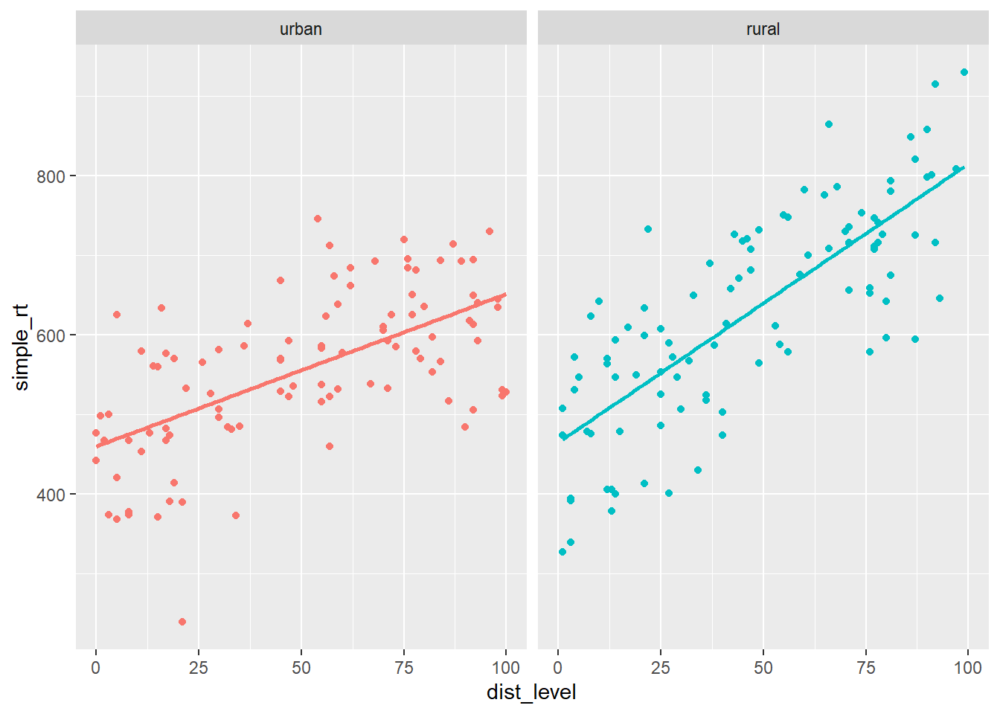

# 交互作用


<!-- understand a common fallacy regarding interactions -->

到目前为止，我们一直专注于估计和解释一个变量或预测变量线性组合对响应变量的影响。然而，往往存在这样的情况，一个预测变量对响应变量的影响取决于另一个预测变量。实际上，我们可以在模型中包含一个**交互**项来估计和解释这种依赖性。

## 连续变量-分类变量交互作用 {#cont-by-cat}

让我们考虑一个简单的虚构例子。假设你对声波干扰对认知表现的影响感兴趣。你的研究中的每个被试在执行一个简单的反应时任务时(尽快对闪光灯做出反应)，被随机分配接受特定水平的声波干扰。你有一种技术，可以自动生成不同水平的背景噪音（例如城市声音的频率和振幅：鸣笛声、钻地声、喧哗声、玻璃破碎声等）。每个参与者在一个随机选择的干扰水平(0到100)下执行任务。你的假设是，城市生活使人们的任务表现更不受声波干扰的影响。你想要比较城市居民和农村居民(来自更安静的农村环境)之间干扰与表现关系的差异。

你有3个变量：

* 一个连续响应变量，`mean_RT`，其较高的水平反映较慢的反应时；
* 一个连续预测变量，声波干扰水平(`dist_level`)，其较高的水平表示更多的干扰；
* 一个两水平的因子，`group` (城市vs.农村)。

让我们从模拟一些城市组的数据开始。假设在0干扰(静音)下，平均反应时约为450毫秒，且干扰每增加1个单位，反应时就增加约2毫秒。这给了我们以下线性模型：

$$Y_i = 450 + 2 X_i + e_i$$

其中$X_i$是声音干扰的水平。

让我们模拟100名被试的数据，设定$\sigma = 80$，并在开始之前设置种子。


```r
library(tidyverse)
set.seed(1031)

n_subj <- 100L  # 模拟100名被试的数据(注：L是说明100是整数)
b0_urban <- 450 # y轴截距
b1_urban <- 2   # 斜率

# 分解表(decomposition table)
urban <- tibble(
  subj_id = 1:n_subj,
  group = "urban",
  b0 = 450,
  b1 = 2,
  dist_level = sample(0:n_subj, n_subj, replace = TRUE),
  err = rnorm(n_subj, mean = 0, sd = 80),
  simple_rt = b0 + b1 * dist_level + err)

urban
```

```
## # A tibble: 100 × 7
##    subj_id group    b0    b1 dist_level     err simple_rt
##      <int> <chr> <dbl> <dbl>      <int>   <dbl>     <dbl>
##  1       1 urban   450     2         59  -36.1       532.
##  2       2 urban   450     2         45  128.        668.
##  3       3 urban   450     2         55   23.5       584.
##  4       4 urban   450     2          8    1.04      467.
##  5       5 urban   450     2         47   48.7       593.
##  6       6 urban   450     2         96   88.2       730.
##  7       7 urban   450     2         62  110.        684.
##  8       8 urban   450     2          8  -91.6       374.
##  9       9 urban   450     2         15 -109.        371.
## 10      10 urban   450     2         70   20.7       611.
## # ℹ 90 more rows
```

让我们绘制创建的数据，并作出最佳拟合线。


```r
ggplot(urban, aes(dist_level, simple_rt)) + 
  geom_point(alpha = .2) +
  geom_smooth(method = "lm", se = FALSE)
```

<div class="figure">

<p class="caption">(\#fig:plot-urban)*声波干扰对简单反应时的影响(城市组)*</p>
</div>

现在让我们为农村组模拟数据。我们假设这些被试的截距可能会略高一些，可能是因为他们对技术不太熟悉。最重要的是，我们假设他们的斜率会更陡，因为他们受到噪音的影响更大。大致如下：

$$Y_i = 500 + 3 X_i + e_i$$


```r
b0_rural <- 500
b1_rural <- 3

rural <- tibble(
  subj_id = 1:n_subj + n_subj,
  group = "rural",
  b0 = b0_rural,
  b1 = b1_rural,
  dist_level = sample(0:n_subj, n_subj, replace = TRUE),
  err = rnorm(n_subj, mean = 0, sd = 80),
  simple_rt = b0 + b1 * dist_level + err)
```

现在让我们把这两组的数据一起画出来。


```r
all_data <- bind_rows(urban, rural)

ggplot(all_data %>% mutate(group = fct_relevel(group, "urban")), 
       aes(dist_level, simple_rt, colour = group)) +
  geom_point() +
  geom_smooth(method = "lm", se = FALSE) +
  facet_wrap(~ group) + 
  theme(legend.position = "none")
```

<div class="figure">

<p class="caption">(\#fig:combined-plot)*声波干扰对简单反应时的影响(城市和乡村)*</p>
</div>

这里我们可以很清楚地看到我们在数据中建立的斜率差异。我们如何测试两个斜率是否有显著不同呢？要做到这一点，我们不能做两个单独的回归。我们需要将这两条回归线纳入同一个模型中。我们应该怎么做呢？

请注意，我们可以用“偏移(offset)”值来表示其中一条回归线。我们(任意地)选一组作为我们的“基线”组，并将另一组的y轴截距和斜率表示为相对于这个基准的偏移值。因此，如果我们选择城市组作为基线，我们可以用两个偏移值$\beta_2$和$\beta_3$分别表示农村组的y轴截距和斜率偏移。

* y轴截距: $\beta_{0\_rural} = \beta_{0\_urban} + \beta_2$
* 斜率: $\beta_{1\_rural} = \beta_{1\_urban} + \beta_3$

