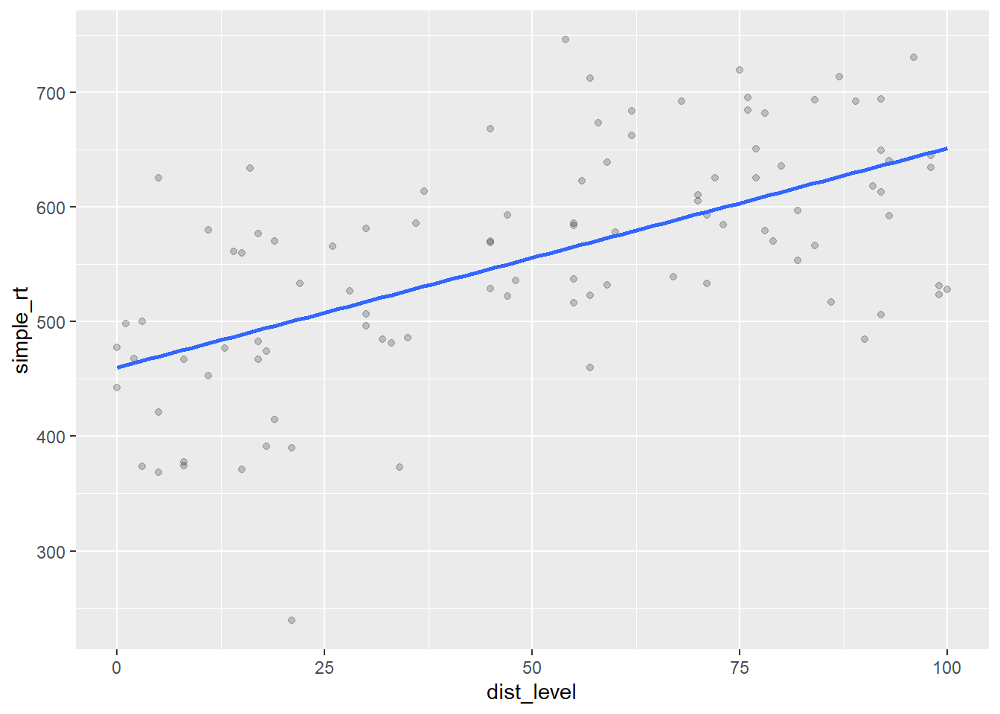
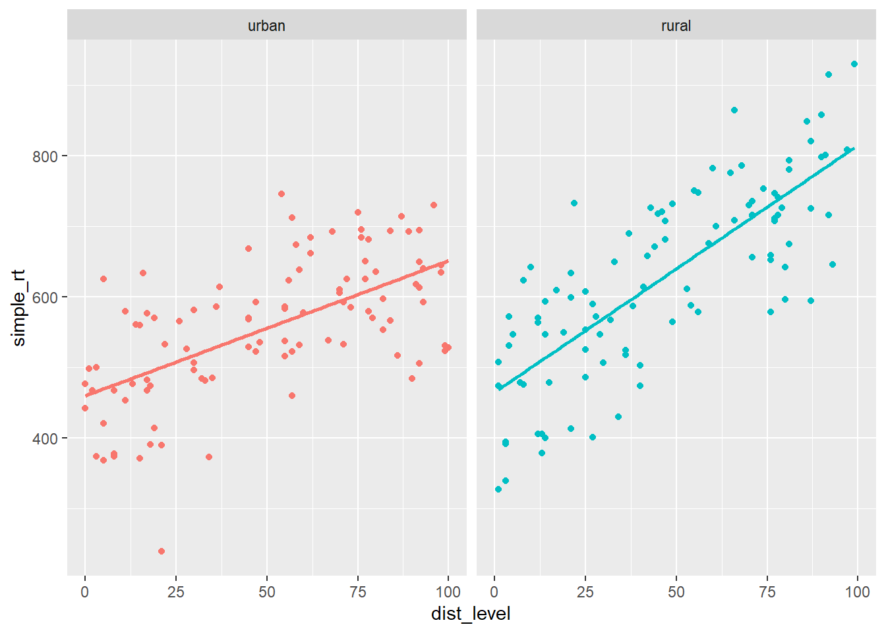
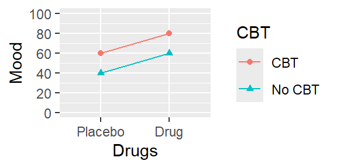
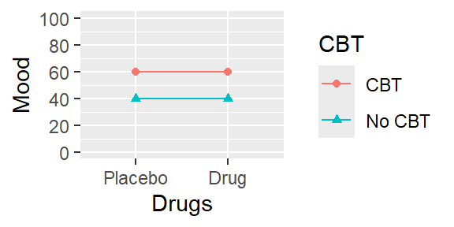
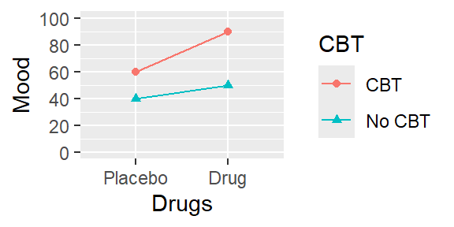

# 交互效应


<!-- understand a common fallacy regarding interactions -->

到目前为止，我们一直专注于估计和解释一个变量或预测变量线性组合对响应变量的影响。然而，往往存在这样的情况，一个预测变量对响应变量的影响取决于另一个预测变量。实际上，我们可以在模型中包含一个**交互**项来估计和解释这种依赖性。

## 连续变量-分类变量交互效应 {#cont-by-cat}

让我们考虑一个简单的虚构例子。假设你对声波干扰对认知表现的影响感兴趣。你的研究中的每个被试在执行一个简单的反应时任务时(尽快对闪光灯做出反应)，被随机分配接受特定水平的声波干扰。你有一种技术，可以自动生成不同水平的背景噪音（例如城市声音的频率和振幅：鸣笛声、钻地声、喧哗声、玻璃破碎声等）。每个参与者在一个随机选择的干扰水平(0到100)下执行任务。你的假设是，城市生活使人们的任务表现更不受声波干扰的影响。你想要比较城市居民和乡村居民(来自更安静的乡村环境)之间干扰与表现关系的差异。

你有3个变量：

-   一个连续响应变量，`mean_RT`，其较高的水平反映较慢的反应时；
-   一个连续预测变量，声波干扰水平(`dist_level`)，其较高的水平表示更多的干扰；
-   一个两水平的因子，`group` (城市vs.乡村)。

让我们从模拟一些城市组的数据开始。假设在0干扰(静音)下，平均反应时约为450毫秒，且干扰每增加1个单位，反应时就增加约2毫秒。这给了我们以下线性模型：

$$Y_i = 450 + 2 X_i + e_i$$

其中$X_i$是声音干扰的水平。

让我们模拟100名被试的数据，设定$\sigma = 80$，并在开始之前设置种子。


```r
library(tidyverse)
set.seed(1031)

n_subj <- 100L  # 模拟100名被试的数据(注：L是说明100是整数)
b0_urban <- 450 # y轴截距
b1_urban <- 2   # 斜率

# 分解表(decomposition table)
urban <- tibble(
  subj_id = 1:n_subj,
  group = "urban",
  b0 = 450,
  b1 = 2,
  dist_level = sample(0:n_subj, n_subj, replace = TRUE),
  err = rnorm(n_subj, mean = 0, sd = 80),
  simple_rt = b0 + b1 * dist_level + err)

urban
```

```
## # A tibble: 100 × 7
##    subj_id group    b0    b1 dist_level     err simple_rt
##      <int> <chr> <dbl> <dbl>      <int>   <dbl>     <dbl>
##  1       1 urban   450     2         59  -36.1       532.
##  2       2 urban   450     2         45  128.        668.
##  3       3 urban   450     2         55   23.5       584.
##  4       4 urban   450     2          8    1.04      467.
##  5       5 urban   450     2         47   48.7       593.
##  6       6 urban   450     2         96   88.2       730.
##  7       7 urban   450     2         62  110.        684.
##  8       8 urban   450     2          8  -91.6       374.
##  9       9 urban   450     2         15 -109.        371.
## 10      10 urban   450     2         70   20.7       611.
## # ℹ 90 more rows
```

让我们绘制创建的数据，并作出最佳拟合线。


```r
ggplot(urban, aes(dist_level, simple_rt)) + 
  geom_point(alpha = .2) +
  geom_smooth(method = "lm", se = FALSE)
```

<div class="figure">

<p class="caption">(\#fig:plot-urban)*声波干扰对简单反应时的影响(城市组)*</p>
</div>

现在让我们为乡村组模拟数据。我们假设这些被试的截距可能会略高一些，可能是因为他们对技术不太熟悉。最重要的是，我们假设他们的斜率会更陡，因为他们受到噪音的影响更大。大致如下：

$$Y_i = 500 + 3 X_i + e_i$$


```r
b0_rural <- 500
b1_rural <- 3

rural <- tibble(
  subj_id = 1:n_subj + n_subj,
  group = "rural",
  b0 = b0_rural,
  b1 = b1_rural,
  dist_level = sample(0:n_subj, n_subj, replace = TRUE),
  err = rnorm(n_subj, mean = 0, sd = 80),
  simple_rt = b0 + b1 * dist_level + err)
```

现在让我们把这两组的数据一起画出来。


```r
all_data <- bind_rows(urban, rural)

ggplot(all_data %>% mutate(group = fct_relevel(group, "urban")), 
       aes(dist_level, simple_rt, colour = group)) +
  geom_point() +
  geom_smooth(method = "lm", se = FALSE) +
  facet_wrap(~ group) + 
  theme(legend.position = "none")
```

<div class="figure">

<p class="caption">(\#fig:combined-plot)*声波干扰对简单反应时的影响(城市和乡村)*</p>
</div>

这里我们可以很清楚地看到我们在数据中建立的斜率差异。我们如何测试两个斜率是否有显著不同呢？要做到这一点，我们不能做两个单独的回归。我们需要将这两条回归线纳入同一个模型中。我们应该怎么做呢？

请注意，我们可以用"偏移(offset)"值来表示其中一条回归线。我们(任意地)选一组作为我们的"基线"组，并将另一组的y轴截距和斜率表示为相对于这个基准的偏移值。因此，如果我们选择城市组作为基线，我们可以用两个偏移值$\beta_2$和$\beta_3$分别表示乡村组的y轴截距和斜率偏移。

-   y轴截距: $\beta_{0\_rural} = \beta_{0\_urban} + \beta_2$
-   斜率: $\beta_{1\_rural} = \beta_{1\_urban} + \beta_3$

我们有城市组参数：$\beta_{0\_urban} = 450$和$\beta_{1\_urban} = 2$，乡村组参数：$\beta_{0\_rural} = 500$和$\beta_{1\_rural} = 3$。因此可以得出：

-   $\beta_2 = 50$，因为$\beta_{0\_rural} - \beta_{0\_urban} = 500 - 450 = 50$
-   $\beta_3 = 1$，因为$\beta_{1\_rural} - \beta_{1\_urban} = 3 - 2 = 1$

现在我们的两个回归模型是：

$$Y_{i\_urban} = \beta_{0\_urban} + \beta_{1\_urban} X_i + e_i$$

和

$$Y_{i\_rural} = (\beta_{0\_urban} + \beta_2) + (\beta_{1\_urban} + \beta_3) X_i + e_i$$

好的，看起来我们更接近将这些模型合并为一个单一的回归模型了。这里有最后的技巧。我们定义一个额外的虚拟变量，该变量在城市组中取值为0(我们选择作为"基线"组)，在其他组中取值为1。下框包含我们的最终模型。

::: bluebox
**含有连续-分类变量交互效应的回归模型**

$$Y_{i} = \beta_0 + \beta_1 X_{1i} + \beta_2 X_{2i} + \beta_3 X_{1i} X_{2i} + e_{i}$$

其中

-   $X_{1i}$是连续变量
-   $X_{2i}$是虚拟变量，0表示基线组，1表示其他组

参数解释：

-   $\beta_0$: 基线组y轴截距；
-   $\beta_1$: 基线组斜率；
-   $\beta_2$: 其他组的y轴截距偏移量；
-   $\beta_3$: 其他组的斜率偏移量。

用R估计：

`lm(Y ~ X1 + X2 + X1:X2, data)`或者缩写:

`lm(Y ~ X1 * X2, data)`。这里`*`的意思是："所有可能的主效应以及X1和X2的交互"
:::

$\beta_3 X_{1i} X_{2i}$项是两个预测变量相乘，被称为**交互项(interaction term)**。现在让我们展示上述广义线性模型(GLM)是如何得出两条回归线的。

为了得到城市组的回归方程，我们将0代入到$X_{2i}$中。得到公式：

$$Y_{i} = \beta_0 + \beta_1 X_{1i} + \beta_2 0 + \beta_3 X_{1i} 0 + e_i$$

去掉等于0的项，就得到：

$$Y_{i} = \beta_0 + \beta_1 X_{1i} + e_i,$$

这就是基线组(城市组)的回归方程。将其与上面的$Y_{i\_urban}$进行对比。

将1代入到$X_{2i}$里会得到乡村组的方程。我们得到：

$$Y_{i} = \beta_0 + \beta_1 X_{1i} + \beta_2 1 + \beta_3 X_{1i} 1 + e_i$$

化简和运用一些代数后，也能表示为：

$$Y_{i} = \beta_0 + \beta_2 + (\beta_1 + \beta_3) X_{1i} + e_i.$$

将其和上面的$Y_{i\_rural}$进行对比。虚拟编码起作用了！

我们如何在R中估计回归系数？假设我们想检验两条线的斜率是否不同。注意，这实际上只是检验原假设$\beta_3 = 0$，因为$\beta_3$是我们的斜率偏移量。如果这个参数为0，意味着两个组具有相同的斜率(尽管它们可以有不同的截距)。换句话说，这意味着两条斜线是**平行的**。如果它非0，这意味着两个组具有不同的斜率，也就是说，两条斜线**不平行**。

::: yellowbox
**样本中的平行线 vs. 总体中的平行线**

我刚刚提到，两条不平行的线意味着分类预测变量和连续预测变量之间存在*交互效应*，而平行的线则意味着不存在交互效应。要明确的是，我所说的平行与否是指在总体(population)中的情况。在样本(sample)中的平行与否不仅取决于它们在总体中的情况，还取决于测量和抽样引入的偏差。总体中是平行的线，在样本中却极有可能出现斜率不同的线，尤其是在样本量较小的情况下。

通常，你会对总体中斜率相同与否感兴趣，而不是样本中的情况。因此，你不能仅仅看样本数据的图表就推断出"线不平行，因此存在交互效应"，或相反"线看起来平行，所以没有交互效应"。你必须进行推论统计检验。

当交互项在某个$\alpha$水平(如0.05)上具有统计显著性时，你会拒绝交互系数为0的原假设(如$H_0: \beta_3 = 0$)，这意味着在总体中这些线不是平行的。

然而，交互项不显著并*不一定*意味着在总体中这些线是平行的。它们可能是平行的，但也可能不是，而你的研究只是缺乏足够的统计效力(power)来检测出差异。

为了获得关于原假设的证据，最好的方法是进行所谓的等效性检验(equivalence test)。在这个检验中你试图拒绝一个原假设，该原假设是总体效应大于某个你感兴趣的最小效应值；教程详见[@Lakens_Scheel_Isager_2018]。
:::

我们已经创建了结合两组模拟数据的数据集`all_data`。我们使用R公式语法表示模型的方式是`Y ~ X1 + X2 + X1:X2`，其中`X1:X2`告诉R创建一个预测变量，该预测变量是`X1`和`X2`的乘积。还有一个缩写方式`Y ~ X1 * X2`，它告诉R计算所有可能的主效应和交互效应。首先，我们将向模型添加一个虚拟预测变量，并将结果存储在`all_data2`中。


```r
all_data2 <- all_data %>%
  mutate(grp = if_else(group == "rural", 1, 0))
```


```r
sonic_mod <- lm(simple_rt ~ dist_level + grp + dist_level:grp,
                all_data2)

summary(sonic_mod)
```

```
## 
## Call:
## lm(formula = simple_rt ~ dist_level + grp + dist_level:grp, data = all_data2)
## 
## Residuals:
##      Min       1Q   Median       3Q      Max 
## -261.130  -50.749    3.617   62.304  191.211 
## 
## Coefficients:
##                Estimate Std. Error t value Pr(>|t|)    
## (Intercept)    460.1098    15.5053  29.674  < 2e-16 ***
## dist_level       1.9123     0.2620   7.299 7.07e-12 ***
## grp              4.8250    21.7184   0.222    0.824    
## dist_level:grp   1.5865     0.3809   4.166 4.65e-05 ***
## ---
## Signif. codes:  0 '***' 0.001 '**' 0.01 '*' 0.05 '.' 0.1 ' ' 1
## 
## Residual standard error: 81.14 on 196 degrees of freedom
## Multiple R-squared:  0.5625,	Adjusted R-squared:  0.5558 
## F-statistic: 83.99 on 3 and 196 DF,  p-value: < 2.2e-16
```

::: purplebox

**练习**

在下面的空格中输入你的答案，至少保留两位小数。

给定回归模型

$$Y_{i} = \beta_0 + \beta_1 X_{1i} + \beta_2 X_{2i} + \beta_3 X_{1i} X_{2i} + e_{i}$$

(其中$X_{1i}$是连续预测变量，$X_{2i}$是分类预测变量)且上方给出了`lm()`的输出结果，填写以下参数的估计值。

- $\hat{\beta}_0$: <input class='webex-solveme nospaces' data-tol='0.01' size='4' data-answer='["460.109764033163"]'/>
- $\hat{\beta}_1$: <input class='webex-solveme nospaces' data-tol='0.01' size='4' data-answer='["1.91232184349596"]'/>
- $\hat{\beta}_2$: <input class='webex-solveme nospaces' data-tol='0.01' size='4' data-answer='["4.82504807369757"]'/>
- $\hat{\beta}_3$: <input class='webex-solveme nospaces' data-tol='0.01' size='4' data-answer='["1.58653315274424"]'/>

根据这些参数估计，(基线)城市组的回归线为:

$Y_i =$ <input class='webex-solveme nospaces' data-tol='0.01' size='2' data-answer='["460.109764033163"]'/> $+$ <input class='webex-solveme nospaces' data-tol='0.01' size='2' data-answer='["1.91232184349596"]'/> $X_{1i}$

乡村组的：

$Y_i =$ <input class='webex-solveme nospaces' data-tol='0.01' size='2' data-answer='["464.934812106861"]'/> $+$ <input class='webex-solveme nospaces' data-tol='0.01' size='2' data-answer='["3.4988549962402"]'/> $X_{1i}$


<div class='webex-solution'><button>展开答案</button>


- $\beta_0=$ 460.11
- $\beta_1=$ 1.91
- $\beta_2=$ 4.83
- $\beta_3=$ 1.59

城市组的回归线是：

$Y_i = \beta_0 + \beta_1 X_{1i}$即

$Y_i =$ 460.11 $+$ 1.91 $X_{1i}$

乡村组的是：

$Y_i = \beta_0 + \beta_2 + \left(\beta_1 + \beta_3\right) X_{1i}$即

$Y_i=$ 464.93 $+$ 3.5 $X_{1i}$


</div>


:::

## 分类变量-分类变量交互效应

**因子设计(factorial design)**在心理学中很常见，通常使用基于ANOVA的技术进行分析，这可能掩盖了ANOVA与回归一样也假设了一个潜在的线性模型的事实。

因子是一种所有预测变量(自变量，IVs)都是分类变量的设计：每个都是具有固定数量**水平**的**因子**。在一个全因子设计(full-factorial design)中，因子之间完全交叉，以表示每种可能的因子组合。我们称每个唯一的组合为设计的一个**单元(cell)**。你经常会听到设计被称为“二乘二(two-by-two)设计”(2x2)，这意味着有2个因子，每个因子有2个水平。一个“三乘三设计”(3x3)是其中有2个因子，每个因子有3个水平的设计；一个“二乘二乘二设计”(2x2x2)是其中有3个因子，每个因子有2个水平，以此类推。

通常，因子设计都以表格形式给出，显示所有因子水平的组合。下面是一个2x2设计的表格表示。

<table class="table" style="width: auto !important; margin-left: auto; margin-right: auto;">
 <thead>
  <tr>
   <th style="text-align:left;">  </th>
   <th style="text-align:left;"> $B_1$ </th>
   <th style="text-align:left;"> $B_2$ </th>
  </tr>
 </thead>
<tbody>
  <tr>
   <td style="text-align:left;"> $A_1$ </td>
   <td style="text-align:left;"> $AB_{11}$ </td>
   <td style="text-align:left;"> $AB_{12}$ </td>
  </tr>
  <tr>
   <td style="text-align:left;"> $A_2$ </td>
   <td style="text-align:left;"> $AB_{21}$ </td>
   <td style="text-align:left;"> $AB_{22}$ </td>
  </tr>
</tbody>
</table>

一个3x2设计可能如下所示。

<table class="table" style="width: auto !important; margin-left: auto; margin-right: auto;">
 <thead>
  <tr>
   <th style="text-align:left;">  </th>
   <th style="text-align:left;"> $B_1$ </th>
   <th style="text-align:left;"> $B_2$ </th>
  </tr>
 </thead>
<tbody>
  <tr>
   <td style="text-align:left;"> $A_1$ </td>
   <td style="text-align:left;"> $AB_{11}$ </td>
   <td style="text-align:left;"> $AB_{12}$ </td>
  </tr>
  <tr>
   <td style="text-align:left;"> $A_2$ </td>
   <td style="text-align:left;"> $AB_{21}$ </td>
   <td style="text-align:left;"> $AB_{22}$ </td>
  </tr>
  <tr>
   <td style="text-align:left;"> $A_3$ </td>
   <td style="text-align:left;"> $AB_{31}$ </td>
   <td style="text-align:left;"> $AB_{32}$ </td>
  </tr>
</tbody>
</table>

最后是一个2x2x2设计.

$$C_1$$

<table class="table" style="width: auto !important; margin-left: auto; margin-right: auto;">
 <thead>
  <tr>
   <th style="text-align:left;">  </th>
   <th style="text-align:left;"> $B_1$ </th>
   <th style="text-align:left;"> $B_2$ </th>
  </tr>
 </thead>
<tbody>
  <tr>
   <td style="text-align:left;"> $A_1$ </td>
   <td style="text-align:left;"> $ABC_{111}$ </td>
   <td style="text-align:left;"> $ABC_{121}$ </td>
  </tr>
  <tr>
   <td style="text-align:left;"> $A_2$ </td>
   <td style="text-align:left;"> $ABC_{211}$ </td>
   <td style="text-align:left;"> $ABC_{221}$ </td>
  </tr>
</tbody>
</table>

$$C_2$$

<table class="table" style="width: auto !important; margin-left: auto; margin-right: auto;">
 <thead>
  <tr>
   <th style="text-align:left;">  </th>
   <th style="text-align:left;"> $B_1$ </th>
   <th style="text-align:left;"> $B_2$ </th>
  </tr>
 </thead>
<tbody>
  <tr>
   <td style="text-align:left;"> $A_1$ </td>
   <td style="text-align:left;"> $ABC_{112}$ </td>
   <td style="text-align:left;"> $ABC_{122}$ </td>
  </tr>
  <tr>
   <td style="text-align:left;"> $A_2$ </td>
   <td style="text-align:left;"> $ABC_{212}$ </td>
   <td style="text-align:left;"> $ABC_{222}$ </td>
  </tr>
</tbody>
</table>

::: yellowbox

不要混淆**因子**和**水平**！

如果你听说一个研究有三个处理组(处理组A、处理组B和对照组)，这不是一个“三因子(three-factor, three-way)设计”。这是一个单因子(one-factor, one-way)设计，具有一个三水平因子(处理条件)。

不存在只有一个水平的因子。
:::

你可以通过将每个因子的水平数相乘来确定设计中有多少个单元。因此，一个2x3x4设计将在设计中有24个单元。

### 认知治疗与药物治疗对情绪的影响

让我们考虑一个简单的因子设计，并思考我们的数据可能展示方式。在从这个具体例子中了解概念之后，我们将将其映射到更抽象的统计术语上。

想象一下，你正在进行一项研究，内容是两种不同类型的治疗(认知疗法和药物疗法)对抑郁症患者的影响。一半的被试被随机分配接受认知行为疗法(Cognitive Behavioral Therapy, CBT)，另一半接受其他控制操作(no-CBT)。此外，你通过随机分配进一步将你的患者分为两组：药物治疗组(接受抗抑郁药物, drug)和对照组(接受安慰剂, placebo)。接受治疗(或对照/安慰剂)后，你使用一个评分标准来测量他们的情绪，较高的数字对应较积极的情绪。

让我们想象一下，下面我们得到的均值是不受测量或抽样误差影响的总体均值。我们将花一点时间考虑3种不同的可能结果，以及它们暗示这些疗法如何独立或交互地影响情绪。

::: yellowbox
在分类变量-连续变量交互效应部分关于的总体和样本的提醒在这里同样适用。除非模拟数据，你几乎**永远不会**知道你正在研究的任何总体的真实均值。下面，我们讨论的是你实际知道总体均值并且可以在没有任何统计测试的情况下得出结论的假设情况。你观察到的任何真实样本均值都会包含抽样和测量误差，你所做的任何推断都将取决于统计检验的结果，而不是观察到的均值。
:::

#### 情景A {-}

<div class="figure">

<p class="caption">(\#fig:scenario-a-plot)*情景A, 单元平均值图*</p>
</div>

下面是一个**单元均值(cell mean)**和**边际均值(marginal mean)**的表格。单元均值是设计的每个单元中因变量(情绪)的平均值。边际均值(在表格的边缘)提供了每行和每列的均值。

<table class="table" style="width: auto !important; margin-left: auto; margin-right: auto;">
 <thead>
  <tr>
   <th style="text-align:left;">  </th>
   <th style="text-align:right;"> No CBT </th>
   <th style="text-align:right;"> CBT </th>
   <th style="text-align:left;">  </th>
  </tr>
 </thead>
<tbody>
  <tr>
   <td style="text-align:left;"> Placebo </td>
   <td style="text-align:right;"> 40 </td>
   <td style="text-align:right;"> 60 </td>
   <td style="text-align:left;"> 50 </td>
  </tr>
  <tr>
   <td style="text-align:left;"> Drug </td>
   <td style="text-align:right;"> 60 </td>
   <td style="text-align:right;"> 80 </td>
   <td style="text-align:left;"> 70 </td>
  </tr>
  <tr>
   <td style="text-align:left;">  </td>
   <td style="text-align:right;"> 50 </td>
   <td style="text-align:right;"> 70 </td>
   <td style="text-align:left;">  </td>
  </tr>
</tbody>
</table>

如果这是我们的结果，你会得出什么结论？认知疗法对情绪有影响吗？药物疗法呢？对于这两个问题的答案都是肯定的：接受CBT的人平均心情(70；第2列的均值)比没有接受的人高出20(50；第1列的均值)。

同样，接受抗抑郁药物的人情绪(70；第2行均值)相对于接受安慰剂的人(50; 第1行均值)更好。

现在我们还可以问下个问题：**认知疗法的效果是否取决于患者是否同时接受药物疗法**？答案是否定的。看看为什么，注意到对于安慰剂组(第1行)，认知疗法使情绪提高了20分(从40提高到60)。但对于药物组来说也是一样的：从60提高到80也是20分的提高。因此，没有证据表明一个因素对心情的影响取决于另一个因素。

#### 情景B {-}

<div class="figure">

<p class="caption">(\#fig:scenario-b-plot)*情景B, 单元平均值图*</p>
</div>

<table class="table" style="width: auto !important; margin-left: auto; margin-right: auto;">
 <thead>
  <tr>
   <th style="text-align:left;">  </th>
   <th style="text-align:right;"> No CBT </th>
   <th style="text-align:right;"> CBT </th>
   <th style="text-align:left;">  </th>
  </tr>
 </thead>
<tbody>
  <tr>
   <td style="text-align:left;"> Placebo </td>
   <td style="text-align:right;"> 40 </td>
   <td style="text-align:right;"> 60 </td>
   <td style="text-align:left;"> 50 </td>
  </tr>
  <tr>
   <td style="text-align:left;"> Drug </td>
   <td style="text-align:right;"> 40 </td>
   <td style="text-align:right;"> 60 </td>
   <td style="text-align:left;"> 50 </td>
  </tr>
  <tr>
   <td style="text-align:left;">  </td>
   <td style="text-align:right;"> 40 </td>
   <td style="text-align:right;"> 60 </td>
   <td style="text-align:left;">  </td>
  </tr>
</tbody>
</table>

在这种情景下，我们也发现CBT改善了情绪(同样提高了20分)，但药物疗法没有效果(第1行和第2行的边际均值都是50)。我们还可以看到，CBT的效果也不依赖于药物疗法：每行都有20分的提高。

#### 情景C {-}

<div class="figure">

<p class="caption">(\#fig:scenario-c-plot)*情景C, 单元平均值图*</p>
</div>

<table class="table" style="width: auto !important; margin-left: auto; margin-right: auto;">
 <thead>
  <tr>
   <th style="text-align:left;">  </th>
   <th style="text-align:right;"> No CBT </th>
   <th style="text-align:right;"> CBT </th>
   <th style="text-align:left;">  </th>
  </tr>
 </thead>
<tbody>
  <tr>
   <td style="text-align:left;"> Placebo </td>
   <td style="text-align:right;"> 40 </td>
   <td style="text-align:right;"> 60 </td>
   <td style="text-align:left;"> 50 </td>
  </tr>
  <tr>
   <td style="text-align:left;"> Drug </td>
   <td style="text-align:right;"> 50 </td>
   <td style="text-align:right;"> 90 </td>
   <td style="text-align:left;"> 70 </td>
  </tr>
  <tr>
   <td style="text-align:left;">  </td>
   <td style="text-align:right;"> 45 </td>
   <td style="text-align:right;"> 75 </td>
   <td style="text-align:left;">  </td>
  </tr>
</tbody>
</table>

根据前面的逻辑，我们发现总体上接受认知疗法的人相比于对照组，情绪有所提升(75分对45分)，而接受药物疗法的人相比于安慰剂组，情绪也有所提升(70分对50分)。但这里还有其他情况：认知疗法对情绪的影响**在同时接受药物疗法的患者中更明显**。对于服用抗抑郁药的患者，情绪相对于对照组提高了40分(从50分到90分；表中的第2行)。对于接受安慰剂的患者，情绪只提高了20分，从40分到60分(表中的第1行)。因此，在这个假设情景中，**认知疗法的效果取决于是否同时进行药物疗法**。

### 因子设计中的效应

如果你理解了上一节描述的基本效应模式，那么你就准备好将这些概念映射到统计语言上了。

#### 主效应(main effect)

**主效应**：在**忽略**设计中其他因子的情况下，一个因子对因变量的效应。

主效应的检验是对边际均值是否等价的检验。因此，在上述场景A中，当你比较药物治疗的行均值时，你是在评估该因子对情绪的主效应。原假设是这两个边际均值相等：

$$\bar{Y}_{1..} = \bar{Y}_{2..}$$

其中$Y_{i..}$是不考虑列因子的情况下$i$行的平均值。

如果你有一个因子有$k$水平，且$k > 2$，此时主效应的原假设是：

$$\bar{Y}_{1..} = \bar{Y}_{2..} = \ldots = \bar{Y}_{k..},$$

即所有的行(或列)都是相等的。

#### 简单效应(simple effect)

**简单效应**是指在另一个因子的特定水平上(将该因子保持在特定值)，一个因子的效应。

例如，在情景C中，我们讨论了CBT对抗抑郁药组被试的效应。在这种情况下，对于接受抗抑郁药的被试来说，CBT的简单效应是40个单位。

我们也可以讨论药物治疗对接受认知疗法的患者的简单效应。在情景C中，这体现为情绪得分从60增加到90(第2列)。

#### 交互效应

当一个变量的效应在另一个变量的各个水平上不同的时候，我们称之为存在**交互效应**。

更像数学定义的表述是，当一个因子的简单效应在另一个因子的各个水平上不同时，就存在交互效应。我们在情景C中看到了这一点，CBT对抗抑郁药组的效果提升了40个单位，而对安慰剂组的效果只提升了20个单位。也许抗抑郁药带来的情绪提升使患者更容易接受CBT。

关键在于，当A的简单效应在B的各个水平上不同时，我们称A和B之间存在简单交互效应。你也可以检查B的简单效应在A上是否不同。如果其中一个陈述为真，另一个陈述也必为真，因此查看简单效应的方式并不重要。

### 高阶设计(Higher-order designs)

双因子设计(也称为“two-way”)在心理学和神经科学中非常常见，但有时你也会遇到超过两个因子的设计，比如2x2x2设计。

为了计算不同类型效应的数量，我们使用下面的公式，这个公式给出了从$n$个元素中取$k$个元素的可能组合数：

$$\frac{n!}{k!(n - k)!}$$

相比于实际上的手算，我们可以在R中使用`choose(n, k)`函数。

对于有$n$个因子的设计，你会有：

* $n$个主效应；
* $\frac{n!}{2!(n - 2)!}$个2因素交互效应；
* $\frac{n!}{3!(n - 3)!}$个3因素交互效应；
* $\frac{n!}{4!(n - 4)!}$个4因素交互效应...以此类推。

因此，如果我们有一个3因子设计，如一个2x2x2设计，其中包含因子$A$，$B$和$C$，我们将有3个主效应：$A$，$B$和$C$；`choose(3, 2)` = 3个2因素交互效应：$AB$，$AC$和$BC$，以及`choose(3, 3)` = 1个3因素交互效应：$ABC$。

3因素交互效应很难解释，但它们意味着任意两个给定因子之间的**简单交互效应**会随着第3个因子的水平变化而不同。例如，它可能意味着$C_1$处的$AB$交互效应与$C_2$处的$AB$交互效应不同。

如果你有一个4因子设计，你将会有四个主效应，`choose(4, 2)` = 6个2因素交互效应，`choose(4, 3)` = 4个3因素交互效应，以及1个4因素交互效应。从4因子设计中解释结果几乎是不可能的，所以请保持你的设计简单！

::: yellowbox
**常见错误**

比较简单效应的显著性**不等于**检验简单效应是否有显著差异。
:::

## 用于因子设计的GLM

现在让我们看一下这些模型背后的数学。通常情况下，你会看到为2x2因子设计编写的方差分析(ANOVA)的GLM使用“ANOVA”符号，如下所示：

$$Y_{ijk} = \mu + A_i + B_j + AB_{ij} + S(AB)_{ijk}.$$

在上方公式中：

* $Y_{ijk}$表示在因子$A$的第$i$个水平和因子$B$的第$j$个水平中观测到的$k$的值；
* $\mu$表示总体均值；
* $A_i$表示因子$A$在$A$的第$i$个水平上的主效应；
* $B_j$表示因子$B$在$B$的第$j$个水平上的主效应；
* $AB_{ij}$表示在$A$的第$i$个水平和$B$的第$j$个水平处的$AB$交互效应；
* $S(AB)_{ijk}$表示残差。

一个重要的数学事实是，各个主效应和交互效应的总和为零，通常写成：

* $\Sigma_i A_i = 0$; 
* $\Sigma_j B_j = 0$;
* $\Sigma_{ij} AB_{ij} = 0$。

理解这些效应的最好方法是查看分解表。研究下面的分解表，该表包含了从具有因子$A$和$B$的2x2设计中获取的12个模拟观测值。提供了索引$i$、$j$和$k$，只是为了帮助你跟踪正在处理的观测值。请记住，$i$表示因子$A$的水平，$j$表示因子$B$的水平，$k$表示单元$AB_{ij}$内的观测值编号。


```
## # A tibble: 12 × 9
##        Y     i     j     k    mu   A_i   B_j AB_ij   err
##    <dbl> <int> <int> <int> <dbl> <dbl> <dbl> <dbl> <int>
##  1    11     1     1     1    10     4    -2    -1     0
##  2    14     1     1     2    10     4    -2    -1     3
##  3     8     1     1     3    10     4    -2    -1    -3
##  4    17     1     2     1    10     4     2     1     0
##  5    15     1     2     2    10     4     2     1    -2
##  6    19     1     2     3    10     4     2     1     2
##  7     8     2     1     1    10    -4    -2     1     3
##  8     4     2     1     2    10    -4    -2     1    -1
##  9     3     2     1     3    10    -4    -2     1    -2
## 10    10     2     2     1    10    -4     2    -1     3
## 11     7     2     2     2    10    -4     2    -1     0
## 12     4     2     2     3    10    -4     2    -1    -3
```

### 估计方程(estimation equations)

这些是你在ANOVA中用来估计效应的方程。

* $\hat{\mu} = Y_{...}$ 
* $\hat{A}_i = Y_{i..} - \hat{\mu}$ 
* $\hat{B}_j = Y_{.j.} - \hat{\mu}$ 
* $\widehat{AB}_{ij} = Y_{ij.} - \hat{\mu} - \hat{A}_i - \hat{B}_j$ 

注意，带有下标点的$Y$变量是$Y$的均值，忽略了下标中的任何内容。因此，$Y_{...}$是$Y$的均值，$Y_{i..}$是$Y$在$A$的第$i$个水平上的均值，$Y_{.j.}$是$Y$在$B$的第$j$个水平上的均值，$Y_{ij.}$是$Y$在$A$的第$i$个水平和$B$的第$j$个水平上的均值，即单元均值$ij$。

### 因子设计App


[启动这个网页APP](https://rstudio-connect.psy.gla.ac.uk/factorial){target="_blank"}，尝试因子设计，直到你理解因子设计中主效应和交互效应的关键概念。

## 在因子设计中对分类预测因子进行编码


心理学研究(尤其是实验心理学)经常涉及分类自变量。分析这些研究的数据时，需要仔细指定预测变量，因为R中的默认设置对实验情景而言并不理想。主要问题是分类预测变量的默认编码在输出中给出的是**简单效应**而非**主效应**，但后者通常是你所需要的。人们有时没有意识到这一点，误读了他们的输出结果。研究人员有时会报告含有分类预测变量的回归结果，但未明确报告他们是如何编码这些变量的，这使得他们的研究结果难以解读和再现。为了确保可重复性、透明度和准确解释，学习如何“手动”编码分类预测变量并在报告中习惯性地报告这些编码是一个好主意。

由于R的默认设置不适合因子设计，我建议在将分类变量作为线性模型中的预测变量时，应该总是手动编码分类变量。不要将它们包括为`factor`变量。

## 分类变量的编码方案

许多实验研究者在尝试从方差分析(ANOVA)转向使用R进行线性混合效应模型(linear mixed-effects models，LMEMs)时，都会在编码分类预测变量时遇到困难。这比预期的要复杂得多，而R提供的默认设置对于因子实验来说完全不合适。实际上，在因子实验中使用这些默认设置可能会导致研究人员从数据中得出错误的结论。

为了简化问题，我们将从设计因子不超过两水平的情况开始，然后再讨论具有三个以上水平的设计。

### 简单效应 vs. 主效应

理解**简单效应(simple effect)**和**主效应(main effect)**以及**简单交互效应(simple interaction)**和**主交互效应(main interaction)**在三因素设计中的区别是非常重要的。

在\(A{\times}B\)设计中，\(A\)的简单效应是**控制**\(B\)后的\(A\)的效应，而\(A\)的主效应是**忽略**\(B\)后\(A\)的效应。另一种看待这个问题的方法是考虑因子设计中的单元均值(\(\bar{Y}_{11}\)，\(\bar{Y}_{12}\)，\(\bar{Y}_{21}\)和\(\bar{Y}_{22}\))以及边际均值(\(\bar{Y}_{1.}\)，\(\bar{Y}_{2.}\)，\(\bar{Y}_{.1}\)和\(\bar{Y}_{.2}\))。(下标的点告诉你“忽略”该点的维度；例如：\(\bar{Y}_{.1}\)告诉你忽略行变量取第1列的均值)。测试\(A\)的主效应是测试原假设\(\bar{Y}_{1.}=\bar{Y}_{2.}\)。测试\(A\)的简单效应，即在\(B\)的特定水平上\(A\)的效应，例如，测试原假设\(\bar{Y}_{11}=\bar{Y}_{21}\)。

<table class="table" style="width: auto !important; margin-left: auto; margin-right: auto;">
 <thead>
  <tr>
   <th style="text-align:center;">  </th>
   <th style="text-align:center;"> \(B_1\) </th>
   <th style="text-align:center;"> \(B_2\) </th>
   <th style="text-align:center;">  </th>
   <th style="text-align:center;">  </th>
  </tr>
 </thead>
<tbody>
  <tr>
   <td style="text-align:center;"> \(A_1\) </td>
   <td style="text-align:center;"> $\bar{Y}_{11}$ </td>
   <td style="text-align:center;"> $\bar{Y}_{12}$ </td>
   <td style="text-align:center;">  </td>
   <td style="text-align:center;"> $\bar{Y}_{1.}$ </td>
  </tr>
  <tr>
   <td style="text-align:center;"> \(A_2\) </td>
   <td style="text-align:center;"> $\bar{Y}_{21}$ </td>
   <td style="text-align:center;"> $\bar{Y}_{22}$ </td>
   <td style="text-align:center;">  </td>
   <td style="text-align:center;"> $\bar{Y}_{2.}$ </td>
  </tr>
  <tr>
   <td style="text-align:center;">  </td>
   <td style="text-align:center;">  </td>
   <td style="text-align:center;">  </td>
   <td style="text-align:center;">  </td>
   <td style="text-align:center;">  </td>
  </tr>
  <tr>
   <td style="text-align:center;">  </td>
   <td style="text-align:center;"> $\bar{Y}_{.1}$ </td>
   <td style="text-align:center;"> $\bar{Y}_{.2}$ </td>
   <td style="text-align:center;">  </td>
   <td style="text-align:center;">  </td>
  </tr>
</tbody>
</table>

区别**简单交互效应**和**主交互效应**的逻辑相同：在\(ABC\)设计中，\(AB\)的简单交互效应是在\(C\)的特定水平上\(AB\)交互效应；而\(AB\)的主交互效应是**忽略**\(C\)后\(AB\)的交互效应。后者是我们在三因子设计中通常讨论的低阶交互效应(lower-order interaction)。这也是标准ANOVA程序(如R的`aov()`函数、SPSS、SAS等)输出中所提供的内容。

### 主要编码方案

通常，编码方案的选择会影响对数据的解释：

1. 截距项的解释
2. 因子设计中除最高阶效应和(最高阶)交互效应之外的所有测试的解释。

它还会影响混合效应模型中随机效应的解释/估计(详见这篇[博客]( https://talklab.psy.gla.ac.uk/simgen/rsonly.html))。如果你的设计只有一个两水平因素，并且使用了[最大随机效应结构]( https://www.sciencedirect.com/science/article/pii/S0749596X12001180)( maximal random-effects structure)，那么编码方案的选择实际上并不重要。

有许多可能的编码方案(详见`?contr.treatment`)。最相关的编码方案是**处理(treatment)编码**、**求和(sum)编码**和**偏差(deviation)编码**。求和编码和偏差编码可以被视为**效应编码(effect coding)**的特例——人们通常把那些编码总和为0的编码称为效应编码。

对于2水平因子，你可以使用下面代码：

<table class="table table-striped" style="width: auto !important; margin-left: auto; margin-right: auto;">
 <thead>
  <tr>
   <th style="text-align:left;"> Scheme </th>
   <th style="text-align:right;"> \(A_1\) </th>
   <th style="text-align:right;"> \(A_2\) </th>
  </tr>
 </thead>
<tbody>
  <tr>
   <td style="text-align:left;"> Treatment (dummy) </td>
   <td style="text-align:right;"> \(0\) </td>
   <td style="text-align:right;"> \(1\) </td>
  </tr>
  <tr>
   <td style="text-align:left;"> Sum </td>
   <td style="text-align:right;"> \(-1\) </td>
   <td style="text-align:right;"> \(1\) </td>
  </tr>
  <tr>
   <td style="text-align:left;"> Deviation </td>
   <td style="text-align:right;"> \(-\frac{1}{2}\) </td>
   <td style="text-align:right;"> \(\frac{1}{2}\) </td>
  </tr>
</tbody>
</table>

默认情况下，R对模型中定义为=factor=的任何变量使用处理编码(详见`?factor`和`?contrasts`)。要了解为什么这对因子设计而言并不理想，可以考虑一个2x2x2的因子设计，因子包括$A$、$B$ 和$C$。我们将只考虑一个完全的被试内设计，每个被试只有一个观测值，因为这允许我们使用最简单的可能的误差结构(error structure)。我们将使用`lm()`来拟合一个这样的模型：

`lm(Y ~ A * B * C)`

下图详细说明了2x2x2设计的各种单元均值和边际均值的符号。


$$C_1$$

<table class="table" style="width: auto !important; margin-left: auto; margin-right: auto;">
 <thead>
  <tr>
   <th style="text-align:center;">  </th>
   <th style="text-align:center;"> \(B_1\) </th>
   <th style="text-align:center;"> \(B_2\) </th>
   <th style="text-align:center;">  </th>
   <th style="text-align:center;">  </th>
  </tr>
 </thead>
<tbody>
  <tr>
   <td style="text-align:center;"> \(A_1\) </td>
   <td style="text-align:center;"> $\bar{Y}_{111}$ </td>
   <td style="text-align:center;"> $\bar{Y}_{121}$ </td>
   <td style="text-align:center;">  </td>
   <td style="text-align:center;"> $\bar{Y}_{1.1}$ </td>
  </tr>
  <tr>
   <td style="text-align:center;"> \(A_2\) </td>
   <td style="text-align:center;"> $\bar{Y}_{211}$ </td>
   <td style="text-align:center;"> $\bar{Y}_{221}$ </td>
   <td style="text-align:center;">  </td>
   <td style="text-align:center;"> $\bar{Y}_{2.1}$ </td>
  </tr>
  <tr>
   <td style="text-align:center;">  </td>
   <td style="text-align:center;">  </td>
   <td style="text-align:center;">  </td>
   <td style="text-align:center;">  </td>
   <td style="text-align:center;">  </td>
  </tr>
  <tr>
   <td style="text-align:center;">  </td>
   <td style="text-align:center;"> $\bar{Y}_{.11}$ </td>
   <td style="text-align:center;"> $\bar{Y}_{.21}$ </td>
   <td style="text-align:center;">  </td>
   <td style="text-align:center;">  </td>
  </tr>
</tbody>
</table>


$$C_2$$

<table class="table" style="width: auto !important; margin-left: auto; margin-right: auto;">
 <thead>
  <tr>
   <th style="text-align:center;">  </th>
   <th style="text-align:center;"> \(B_1\) </th>
   <th style="text-align:center;"> \(B_2\) </th>
   <th style="text-align:center;">  </th>
   <th style="text-align:center;">  </th>
  </tr>
 </thead>
<tbody>
  <tr>
   <td style="text-align:center;"> \(A_1\) </td>
   <td style="text-align:center;"> $\bar{Y}_{112}$ </td>
   <td style="text-align:center;"> $\bar{Y}_{122}$ </td>
   <td style="text-align:center;">  </td>
   <td style="text-align:center;"> $\bar{Y}_{1.2}$ </td>
  </tr>
  <tr>
   <td style="text-align:center;"> \(A_2\) </td>
   <td style="text-align:center;"> $\bar{Y}_{212}$ </td>
   <td style="text-align:center;"> $\bar{Y}_{222}$ </td>
   <td style="text-align:center;">  </td>
   <td style="text-align:center;"> $\bar{Y}_{2.2}$ </td>
  </tr>
  <tr>
   <td style="text-align:center;">  </td>
   <td style="text-align:center;">  </td>
   <td style="text-align:center;">  </td>
   <td style="text-align:center;">  </td>
   <td style="text-align:center;">  </td>
  </tr>
  <tr>
   <td style="text-align:center;">  </td>
   <td style="text-align:center;"> $\bar{Y}_{.12}$ </td>
   <td style="text-align:center;"> $\bar{Y}_{.22}$ </td>
   <td style="text-align:center;">  </td>
   <td style="text-align:center;">  </td>
  </tr>
</tbody>
</table>


下表提供了在三种不同编码方案下模型中各种效应的解释。注意，$Y$是因变量，下标的点表示“忽略”相应的维度。因此，\(\bar{Y}_{.1.}\)是B_1的均值(忽略因子\(A\)和因子\(C\))，而\(\bar{Y}_{...}\)是“总均值”(忽略所有因子)。

<table class="table table-striped" style="width: auto !important; margin-left: auto; margin-right: auto;">
 <thead>
  <tr>
   <th style="text-align:center;"> term </th>
   <th style="text-align:center;"> treatment </th>
   <th style="text-align:center;"> sum </th>
   <th style="text-align:center;"> deviation </th>
  </tr>
 </thead>
<tbody>
  <tr>
   <td style="text-align:center;"> \(\mu\) </td>
   <td style="text-align:center;"> $\bar{Y}_{111}$ </td>
   <td style="text-align:center;"> $\bar{Y}_{...}$ </td>
   <td style="text-align:center;"> $\bar{Y}_{...}$ </td>
  </tr>
  <tr>
   <td style="text-align:center;"> \(A\) </td>
   <td style="text-align:center;"> \(\bar{Y}_{211} - \bar{Y}_{111}\) </td>
   <td style="text-align:center;"> \(\frac{(\bar{Y}_{2..} - \bar{Y}_{1..})}{2}\) </td>
   <td style="text-align:center;"> \(\bar{Y}_{2..} - \bar{Y}_{1..}\) </td>
  </tr>
  <tr>
   <td style="text-align:center;"> \(B\) </td>
   <td style="text-align:center;"> \(\bar{Y}_{121} - \bar{Y}_{111}\) </td>
   <td style="text-align:center;"> \(\frac{(\bar{Y}_{.2.} - \bar{Y}_{.1.})}{2}\) </td>
   <td style="text-align:center;"> \(\bar{Y}_{.2.} - \bar{Y}_{.1.}\) </td>
  </tr>
  <tr>
   <td style="text-align:center;"> \(C\) </td>
   <td style="text-align:center;"> \(\bar{Y}_{112} - \bar{Y}_{111}\) </td>
   <td style="text-align:center;"> \(\frac{(\bar{Y}_{..2} - \bar{Y}_{..1})}{2}\) </td>
   <td style="text-align:center;"> \(\bar{Y}_{..2} - \bar{Y}_{..1}\) </td>
  </tr>
  <tr>
   <td style="text-align:center;"> \(AB\) </td>
   <td style="text-align:center;"> \((\bar{Y}_{221} - \bar{Y}_{121}) - (\bar{Y}_{211} - \bar{Y}_{111})\) </td>
   <td style="text-align:center;"> \(\frac{(\bar{Y}_{22.} - \bar{Y}_{12.}) - (\bar{Y}_{21.} - \bar{Y}_{11.})}{4}\) </td>
   <td style="text-align:center;"> \((\bar{Y}_{22.} - \bar{Y}_{12.}) - (\bar{Y}_{21.} - \bar{Y}_{11.})\) </td>
  </tr>
  <tr>
   <td style="text-align:center;"> \(AC\) </td>
   <td style="text-align:center;"> \((\bar{Y}_{212} - \bar{Y}_{211}) - (\bar{Y}_{112} - \bar{Y}_{111})\) </td>
   <td style="text-align:center;"> \(\frac{(\bar{Y}_{2.2} - \bar{Y}_{1.2}) - (\bar{Y}_{2.1} - \bar{Y}_{1.1})}{4}\) </td>
   <td style="text-align:center;"> \((\bar{Y}_{2.2} - \bar{Y}_{1.2}) - (\bar{Y}_{2.1} - \bar{Y}_{1.1})\) </td>
  </tr>
  <tr>
   <td style="text-align:center;"> \(BC\) </td>
   <td style="text-align:center;"> \((\bar{Y}_{122} - \bar{Y}_{112}) - (\bar{Y}_{121} - \bar{Y}_{111})\) </td>
   <td style="text-align:center;"> \(\frac{(\bar{Y}_{.22} - \bar{Y}_{.12}) - (\bar{Y}_{.21} - \bar{Y}_{.11})}{4}\) </td>
   <td style="text-align:center;"> \((\bar{Y}_{.22} - \bar{Y}_{.12}) - (\bar{Y}_{.21} - \bar{Y}_{.11})\) </td>
  </tr>
</tbody>
</table>

对于三因子\(A \times B \times C\)的交互效应：

<table class="table table-striped" style="width: auto !important; margin-left: auto; margin-right: auto;">
 <thead>
  <tr>
   <th style="text-align:center;"> scheme </th>
   <th style="text-align:center;"> interpretation </th>
  </tr>
 </thead>
<tbody>
  <tr>
   <td style="text-align:center;"> treatment </td>
   <td style="text-align:center;"> \(\displaystyle\left[\displaystyle\left(\bar{Y}_{221} - \bar{Y}_{121}\right) - \displaystyle\left(\bar{Y}_{211} - \bar{Y}_{111}\right)\right] - \displaystyle\left[\displaystyle\left(\bar{Y}_{222} - \bar{Y}_{122}\right) - \displaystyle\left(\bar{Y}_{212} - \bar{Y}_{112}\right)\right]\) </td>
  </tr>
  <tr>
   <td style="text-align:center;"> sum </td>
   <td style="text-align:center;"> \(\frac{\displaystyle\left[\displaystyle\left(\bar{Y}_{221} - \bar{Y}_{121}\right) - \displaystyle\left(\bar{Y}_{211} - \bar{Y}_{111}\right)\right] - \displaystyle\left[\displaystyle\left(\bar{Y}_{222} - \bar{Y}_{122}\right) - \displaystyle\left(\bar{Y}_{212} - \bar{Y}_{112}\right)\right]}{8}\) </td>
  </tr>
  <tr>
   <td style="text-align:center;"> deviation </td>
   <td style="text-align:center;"> \(\displaystyle\left[\displaystyle\left(\bar{Y}_{221} - \bar{Y}_{121}\right) - \displaystyle\left(\bar{Y}_{211} - \bar{Y}_{111}\right)\right] - \displaystyle\left[\displaystyle\left(\bar{Y}_{222} - \bar{Y}_{122}\right) - \displaystyle\left(\bar{Y}_{212} - \bar{Y}_{112}\right)\right]\) </td>
  </tr>
</tbody>
</table>

请注意，尽管求和编码的参数估计值为其他方案的八分之一，但$A \times B \times C$的推断检验结果全部相同。对于所有低阶效应(lower-order effects)，求和编码和偏差编码将给出不同的参数估计，但相同的推断结果。这两种编码方案都对主效应和主交互效应提供了和3因素ANOVA中相同的检测。相反，处理(虚拟)编码将提供简单效应和简单交互效应的推断检测。因此，如果您感兴趣的是获得方差分析中的“经典”检测结果，请使用求和编码或偏差编码。

### 超过2水平的因子呢？

一个具有\(k\)水平的因子需要\(k-1\)个变量。每个预测变量将因子的特定“目标”水平与你(任意地)选择为“基线”的水平进行对比。例如，对于一个3水平因子\(A\)，选择\(A1\)作为基线，你将有两个预测变量，一个比较\(A2\)和\(A1\)，另一个比较\(A3\)和\(A1\)。

对于处理(虚拟)编码，目标水平设置为1，否则为0。

对于求和编码，水平的总和必须为零，因此对于给定的预测变量，目标水平被赋值为1，基线水平被赋值为-1，任何其他水平被赋值为0。

对于偏差编码，值也必须总和为0。无论哪种情况，建议在尝试进行ANOVA式推断时使用偏差编码。根据这种方案，目标水平的值为\(\frac{k-1}{k}\)，而任何非目标水平的值为\(-\frac{1}{k}\)。

**有趣的事实**：对平衡数据进行均值中心处理编码(Mean-centering treatment codes)，你会得到偏差编码。

注：配合这篇[知乎帖子](https://zhuanlan.zhihu.com/p/513227882?ssr_src=heifetz)阅读，有助理解。

### 举例：3水平因子

#### 处理(虚拟)编码

<table class="table table-striped" style="width: auto !important; margin-left: auto; margin-right: auto;">
 <thead>
  <tr>
   <th style="text-align:left;"> level </th>
   <th style="text-align:right;"> A2v1 </th>
   <th style="text-align:right;"> A3v1 </th>
  </tr>
 </thead>
<tbody>
  <tr>
   <td style="text-align:left;"> A1 </td>
   <td style="text-align:right;"> 0 </td>
   <td style="text-align:right;"> 0 </td>
  </tr>
  <tr>
   <td style="text-align:left;"> A2 </td>
   <td style="text-align:right;"> 1 </td>
   <td style="text-align:right;"> 0 </td>
  </tr>
  <tr>
   <td style="text-align:left;"> A3 </td>
   <td style="text-align:right;"> 0 </td>
   <td style="text-align:right;"> 1 </td>
  </tr>
</tbody>
</table>

#### 求和编码

<table class="table table-striped" style="width: auto !important; margin-left: auto; margin-right: auto;">
 <thead>
  <tr>
   <th style="text-align:left;"> level </th>
   <th style="text-align:right;"> A2v1 </th>
   <th style="text-align:right;"> A3v1 </th>
  </tr>
 </thead>
<tbody>
  <tr>
   <td style="text-align:left;"> A1 </td>
   <td style="text-align:right;"> -1 </td>
   <td style="text-align:right;"> -1 </td>
  </tr>
  <tr>
   <td style="text-align:left;"> A2 </td>
   <td style="text-align:right;"> 1 </td>
   <td style="text-align:right;"> 0 </td>
  </tr>
  <tr>
   <td style="text-align:left;"> A3 </td>
   <td style="text-align:right;"> 0 </td>
   <td style="text-align:right;"> 1 </td>
  </tr>
</tbody>
</table>

#### 偏差编码

<table class="table table-striped" style="width: auto !important; margin-left: auto; margin-right: auto;">
 <thead>
  <tr>
   <th style="text-align:left;"> level </th>
   <th style="text-align:right;"> A2v1 </th>
   <th style="text-align:right;"> A3v1 </th>
  </tr>
 </thead>
<tbody>
  <tr>
   <td style="text-align:left;"> A1 </td>
   <td style="text-align:right;"> \(-\frac{1}{3}\) </td>
   <td style="text-align:right;"> \(-\frac{1}{3}\) </td>
  </tr>
  <tr>
   <td style="text-align:left;"> A2 </td>
   <td style="text-align:right;"> \(\frac{2}{3}\) </td>
   <td style="text-align:right;"> \(-\frac{1}{3}\) </td>
  </tr>
  <tr>
   <td style="text-align:left;"> A3 </td>
   <td style="text-align:right;"> \(-\frac{1}{3}\) </td>
   <td style="text-align:right;"> \(\frac{2}{3}\) </td>
  </tr>
</tbody>
</table>

#### 举例：5水平因子

#### 处理(虚拟)编码

<table class="table table-striped" style="width: auto !important; margin-left: auto; margin-right: auto;">
 <thead>
  <tr>
   <th style="text-align:left;"> level </th>
   <th style="text-align:right;"> A2v1 </th>
   <th style="text-align:right;"> A3v1 </th>
   <th style="text-align:right;"> A4v1 </th>
   <th style="text-align:right;"> A5v1 </th>
  </tr>
 </thead>
<tbody>
  <tr>
   <td style="text-align:left;"> A1 </td>
   <td style="text-align:right;"> 0 </td>
   <td style="text-align:right;"> 0 </td>
   <td style="text-align:right;"> 0 </td>
   <td style="text-align:right;"> 0 </td>
  </tr>
  <tr>
   <td style="text-align:left;"> A2 </td>
   <td style="text-align:right;"> 1 </td>
   <td style="text-align:right;"> 0 </td>
   <td style="text-align:right;"> 0 </td>
   <td style="text-align:right;"> 0 </td>
  </tr>
  <tr>
   <td style="text-align:left;"> A3 </td>
   <td style="text-align:right;"> 0 </td>
   <td style="text-align:right;"> 1 </td>
   <td style="text-align:right;"> 0 </td>
   <td style="text-align:right;"> 0 </td>
  </tr>
  <tr>
   <td style="text-align:left;"> A4 </td>
   <td style="text-align:right;"> 0 </td>
   <td style="text-align:right;"> 0 </td>
   <td style="text-align:right;"> 1 </td>
   <td style="text-align:right;"> 0 </td>
  </tr>
  <tr>
   <td style="text-align:left;"> A5 </td>
   <td style="text-align:right;"> 0 </td>
   <td style="text-align:right;"> 0 </td>
   <td style="text-align:right;"> 0 </td>
   <td style="text-align:right;"> 1 </td>
  </tr>
</tbody>
</table>

#### 求和编码


<table class="table table-striped" style="width: auto !important; margin-left: auto; margin-right: auto;">
 <thead>
  <tr>
   <th style="text-align:left;"> level </th>
   <th style="text-align:right;"> A2v1 </th>
   <th style="text-align:right;"> A3v1 </th>
   <th style="text-align:right;"> A4v1 </th>
   <th style="text-align:right;"> A5v1 </th>
  </tr>
 </thead>
<tbody>
  <tr>
   <td style="text-align:left;"> A1 </td>
   <td style="text-align:right;"> -1 </td>
   <td style="text-align:right;"> -1 </td>
   <td style="text-align:right;"> -1 </td>
   <td style="text-align:right;"> -1 </td>
  </tr>
  <tr>
   <td style="text-align:left;"> A2 </td>
   <td style="text-align:right;"> 1 </td>
   <td style="text-align:right;"> 0 </td>
   <td style="text-align:right;"> 0 </td>
   <td style="text-align:right;"> 0 </td>
  </tr>
  <tr>
   <td style="text-align:left;"> A3 </td>
   <td style="text-align:right;"> 0 </td>
   <td style="text-align:right;"> 1 </td>
   <td style="text-align:right;"> 0 </td>
   <td style="text-align:right;"> 0 </td>
  </tr>
  <tr>
   <td style="text-align:left;"> A4 </td>
   <td style="text-align:right;"> 0 </td>
   <td style="text-align:right;"> 0 </td>
   <td style="text-align:right;"> 1 </td>
   <td style="text-align:right;"> 0 </td>
  </tr>
  <tr>
   <td style="text-align:left;"> A5 </td>
   <td style="text-align:right;"> 0 </td>
   <td style="text-align:right;"> 0 </td>
   <td style="text-align:right;"> 0 </td>
   <td style="text-align:right;"> 1 </td>
  </tr>
</tbody>
</table>

#### 偏差编码

<table class="table table-striped" style="width: auto !important; margin-left: auto; margin-right: auto;">
 <thead>
  <tr>
   <th style="text-align:left;"> level </th>
   <th style="text-align:right;"> A2v1 </th>
   <th style="text-align:right;"> A3v1 </th>
   <th style="text-align:right;"> A4v1 </th>
   <th style="text-align:right;"> A5v1 </th>
  </tr>
 </thead>
<tbody>
  <tr>
   <td style="text-align:left;"> A1 </td>
   <td style="text-align:right;"> \(-\frac{1}{5}\) </td>
   <td style="text-align:right;"> \(-\frac{1}{5}\) </td>
   <td style="text-align:right;"> \(-\frac{1}{5}\) </td>
   <td style="text-align:right;"> \(-\frac{1}{5}\) </td>
  </tr>
  <tr>
   <td style="text-align:left;"> A2 </td>
   <td style="text-align:right;"> \(\frac{4}{5}\) </td>
   <td style="text-align:right;"> \(-\frac{1}{5}\) </td>
   <td style="text-align:right;"> \(-\frac{1}{5}\) </td>
   <td style="text-align:right;"> \(-\frac{1}{5}\) </td>
  </tr>
  <tr>
   <td style="text-align:left;"> A3 </td>
   <td style="text-align:right;"> \(-\frac{1}{5}\) </td>
   <td style="text-align:right;"> \(\frac{4}{5}\) </td>
   <td style="text-align:right;"> \(-\frac{1}{5}\) </td>
   <td style="text-align:right;"> \(-\frac{1}{5}\) </td>
  </tr>
  <tr>
   <td style="text-align:left;"> A4 </td>
   <td style="text-align:right;"> \(-\frac{1}{5}\) </td>
   <td style="text-align:right;"> \(-\frac{1}{5}\) </td>
   <td style="text-align:right;"> \(\frac{4}{5}\) </td>
   <td style="text-align:right;"> \(-\frac{1}{5}\) </td>
  </tr>
  <tr>
   <td style="text-align:left;"> A5 </td>
   <td style="text-align:right;"> \(-\frac{1}{5}\) </td>
   <td style="text-align:right;"> \(-\frac{1}{5}\) </td>
   <td style="text-align:right;"> \(-\frac{1}{5}\) </td>
   <td style="text-align:right;"> \(\frac{4}{5}\) </td>
  </tr>
</tbody>
</table>

### 如何创建你自己的数值型预测变量

让我们假设你的数据包含在如下所示的表`dat`中。


```r
 ## 创建你自己的数值型预测变量
 ## 创建一个示例表
 dat <- tibble(Y = rnorm(12),
               A = rep(paste0("A", 1:3), each = 4))
```


<div class='webex-solution'><button>单击查看示例数据</button>


<table class="table" style="width: auto !important; margin-left: auto; margin-right: auto;">
 <thead>
  <tr>
   <th style="text-align:right;"> Y </th>
   <th style="text-align:left;"> A </th>
  </tr>
 </thead>
<tbody>
  <tr>
   <td style="text-align:right;"> -0.41 </td>
   <td style="text-align:left;"> A1 </td>
  </tr>
  <tr>
   <td style="text-align:right;"> -1.44 </td>
   <td style="text-align:left;"> A1 </td>
  </tr>
  <tr>
   <td style="text-align:right;"> -2.01 </td>
   <td style="text-align:left;"> A1 </td>
  </tr>
  <tr>
   <td style="text-align:right;"> 0.56 </td>
   <td style="text-align:left;"> A1 </td>
  </tr>
  <tr>
   <td style="text-align:right;"> -0.67 </td>
   <td style="text-align:left;"> A2 </td>
  </tr>
  <tr>
   <td style="text-align:right;"> 1.00 </td>
   <td style="text-align:left;"> A2 </td>
  </tr>
  <tr>
   <td style="text-align:right;"> -1.61 </td>
   <td style="text-align:left;"> A2 </td>
  </tr>
  <tr>
   <td style="text-align:right;"> 0.32 </td>
   <td style="text-align:left;"> A2 </td>
  </tr>
  <tr>
   <td style="text-align:right;"> -0.44 </td>
   <td style="text-align:left;"> A3 </td>
  </tr>
  <tr>
   <td style="text-align:right;"> 1.19 </td>
   <td style="text-align:left;"> A3 </td>
  </tr>
  <tr>
   <td style="text-align:right;"> 0.87 </td>
   <td style="text-align:left;"> A3 </td>
  </tr>
  <tr>
   <td style="text-align:right;"> -0.50 </td>
   <td style="text-align:left;"> A3 </td>
  </tr>
</tbody>
</table>


</div>


#### `mutate()`、`if_else()`、`case_when()` 方法操作3水平因子

#### 处理编码


```r
  ## 3水平因子示例
  ## 处理编码
  dat_treat <- dat %>%
    mutate(A2v1 = if_else(A == "A2", 1L, 0L),
	   A3v1 = if_else(A == "A3", 1L, 0L))
```


<div class='webex-solution'><button>点击查看结果</button>


```
## # A tibble: 12 × 4
##         Y A      A2v1  A3v1
##     <dbl> <chr> <int> <int>
##  1 -0.410 A1        0     0
##  2 -1.44  A1        0     0
##  3 -2.01  A1        0     0
##  4  0.562 A1        0     0
##  5 -0.671 A2        1     0
##  6  1.00  A2        1     0
##  7 -1.61  A2        1     0
##  8  0.322 A2        1     0
##  9 -0.443 A3        0     1
## 10  1.19  A3        0     1
## 11  0.868 A3        0     1
## 12 -0.500 A3        0     1
```


</div>


#### 求和编码


```r
## 求和编码
dat_sum <- dat %>%
  mutate(A2v1 = case_when(A == "A1" ~ -1L, # 基线
                          A == "A2" ~ 1L,  # 目标
                          TRUE      ~ 0L), # 其他
         A3v1 = case_when(A == "A1" ~ -1L, # 基线
                          A == "A3" ~  1L, # 目标
                          TRUE      ~ 0L)) # 其他
```


<div class='webex-solution'><button>点击查看结果</button>


```
## # A tibble: 12 × 4
##         Y A      A2v1  A3v1
##     <dbl> <chr> <int> <int>
##  1 -0.410 A1       -1    -1
##  2 -1.44  A1       -1    -1
##  3 -2.01  A1       -1    -1
##  4  0.562 A1       -1    -1
##  5 -0.671 A2        1     0
##  6  1.00  A2        1     0
##  7 -1.61  A2        1     0
##  8  0.322 A2        1     0
##  9 -0.443 A3        0     1
## 10  1.19  A3        0     1
## 11  0.868 A3        0     1
## 12 -0.500 A3        0     1
```


</div>


#### 偏差编码


```r
## 偏差编码
## 基线A1
dat_dev <- dat %>%
  mutate(A2v1 = if_else(A == "A2", 2/3, -1/3), # 目标A2
         A3v1 = if_else(A == "A3", 2/3, -1/3)) # 目标A3
```


<div class='webex-solution'><button>点击查看结果</button>


```r
dat_dev
```

```
## # A tibble: 12 × 4
##         Y A       A2v1   A3v1
##     <dbl> <chr>  <dbl>  <dbl>
##  1 -0.410 A1    -0.333 -0.333
##  2 -1.44  A1    -0.333 -0.333
##  3 -2.01  A1    -0.333 -0.333
##  4  0.562 A1    -0.333 -0.333
##  5 -0.671 A2     0.667 -0.333
##  6  1.00  A2     0.667 -0.333
##  7 -1.61  A2     0.667 -0.333
##  8  0.322 A2     0.667 -0.333
##  9 -0.443 A3    -0.333  0.667
## 10  1.19  A3    -0.333  0.667
## 11  0.868 A3    -0.333  0.667
## 12 -0.500 A3    -0.333  0.667
```


</div>


### 小结

**除最高阶效应外，所有效应的解释都取决于编码方案**。

使用处理编码，你将查看**简单**效应和**简单**交互效应，而不是**主**效应和**主**交互效应。

**求和编码的参数估计与偏差编码只在参数估计的大小上有所不同，但具有相同的解释**。

由于偏差编码不受求和编码中的缩放效应的影响，因此在ANOVA式设计中应默认(建议)使用偏差编码。

**R中因子的默认编码方案是“处理”编码**。

因此，每当你将一个变量声明为`factor`类型，并将该变量用作回归模型中的预测变量时，R将自动创建处理编码操作后的变量。

::: yellowbox
**要点：在R中使用回归来分析因子设计时，为了获得主效应和交互效应的经典ANOVA式解释，请使用偏差编码，而不是默认的处理编码**。
:::
