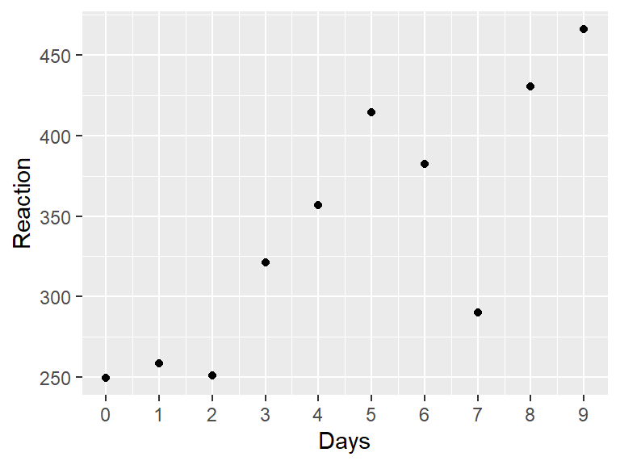

# 介绍线性混合效应模型


## 多层数据建模

::: bluebox
本章中的一些观点来自 @McElreath_2020 的[《Statistical Rethinking》](https://xcelab.net/rm/statistical-rethinking/)，还广泛借鉴了Tristan Mahr关于部分混合(partial pooling)的出色[博客]( https://www.tjmahr.com/plotting-partial-pooling-in-mixed-effects-models/)。
:::

在本章中，我们将使用一些来自研究睡眠剥夺对心理运动能力(psychomotor performance)影响的真实数据[@Belenky_et_al_2003]。该研究的数据包含在R的`lme4`包中的内置数据集`sleepstudy`中[@Bates_et_al_2015]。

让我们从查看`sleepstudy`数据集的文档开始。加载**`lme4`**包后，你可以在控制台中输入`?sleepstudy`来访问文档。

```
注：这是对数据集文档的中文翻译
sleepstudy                package:lme4                 R Documentation

睡眠剥夺研究中的反应时

描述：

     一项睡眠剥夺研究中，被试每天的平均反应时(以毫秒为单位)。
    
     第0-1天为适应和训练阶段(T1/T2)，第2天为基线(B)；睡眠剥夺从第2天开始。
    
格式：

     一个包含180个观测结果的数据框，其中包含以下3个变量：
    
     Reaction：平均反应时(毫秒)
    
     Days：睡眠剥夺的天数
    
     Subject：进行观测的被试编号

详细信息：

     这些数据来自Belenky et al.(2003)描述的研究，针对的是最严重的睡
     眠剥夺组(每天仅睡3小时)和研究的前10天，直到恢复期。原始研究分析
     了速度(1/反应时)，并将天数作为分类而非连续预测变量进行处理。

参考文献：

     Gregory Belenky, Nancy J. Wesensten, David R. Thorne, Maria L.
     Thomas, Helen C. Sing, Daniel P. Redmond, Michael B. Russo and
     Thomas J. Balkin (2003) Patterns of performance degradation and
     restoration during sleep restriction and subsequent recovery: a
     sleep dose-response study. _Journal of Sleep Research_ *12*, 1-12.
```

这些数据符合我们对多层数据的定义，因为在十天内对同一被试的同一因变量(平均反应时)进行了重复测量。这种类型的多层数据在心理学中非常常见。不幸的是，大多数心理学课程常用的统计教材对多层数据的讨论是不充分的，通常只涉及配对样本t检验和重复测量ANOVA。`sleepstudy`数据集很有趣，因为它是多层的，但有一个连续的预测变量，因此不适合t检验或ANOVA，因为这两种方法都是针对分类预测变量的。有方法可以让数据适应其中一个框架，但会丢失信息或可能违反假设。

遗憾的是，心理学专业的学生并没有真正学会如何分析多层数据。想想你最近读过的心理学或神经科学的研究。有多少研究是对每个被试只测量一次因变量？很少，如果有的话。几乎所有研究都进行了多次测量，因为以下一种或多种原因：(1)研究者在被试内设计中跨因子多水平测量同一被试；(2)他们有兴趣评估随时间的变化；或(3)他们在测量对多种刺激的反应。多层数据如此常见，以至于多层分析应该作为心理学中的**默认**方法来教授。学习多层分析可能具有挑战性，但你已经通过学习相关和回归掌握了大部分所需的知识。你会发现它只是简单回归的扩展。

让我们更详细地看看`sleepstudy`数据。该数据集包含来自三小时睡眠情况下的十八位被试。在为期十天的时间里，被试每天进行十分钟的“心理运动警觉性测试(psychomotor vigilance test)”，在每次出现刺激时尽快按下按钮。数据集中的因变量是被试在当天任务中的平均反应时(RT)。

开始分析的一个好方法是绘制数据图。下面是一个被试的数据。


```r
library(lme4)
library(tidyverse)

just_308 <- sleepstudy %>%
  filter(Subject == "308")

ggplot(just_308, aes(x = Days, y = Reaction)) +
  geom_point() +
  scale_x_continuous(breaks = 0:9)
```

<div class="figure">

<p class="caption">(\#fig:one-subject)*Belenky et al.(2003)中单个被试的数据*</p>
</div>

::: purplebox
**练习**

使用`ggplot`重现下面的图，这包含了所有18个被试。

<div class="figure">

<p class="caption">(\#fig:plot-solution0)*Belenky et al.(2003)中的数据*</p>
</div>

从第2天开始到第10天，RT似乎随着睡眠剥夺天数的增加而增加。


<div class='webex-solution'><button>请提示</button>


上面给出了绘制单个被试数据的代码。通过去掉`filter()`语句并添加以`facet_`开头的*`ggplot2`*函数，将此代码改为显示所有被试的数据。


</div>


<div class='webex-solution'><button>展示答案</button>


和上面一样，只是你要增加一行：`facet_wrap(~Subject)`


```r
ggplot(sleepstudy, aes(x = Days, y = Reaction)) +
  geom_point() +
  scale_x_continuous(breaks = 0:9) +
  facet_wrap(~Subject)
```


</div>

:::

## 如何对这些数据进行建模

要合理地对数据进行建模，我们首先需要了解更多关于设计的信息 @Belenky_et_al_2003 在他们的研究中是这样描述的(p. 2)：

> 前3天(T1、T2和B)是适应和训练(T1和T2)以及基线(B)，被试要求从23:00到07:00上床睡觉[在床时间(time in bed，TIB)为8小时]。在第3天(B)，进行了基线测量。从第4天开始，连续7天(E1-E7)，被试处于4种睡眠条件之一[TIB为9小时(22:00–07:00)，TIB为7小时(24:00–07:00)，TIB为5小时(02:00–07:00)或TIB为3小时(04:00–07:00)]，实际上是一种睡眠延长条件和三种睡眠限制条件。

从第3天之后的第1晚开始，有7晚的睡眠限制。前2天，编码为`0`、`1`，是适应(adaptation)和训练(training)。编码为`2`的那天是进行基线测量的时间，应该是我们分析开始的地方。如果我们将`0`和`1`两天包含在我们的分析中，可能会偏倚(bias)我们的结果，因为前两天的任何表现变化都与训练有关，而不是与睡眠限制有关。

::: purplebox
***练习***

从数据集中删除`Days`编码为`0`或`1`的观察值，然后根据`Days`变量创建一个新的变量`days_deprived`，使序列从第2天开始，第2天重新编码为第0天，第3天为第1天，第4天为第2天，依此类推。这个新变量现在追踪睡眠剥夺的天数。将新表存储为`sleep2`。


<div class='webex-solution'><button>展开答案</button>


```r
sleep2 <- sleepstudy %>%
  filter(Days >= 2L) %>%
  mutate(days_deprived = Days - 2L)
```

仔细检查代码是否按预期工作总是一个好主意。首先，看看它：


```r
head(sleep2)
```

```
##   Reaction Days Subject days_deprived
## 1 250.8006    2     308             0
## 2 321.4398    3     308             1
## 3 356.8519    4     308             2
## 4 414.6901    5     308             3
## 5 382.2038    6     308             4
## 6 290.1486    7     308             5
```

检查`Days`和`days_deprivation`是否匹配。


```r
sleep2 %>%
  count(days_deprived, Days)
```

```
##   days_deprived Days  n
## 1             0    2 18
## 2             1    3 18
## 3             2    4 18
## 4             3    5 18
## 5             4    6 18
## 6             5    7 18
## 7             6    8 18
## 8             7    9 18
```

看起来很好. 请注意，由`count()`生成的变量`n`会告诉你`Days`和`days_deprivation`的每个唯一组合有多少行。在这种情况下有18行，每个被试1行。


</div>

:::

现在让我们重新绘制数据，只查看从第0天到第7天的这8个数据点。我们已经从上面的代码中复制了代码，将`sleepstudy`替换为`sleep2`，并使用`days_deprived`作为我们的`x`变量。


```r
ggplot(sleep2, aes(x = days_deprived, y = Reaction)) +
  geom_point() +
  scale_x_continuous(breaks = 0:7) +
  facet_wrap(~Subject) +
  labs(y = "反应时", x = "睡眠剥夺的天数(0 = 基线)")
```

<div class="figure">

<p class="caption">(\#fig:plot-solution2)*数据来自Belenky et al.(2003)，显示了基线(0天)和每天睡眠剥夺后的反应时*</p>
</div>

请稍作思考，我们如何对`days_deprived`和`Reaction`之间的关系建模。随着睡眠剥夺的增加，反应时间是增加还是减少？这种关系大致稳定还是随时间变化？

除了一个例外(335号被试)，看起来反应时随着睡眠剥夺的增加而增加。看起来我们可以对每位被试的数据拟合一条直线。回想一下，一条直线的一般方程形式为**y = y轴截距 + 斜率 $\times$ x**。在回归分析中，我们通常用以下公式表示线性关系：

$$Y = \beta_0 + \beta_1 X$$

其中$\beta_0$是y轴截距，$\beta_1$是斜率，这些参数都是我们从数据中估计而来的。

这些线的截距(剥夺睡眠开始前第0天的平均RT)和斜率(每增加一天的睡眠剥夺后RT的变化)都不同。但我们应该为每个被试拟合同一条线吗？还是每个被试拟合完全不同的线？或者介于两者之间的某种情况？

让我们首先考虑可能用到的三种不同方法。根据McElreath的说法，我们将这些方法称为**完全混合(complete pooling)**、**不混合(no pooling)**和**部分混合(partial pooling)**。

### 完全混合：一刀切

**完全混合**是一种“一刀切”模型：它为整个数据集估计单一的截距和斜率，忽略了不同被试在截距或斜率上可能存在的差异。如果这听起来像是一种糟糕的方法，那确实是对的；但你知道这一点是因为你已经可视化了数据，并注意到每个参与者的模式似乎需要不同的y轴截距和斜率值。

拟合出一条线称为“完全混合”方法，因为我们将所有被试的数据混合在一起，得到总体截距和斜率的单一估计。该方法的广义线性模型(GLM)简单地表示为：

$$Y_{sd} = \beta_0 + \beta_1 X_{sd} + e_{sd}$$

$$e_{sd} \sim N\left(0, \sigma^2\right)$$

其中$Y_{sd}$是被试$s$在第$d$天的平均反应时，$X_{sd}$是与该情况相关的`days_deprived`值(0-7)，$e_{sd}$是误差。

我们可以在R中用`lm()`函数拟合一个这样的模型，如下：


```r
cp_model <- lm(Reaction ~ days_deprived, sleep2)

summary(cp_model)
```

```
## 
## Call:
## lm(formula = Reaction ~ days_deprived, data = sleep2)
## 
## Residuals:
##      Min       1Q   Median       3Q      Max 
## -112.284  -26.732    2.143   27.734  140.453 
## 
## Coefficients:
##               Estimate Std. Error t value Pr(>|t|)    
## (Intercept)    267.967      7.737  34.633  < 2e-16 ***
## days_deprived   11.435      1.850   6.183 6.32e-09 ***
## ---
## Signif. codes:  0 '***' 0.001 '**' 0.01 '*' 0.05 '.' 0.1 ' ' 1
## 
## Residual standard error: 50.85 on 142 degrees of freedom
## Multiple R-squared:  0.2121,	Adjusted R-squared:  0.2066 
## F-statistic: 38.23 on 1 and 142 DF,  p-value: 6.316e-09
```

根据这个模型，第0天的预测平均反应时约为268毫秒，随着剥夺天数的增加，每天的反应时平均增加约11毫秒。然而，我们不能相信回归系数的标准误，因为我们假设所有的观测值都是独立的(严格来说是残差独立)。但我们可以很确定这是一个糟糕的假设。

让我们把模型预测值添加到我们之前创建的图中。我们可以使用`geom_abline()`来做到这一点，指定截距和斜率为模型拟合的回归系数`coef(cp_model)`，该函数返回一个包含截距和斜率两个元素的向量。


```r
coef(cp_model)
```

```
##   (Intercept) days_deprived 
##     267.96742      11.43543
```


```r
ggplot(sleep2, aes(x = days_deprived, y = Reaction)) +
  geom_abline(intercept = coef(cp_model)[1],
              slope = coef(cp_model)[2],
              color = 'blue') +
  geom_point() +
  scale_x_continuous(breaks = 0:7) +
  facet_wrap(~Subject) +
  labs(y = "反应时", x = "睡眠剥夺的天数(0 = 基线)")
```

<div class="figure">

<p class="caption">(\#fig:cp-model-plot)数据根据完全混合模型的预测结果绘制</p>
</div>

这个模型与数据不太吻合。我们需要一种不同的方法。

### 不混合

将所有信息混合成一个截距和一个斜率来估计是不合适的。另一种方法是为每个被试拟合单独的线。这意味着每个被试的估计值将完全不受其他被试估计值的影响。换句话说，我们可以分别估计18组单独的截距/斜率对。

这个模型可以通过两种方式实现：(1)为每个被试运行单独的回归或(2)运行混合效应回归。我们将采用后者，这样所有内容都在一个大模型中。我们已经知道了如何做到这一点：我们为`Subject`因子添加虚拟编码。这个因子有18个水平，所以我们需要17个虚拟编码。幸运的是，R为我们省去了手动创建这17个变量的麻烦。我们只需要在模型中纳入`Subject`作为预测变量，并将这个分类预测变量与`days_deprived`进行交互，以允许截距和斜率变化。

::: yellowbox
`sleep2`数据集中的变量`Subject`是名义变量。我们只是用数字作为标签来保证匿名性，并不意味着被试310比被试309好1点，或者比被试308好2点。确保将其定义为因子变量，而不是作为连续变量包含在内！

我们可以通过多种方式测试某个变量是否为因子变量。其中一种方法是对表格使用`summary()`函数。


```r
sleep2 %>% summary()
```

```
##     Reaction          Days         Subject   days_deprived 
##  Min.   :203.0   Min.   :2.00   308    : 8   Min.   :0.00  
##  1st Qu.:265.2   1st Qu.:3.75   309    : 8   1st Qu.:1.75  
##  Median :303.2   Median :5.50   310    : 8   Median :3.50  
##  Mean   :308.0   Mean   :5.50   330    : 8   Mean   :3.50  
##  3rd Qu.:347.7   3rd Qu.:7.25   331    : 8   3rd Qu.:5.25  
##  Max.   :466.4   Max.   :9.00   332    : 8   Max.   :7.00  
##                                 (Other):96
```

这里你可以看到它并没有被当做一个数字变量，因为它没给出分布信息(均值等)，而是告诉你在每个水平上有多少个观测值。

你也可以直接测试它：


```r
sleep2 %>% pull(Subject) %>% is.factor()
```

```
## [1] TRUE
```

如果某些变量不是因子变量，你可以使用`factor()`函数重新定义它，使其变为因子变量。
:::


```r
np_model <- lm(Reaction ~ days_deprived + Subject + days_deprived:Subject,
               data = sleep2)

summary(np_model)
```

```
## 
## Call:
## lm(formula = Reaction ~ days_deprived + Subject + days_deprived:Subject, 
##     data = sleep2)
## 
## Residuals:
##      Min       1Q   Median       3Q      Max 
## -106.521   -8.541    1.143    8.889  128.545 
## 
## Coefficients:
##                          Estimate Std. Error t value Pr(>|t|)    
## (Intercept)              288.2175    16.4772  17.492  < 2e-16 ***
## days_deprived             21.6905     3.9388   5.507 2.49e-07 ***
## Subject309               -87.9262    23.3023  -3.773 0.000264 ***
## Subject310               -62.2856    23.3023  -2.673 0.008685 ** 
## Subject330               -14.9533    23.3023  -0.642 0.522422    
## Subject331                 9.9658    23.3023   0.428 0.669740    
## Subject332                27.8157    23.3023   1.194 0.235215    
## Subject333                -2.7581    23.3023  -0.118 0.906000    
## Subject334               -50.2051    23.3023  -2.155 0.033422 *  
## Subject335               -25.3429    23.3023  -1.088 0.279207    
## Subject337                24.6143    23.3023   1.056 0.293187    
## Subject349               -59.2183    23.3023  -2.541 0.012464 *  
## Subject350               -40.2023    23.3023  -1.725 0.087343 .  
## Subject351               -24.2467    23.3023  -1.041 0.300419    
## Subject352                43.0655    23.3023   1.848 0.067321 .  
## Subject369               -21.5040    23.3023  -0.923 0.358154    
## Subject370               -53.3072    23.3023  -2.288 0.024107 *  
## Subject371               -30.4896    23.3023  -1.308 0.193504    
## Subject372                 2.4772    23.3023   0.106 0.915535    
## days_deprived:Subject309 -17.3334     5.5703  -3.112 0.002380 ** 
## days_deprived:Subject310 -17.7915     5.5703  -3.194 0.001839 ** 
## days_deprived:Subject330 -13.6849     5.5703  -2.457 0.015613 *  
## days_deprived:Subject331 -16.8231     5.5703  -3.020 0.003154 ** 
## days_deprived:Subject332 -19.2947     5.5703  -3.464 0.000765 ***
## days_deprived:Subject333 -10.8151     5.5703  -1.942 0.054796 .  
## days_deprived:Subject334  -3.5745     5.5703  -0.642 0.522423    
## days_deprived:Subject335 -25.8995     5.5703  -4.650 9.47e-06 ***
## days_deprived:Subject337   0.7518     5.5703   0.135 0.892895    
## days_deprived:Subject349  -5.2644     5.5703  -0.945 0.346731    
## days_deprived:Subject350   1.6007     5.5703   0.287 0.774382    
## days_deprived:Subject351 -13.1681     5.5703  -2.364 0.019867 *  
## days_deprived:Subject352 -14.4019     5.5703  -2.585 0.011057 *  
## days_deprived:Subject369  -7.8948     5.5703  -1.417 0.159273    
## days_deprived:Subject370  -1.0495     5.5703  -0.188 0.850912    
## days_deprived:Subject371  -9.3443     5.5703  -1.678 0.096334 .  
## days_deprived:Subject372 -10.6041     5.5703  -1.904 0.059613 .  
## ---
## Signif. codes:  0 '***' 0.001 '**' 0.01 '*' 0.05 '.' 0.1 ' ' 1
## 
## Residual standard error: 25.53 on 108 degrees of freedom
## Multiple R-squared:  0.849,	Adjusted R-squared:  0.8001 
## F-statistic: 17.35 on 35 and 108 DF,  p-value: < 2.2e-16
```

这个模型将一个被试(具体来说是被试308)作为基线，并通过偏移量来表示每个被试相对于该基线的差异。在我们之前讨论[连续变量-分类变量交互效应]时你已经看过这种方法了。

::: purplebox
回答这些问题(结果保留三位小数)

* 被试308的截距是多少？<input class='webex-solveme nospaces' data-tol='0.001' size='8' data-answer='["288.217466666666"]'/>
* 被试308的斜率是多少？<input class='webex-solveme nospaces' data-tol='0.001' size='8' data-answer='["21.6904952380953"]'/>
* 被试335的截距是多少？<input class='webex-solveme nospaces' data-tol='0.001' size='8' data-answer='["262.874583333333"]'/>
* 被试335的斜率是多少？<input class='webex-solveme nospaces' data-tol='0.001' size='8' data-answer='["-4.20899166666667"]'/>


<div class='webex-solution'><button>答案和解析</button>


基线被试是308——R中默认按字母顺序排列因子的水平，并选择第一个作为基线。这意味着对于被试308，截距由`(Intercept)`给出，而斜率由`days_deprived`给出，因为其他17个虚拟变量对被试308而言都是0。

所有其他被试的回归系数都表示为相对于此基线被试的*偏移量*。如果我们想计算特定受试者的截距和斜率，只需加上相应的偏移量即可。因此，答案如下：

* 被试308的截距: <u>288.217</u>
* 被试308的斜率: 21.69

* 被试355的截距: `(Intercept)` + `Subject335` = 288.217 + -25.343 = <u>262.874</u>
* 被试355的斜率: `days_deprived` + `days_deprived:Subject335` = 21.69 + -25.899 = <u>-4.209</u>


</div>

:::
在“不混合”模型中，没有*整个*总体截距和斜率的估计；在这种情况下，`(Intercept)`和`days_deprived`是被试308的截距和斜率的估计，因为被试308被(随意地)选择为基线被试。为了得到总体的估计值，我们可以引入第二阶段分析，计算各个被试的截距和斜率的平均值。让我们使用模型估计值来计算每个被试的截距和斜率。


```r
all_intercepts <- c(coef(np_model)["(Intercept)"],
                    coef(np_model)[3:19] + coef(np_model)["(Intercept)"])

all_slopes  <- c(coef(np_model)["days_deprived"],
                 coef(np_model)[20:36] + coef(np_model)["days_deprived"])

ids <- sleep2 %>% pull(Subject) %>% levels() %>% factor()

# 用上面提取的数据创建一个tibble
np_coef <- tibble(Subject = ids,
                  intercept = all_intercepts,
                  slope = all_slopes)

np_coef
```

```
## # A tibble: 18 × 3
##    Subject intercept slope
##    <fct>       <dbl> <dbl>
##  1 308          288. 21.7 
##  2 309          200.  4.36
##  3 310          226.  3.90
##  4 330          273.  8.01
##  5 331          298.  4.87
##  6 332          316.  2.40
##  7 333          285. 10.9 
##  8 334          238. 18.1 
##  9 335          263. -4.21
## 10 337          313. 22.4 
## 11 349          229. 16.4 
## 12 350          248. 23.3 
## 13 351          264.  8.52
## 14 352          331.  7.29
## 15 369          267. 13.8 
## 16 370          235. 20.6 
## 17 371          258. 12.3 
## 18 372          291. 11.1
```

让我们看看这个模型拟合数据的效果有多好。


```r
ggplot(sleep2, aes(x = days_deprived, y = Reaction)) +
  geom_abline(data = np_coef,
              mapping = aes(intercept = intercept,
                            slope = slope),
              color = 'blue') +
  geom_point() +
  scale_x_continuous(breaks = 0:7) +
  facet_wrap(~Subject) +
  labs(y = "反应时", x = "睡眠剥夺的天数(0 = 基线)")
```

<div class="figure">

<p class="caption">(\#fig:np-model-fits)数据根据不混合方法的拟合结果绘制</p>
</div>

这比完全混合模型要好得多。如果要检验固定斜率为0的原假设，可以用单样本检验。


```r
np_coef %>% pull(slope) %>% t.test()
```

```
## 
## 	One Sample t-test
## 
## data:  .
## t = 6.1971, df = 17, p-value = 9.749e-06
## alternative hypothesis: true mean is not equal to 0
## 95 percent confidence interval:
##   7.542244 15.328613
## sample estimates:
## mean of x 
##  11.43543
```

这告诉我们平均斜率
11.435
显著不等于0,
t(17) = 6.197, $p < .001$.

## 使用混合效果模型的部分混合

完全混合或不混合方法都不是令人满意的。如果我们能够利用对其他被试的了解来改进对单个被试的估计，那将是可取的。这将有助于更好地区分每个被试的信号(signal)和误差(error)，并提高对总体的可推广性。正如最下面的网页APP所示，当我们有不平衡或缺失的数据时，这变得尤为重要。

在不混合模型中，我们将`Subject`视为一个**固定因子(fixed factor)**。每对截距和斜率的估计仅由该被试的数据决定。然而，我们对这18个被试本身并不感兴趣；我们更感兴趣的是他们作为具有潜在被试的更大群体的代表。如果你的目标是推广到你感兴趣的群体中的新被试，那么这种被试作为固定效应因子的方法是不够优化的。

部分混合发生在你将一个因子视为随机因子而不是固定因子进行分析时。**随机因子(random factor)**是指其水平被认为代表所有潜在水平的一个真子集(proper subset)。通常情况下，当你数据中的水平是抽样结果，并且你希望推广到超出这些水平的范围时，你会将一个因子视为随机。在这种情况下，我们有18个独特被试(因此有18个`Subject`因子的水平)，希望能够对潜在被试群体的睡眠剥夺效应做出一些一般性的陈述。

<!-- Just as there are two types of factors---fixed and random---there are -->

一种在分析中包含随机因子的方法是使用线性混合效应模型(linear mixed-effects model)。当你这样做时，每个因子水平(即每个被试)的估计值将受其他水平(即其他被试)信息的影响。与不考虑其他被试估计的情况下为每个被试估计截距和斜率相比，该模型会估计总体的值，并将各个被试的估计值向这些值拉近，这种统计现象称为`shrinkage`。

下面是多层模型。理解其中的数学原理及其意义非常重要。乍一看似乎很复杂，但实际上这里没有什么是你以前没有见过的。我们将逐步解释一切。

*第1层:*

\begin{equation}
Y_{sd} = \beta_{0s} + \beta_{1s} X_{sd} + e_{sd}
\end{equation}

*第2层:*

\begin{equation}
\beta_{0s} = \gamma_{0} + S_{0s}
\end{equation}

\begin{equation}
\beta_{1s} = \gamma_{1} + S_{1s}
\end{equation}

*方差成分(variance components):*

\begin{equation}
 \langle S_{0s}, S_{1s} \rangle \sim N\left(\langle 0, 0 \rangle, \mathbf{\Sigma}\right) 
\end{equation}

\begin{equation}
\mathbf{\Sigma} = \left(\begin{array}{cc}{\tau_{00}}^2 & \rho\tau_{00}\tau_{11} \\
         \rho\tau_{00}\tau_{11} & {\tau_{11}}^2 \\
         \end{array}\right) 
\end{equation}

\begin{equation}
e_{sd} \sim N\left(0, \sigma^2\right)
\end{equation}

如果你感到迷惑，这里有一个表格，解释了上述方程组中的所有变量。

| 变量                   | 类型     | 描述                                                                  |
|:-----------------------|:---------|:----------------------------------------------------------------------|
| $Y_{sd}$               | 观测值   | 被试$s$在第$d$天的`Reaction`值                                        |
| $X_{sd}$               | 观测值   | 被试$s$在第$d$天的`days_deprived`值(0-7)                              |
| $\beta_{0s}$           | 派生值   | 第1层截距参数                                                         |
| $\beta_{1s}$           | 派生值   | 第1层斜率参数                                                         |
| $e_{sd}$               | 派生值   | 被试$s$在第$d$天的误差                                                |
| $\gamma_0$             | 固定     | 总体截距("gamma")                                                     |
| $\gamma_1$             | 固定     | 总体斜率("gamma")                                                     |
| $S_{0s}$               | 派生值   | 被试$s$的随机截距(偏移量)                                             |
| $S_{1s}$               | 派生值   | 被试$s$的随机斜率(偏移量)                                             |
| $\mathbf{\Sigma}$      | 随机     | 方差协方差矩阵                                                        |
| ${\tau_{00}}^2$        | 随机     | 随机截距的方差                                                        |
| $\rho$                 | 随机     | 截距和斜率之间的随机相关性                                            |
| ${\tau_{11}}^2$        | 随机     | 随机斜率的方差                                                        |
| $\sigma^2$             | 随机     | 误差方差                                                              |

注意，表格的“类型”列包含的内容有*固定*、*随机*和*派生值*。尽管*固定*和*随机*是标准术语，但*派生值*不是；我引入这个术语是为了帮助你理解这些不同变量在模型中的意义，并帮助你区分直接估计的变量和非直接估计的变量。

让我们从模型的第1层方程开始，它表示预测变量和响应变量之间的总体关系。它捕捉了反应时\(Y_{sd}\)和睡眠剥夺\(X_{sd}\)之间主要关系的函数形式：一条截距为\(\beta_{0s}\)和斜率为\(\beta_{1s}\)的直线。现在\(\beta_{0s}\)和\(\beta_{1s}\)使它看起来像完全混合模型，在这种模型中，我们为整个数据集估计一个截距和一个斜率；然而，我们实际上并没有直接估计这些值。相反，我们将\(\beta_{0s}\)和\(\beta_{1s}\)视为派生值：它们完全由模型第2层的变量定义。

模型的第2层由两个方程定义，表示被试层次的关系。在这里，我们通过固定效应\(\gamma_0\)和*随机截距*\(S_{0s}\)来定义截距$\beta_{0s}$；同样地，我们通过固定斜率\(\gamma_1\)和*随机斜率*\(S_{1s}\)来定义斜率$\beta_{1s}$。

最后的方程代表模型的*方差成分*。我们将在下面更详细地讨论这一点。

让我们将第2层方程代入第1层方程，看看以多层方式表示事物的优势。
