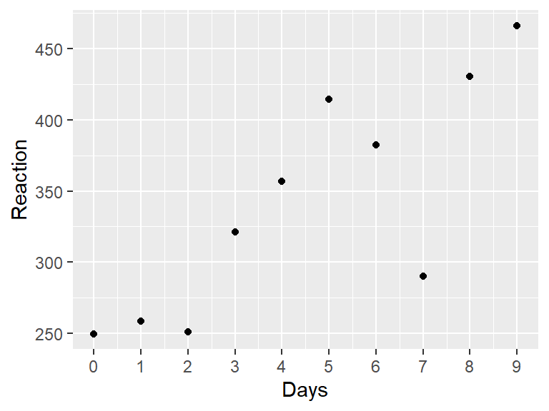

# 介绍线性混合模型


## 多层数据建模

::: bluebox
本章中的一些观点来自 @McElreath_2020 的[《Statistical Rethinking》](https://xcelab.net/rm/statistical-rethinking/)，还广泛借鉴了Tristan Mahr关于部分混合(partial pooling)的出色[博客]( https://www.tjmahr.com/plotting-partial-pooling-in-mixed-effects-models/)。
:::

在本章中，我们将使用一些来自研究睡眠剥夺对心理运动能力(psychomotor performance)影响的真实数据[@Belenky_et_al_2003]。该研究的数据包含在R的`lme4`包中的内置数据集`sleepstudy`中[@Bates_et_al_2015]。

让我们从查看`sleepstudy`数据集的文档开始。加载**`lme4`**包后，你可以在控制台中输入`?sleepstudy`来访问文档。

```
注：这是对数据集文档的中文翻译
sleepstudy                package:lme4                 R Documentation

睡眠剥夺研究中的反应时

描述：

     一项睡眠剥夺研究中，被试每天的平均反应时(以毫秒为单位)。
    
     第0-1天为适应和训练阶段(T1/T2)，第2天为基线(B)；睡眠剥夺从第2天开始。
    
格式：

     一个包含180个观测结果的数据框，其中包含以下3个变量：
    
     Reaction：平均反应时(毫秒)
    
     Days：睡眠剥夺的天数
    
     Subject：进行观测的被试编号

详细信息：

     这些数据来自Belenky et al.(2003)描述的研究，针对的是最严重的睡
     眠剥夺组(每天仅睡3小时)和研究的前10天，直到恢复期。原始研究分析
     了速度(1/反应时)，并将天数作为分类而非连续预测变量进行处理。

参考文献：

     Gregory Belenky, Nancy J. Wesensten, David R. Thorne, Maria L.
     Thomas, Helen C. Sing, Daniel P. Redmond, Michael B. Russo and
     Thomas J. Balkin (2003) Patterns of performance degradation and
     restoration during sleep restriction and subsequent recovery: a
     sleep dose-response study. _Journal of Sleep Research_ *12*, 1-12.
```

这些数据符合我们对多层数据的定义，因为在十天内对同一被试的同一因变量(平均反应时)进行了重复测量。这种类型的多层数据在心理学中非常常见。不幸的是，大多数心理学课程常用的统计教材对多层数据的讨论是不充分的，通常只涉及配对样本t检验和重复测量ANOVA。`sleepstudy`数据集很有趣，因为它是多层的，但有一个连续的预测变量，因此不适合t检验或ANOVA，因为这两种方法都是针对分类预测变量的。有方法可以让数据适应其中一个框架，但会丢失信息或可能违反假设。

遗憾的是，心理学专业的学生并没有真正学会如何分析多层数据。想想你最近读过的心理学或神经科学的研究。有多少研究是对每个被试只测量一次因变量？很少，如果有的话。几乎所有研究都进行了多次测量，因为以下一种或多种原因：(1)研究者在被试内设计中跨因子多水平测量同一被试；(2)他们有兴趣评估随时间的变化；或(3)他们在测量对多种刺激的反应。多层数据如此常见，以至于多层分析应该作为心理学中的**默认**方法来教授。学习多层分析可能具有挑战性，但你已经通过学习相关和回归掌握了大部分所需的知识。你会发现它只是简单回归的扩展。

让我们更详细地看看`sleepstudy`数据。该数据集包含来自三小时睡眠情况下的十八位被试。在为期十天的时间里，被试每天进行十分钟的“心理运动警觉性测试(psychomotor vigilance test)”，在每次出现刺激时尽快按下按钮。数据集中的因变量是被试在当天任务中的平均反应时(RT)。

开始分析的一个好方法是绘制数据图。下面是一个被试的数据。


```r
library(lme4)
library(tidyverse)

just_308 <- sleepstudy %>%
  filter(Subject == "308")

ggplot(just_308, aes(x = Days, y = Reaction)) +
  geom_point() +
  scale_x_continuous(breaks = 0:9)
```

<div class="figure">

<p class="caption">(\#fig:one-subject)*Belenky et al.(2003)中单个被试的数据*</p>
</div>

::: purplebox
**练习**

使用`ggplot`重现下面的图，这包含了所有18个被试。

<div class="figure">

<p class="caption">(\#fig:plot-solution0)*Belenky et al.(2003)中的数据*</p>
</div>

从第2天开始到第10天，RT似乎随着睡眠剥夺天数的增加而增加。


<div class='webex-solution'><button>请提示</button>


上面给出了绘制单个被试数据的代码。通过去掉`filter()`语句并添加以`facet_`开头的*`ggplot2`*函数，将此代码改为显示所有被试的数据。


</div>


<div class='webex-solution'><button>展示答案</button>


和上面一样，只是你要增加一行：`facet_wrap(~Subject)`


```r
ggplot(sleepstudy, aes(x = Days, y = Reaction)) +
  geom_point() +
  scale_x_continuous(breaks = 0:9) +
  facet_wrap(~Subject)
```


</div>

:::

## 如何对这些数据进行建模

要合理地对数据进行建模，我们首先需要了解更多关于设计的信息 @Belenky_et_al_2003 在他们的研究中是这样描述的(p. 2)：

> 前3天(T1、T2和B)是适应和训练(T1和T2)以及基线(B)，被试要求从23:00到07:00上床睡觉[在床时间(time in bed，TIB)为8小时]。在第3天(B)，进行了基线测量。从第4天开始，连续7天(E1-E7)，被试处于4种睡眠条件之一[TIB为9小时(22:00–07:00)，TIB为7小时(24:00–07:00)，TIB为5小时(02:00–07:00)或TIB为3小时(04:00–07:00)]，实际上是一种睡眠延长条件和三种睡眠限制条件。

从第3天之后的第1晚开始，有7晚的睡眠限制。前2天，编码为`0`、`1`，是适应(adaptation)和训练(training)。编码为`2`的那天是进行基线测量的时间，应该是我们分析开始的地方。如果我们将`0`和`1`两天包含在我们的分析中，可能会偏倚(bias)我们的结果，因为前两天的任何表现变化都与训练有关，而不是与睡眠限制有关。

::: purplebox
***练习***

从数据集中删除`Days`编码为`0`或`1`的观察值，然后根据`Days`变量创建一个新的变量`days_deprived`，使序列从第2天开始，第2天重新编码为第0天，第3天为第1天，第4天为第2天，依此类推。这个新变量现在追踪睡眠剥夺的天数。将新表存储为`sleep2`。


<div class='webex-solution'><button>展开答案</button>


```r
sleep2 <- sleepstudy %>%
  filter(Days >= 2L) %>%
  mutate(days_deprived = Days - 2L)
```

仔细检查代码是否按预期工作总是一个好主意。首先，看看它：


```r
head(sleep2)
```

```
##   Reaction Days Subject days_deprived
## 1 250.8006    2     308             0
## 2 321.4398    3     308             1
## 3 356.8519    4     308             2
## 4 414.6901    5     308             3
## 5 382.2038    6     308             4
## 6 290.1486    7     308             5
```

检查`Days`和`days_deprivation`是否匹配。


```r
sleep2 %>%
  count(days_deprived, Days)
```

```
##   days_deprived Days  n
## 1             0    2 18
## 2             1    3 18
## 3             2    4 18
## 4             3    5 18
## 5             4    6 18
## 6             5    7 18
## 7             6    8 18
## 8             7    9 18
```

看起来很好. 请注意，由`count()`生成的变量`n`会告诉你`Days`和`days_deprivation`的每个唯一组合有多少行。在这种情况下有18行，每个被试1行。


</div>

:::

现在让我们重新绘制数据，只查看从第0天到第7天的这8个数据点。我们已经从上面的代码中复制了代码，将`sleepstudy`替换为`sleep2`，并使用`days_deprived`作为我们的`x`变量。


```r
ggplot(sleep2, aes(x = days_deprived, y = Reaction)) +
  geom_point() +
  scale_x_continuous(breaks = 0:7) +
  facet_wrap(~Subject) +
  labs(y = "反应时", x = "被剥夺睡眠的天数(0 = 基线)")
```

<div class="figure">

<p class="caption">(\#fig:plot-solution2)*数据来自Belenky et al.(2003)，显示了基线(0天)和每天睡眠剥夺后的反应时*</p>
</div>

请稍作思考，我们如何对`days_deprived`和`Reaction`之间的关系建模。随着睡眠剥夺的增加，反应时间是增加还是减少？这种关系大致稳定还是随时间变化？

除了一个例外(335号被试)，看起来反应时随着睡眠剥夺的增加而增加。看起来我们可以对每位被试的数据拟合一条直线。回想一下，一条直线的一般方程形式为**y = y轴截距 + 斜率 $\times$ x**。在回归分析中，我们通常用以下公式表示线性关系：

$$Y = \beta_0 + \beta_1 X$$

其中$\beta_0$是y轴截距，$\beta_1$是斜率，这些参数都是我们从数据中估计而来的。

这些线的截距(剥夺睡眠开始前第0天的平均RT)和斜率(每增加一天的睡眠剥夺后RT的变化)都不同。但我们应该为每个被试拟合同一条线吗？还是每个被试拟合完全不同的线？或者介于两者之间的某种情况？

让我们首先考虑可能用到的三种不同方法。根据McElreath的说法，我们将这些方法称为**完全混合(complete pooling)**、**无混合(no pooling)**和**部分混合(partial pooling)**。
