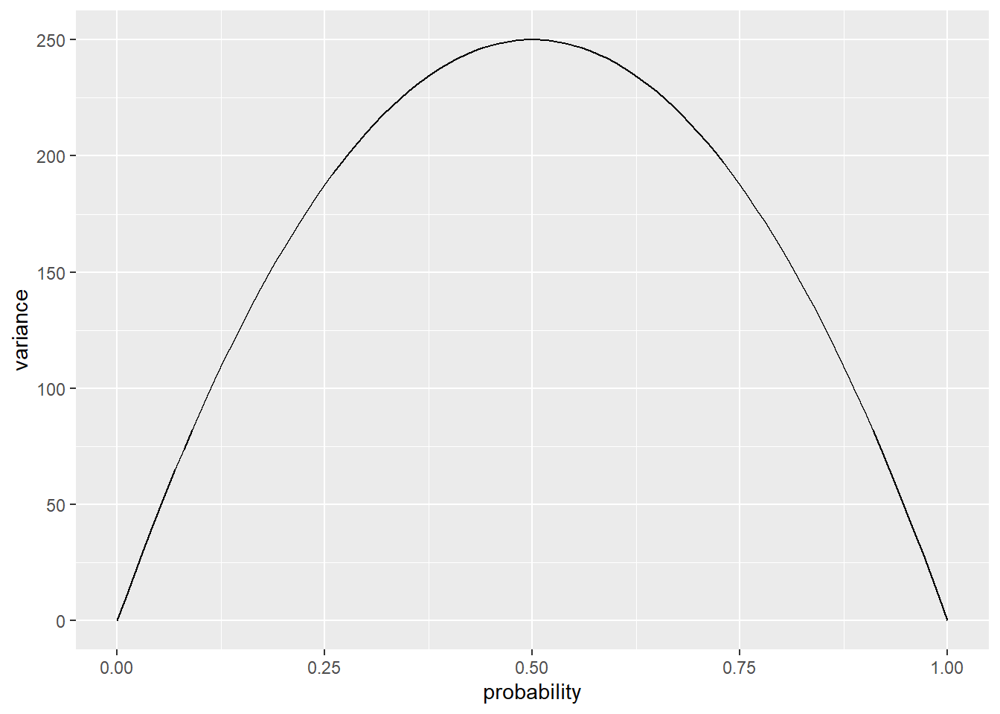

# 广义线性混合效应模型


## 离散(discrete)数据 vs. 连续(continuous)数据

到目前为止，我们考虑的所有模型都假设测量的响应变量(即因变量)是**连续的**且是数值型的。然而，在心理学中，很多情况下我们的测量结果是**离散的**。离散数据的一种类型是可能值的有限值集合，且可能值之间有间隔，例如使用李克特量表获得的数据。另一种类型的离散数据是响应变量反映没有内在顺序的类别(通常称为“名义(nominal)”数据)，例如餐馆顾客点的是鸡肉、牛肉还是豆腐。

离散数据在心理学中很常见。以下是一些离散数据的例子：

* 说话者产生的语言结构类型(双宾语结构或介词短语结构)；
* 被试在给定时间内观看的是哪一组图像；
* 被试是否做出了准确或不准确的选择；
* 求职者是否被录用；
* 李克特量表上的同意度。

另一种常见的数据类型是**计数**数据，其中数值也是离散的。通常在计数数据中，某件事发生的机会数量没有明确定义。一些例子：

* 自然语言语料库中的语误次数；
* 每年在某个路口发生的交通事故次数；
* 在给定月份中看医生的次数。

### 为什么不将离散数据建模为连续数据？

离散数据具有一些特性，这些特性通常使得尝试使用连续数据模型来分析它们变得不合适。例如，如果你对某些二元事件(被试在强制选择任务中的准确性)的概率感兴趣，每次测量将表示为0或1，分别表示不准确或准确的响应。你可以计算每个被试的准确响应比例并分析它(确实很多人这么做)，但这是一个糟糕的想法，原因有很多。

#### 有界尺度(dounded scale)

离散数据通常具有有界尺度。它可能是有下界的(如计数数据下界为0)，也可能同时有上界和下界(如李克特量表数据或二元数据)。如果你尝试使用为连续数据设计的方法来建模有界数据，那么模型可能最终将非零概率分配给尺度之外的不可能值。

使用连续数据模型分析有界数据可能会导致虚假的交互效应。例如，考虑某种实验干预对准确性的影响。如果被试在条件A中已经非常准确(如超过90%)，而在条件B中较低(如50%)，那么(干预)在A中的可能效果很可能小于在B中的可能效果，因为准确性不能超过100%。因此，很难确定交互效应是反映了理论上有意义的东西，还是单纯是尺度有界的产物。

#### 方差依赖于均值

在大多数连续数据设置中，通常假设方差与均值无关；这本质上是对含有连续预测变量的模型的方差齐性(homogeneity of variance)假设。对于离散数据，这种方差独立于均值的假设通常不成立。

我们可以通过数据模拟看到这一点。`rbinom()`函数可以模拟**二项分布**的数据，该分布描述了一组行为的离散观测值。让我们考虑一下巴塞罗那(Barcelona, Spain)和格拉斯哥(Glasgow, U.K)在某一天的降雨概率。根据[这个网站](https://www.currentresults.com/Weather/Europe/Cities/precipitation-annual-average.php)，巴塞罗那每年平均有55天下雨，而格拉斯哥有170天。因此，格拉斯哥某一天的降雨概率可以估计为170/365，大约是0.47，而巴塞罗那的概率是55/365，大约是0.15。让我们模拟500年的降雨数据(假设气候恒定)。


```r
rainy_days <- tibble(city = rep(c("Barcelona", "Glasgow"), each = 500),
       days_of_rain = c(rbinom(500, 365, 55/365),
                        rbinom(500, 365, 170/365))) 
```

如果我们看一下每个城市模拟数据的标准差，我们可以看到格拉斯哥的变异性更大。


```r
rainy_days %>%
  group_by(city) %>%
  summarise(variance = var(days_of_rain))
```

```
## # A tibble: 2 × 2
##   city      variance
##   <chr>        <dbl>
## 1 Barcelona     42.9
## 2 Glasgow       86.1
```

对于二项分布的数据，方差由$np(1-p)$给出，其中$n$是观测次数，$p$是“成功”的概率(上述例子中某一天降雨的概率)。下图显示了$n=1000$的情况；注意，当概率接近0和1时，方差变得很小，而在0.5处达到峰值。

<div class="figure">

<p class="caption">(\#fig:binomial-var-plot)方差与概率的关系图($n=1000$)</p>
</div>

## 广义线性模型

广义线性模型[不要与一般线性模型(General Linear Models)混淆]的基本思想是指定一个**链接函数(link function)**，将响应空间(response space)转换为建模空间(modeling space)，这样我们可以执行常规线性回归，并通过**方差函数(variance function)**捕捉方差对均值的依赖性。模型的参数将在建模空间的尺度上表示，但我们总是可以使用**逆链接函数(inverse link function)**将其转换回原始的响应空间。

有很多不同类型的广义线性模型可以拟合不同类型的数据。在心理学中最常用的是**逻辑回归(logistic regression)**和**泊松回归(Poisson regression)**，前者用于二分类数据(伯努利试验，Bernoulli trials)，后者用于试验次数未明确规定计数数据。我们将重点关注逻辑回归。

## 逻辑回归

### 术语


|Term                     |Definition                                     |
|:------------------------|:----------------------------------------------|
|**伯努利试验**           |具有二元结果的事件，其中一个结果被认为是“成功” |
|**概率(proportion)**     |伯努利试验的成功次数与总次数之比               |
|**发生比(odds)**         |成功对失败的比率                               |
|**对数发生比(log odds)** |发生比的(自然)对数                             |

注：odds也有人翻译为几率，考虑到几率表意并不直观，且易与概率(proportion)混淆，发生比又有些拗口，很多材料也不去翻译，所以本文之后直接使用odds和log odds。

在逻辑回归中，我们在log odds空间中建模响应变量与一组预测变量之间的关系。

逻辑回归用于个体结果是伯努利试验(具有二分类结果的事件)的情况。通常两种结果之一被称为“成功”，编码为1；另一种结果称为“失败”，编码为0。需要注意的是，“成功”和“失败”这两个术语是完全随意的，不应该认为更可取的类别总是编码为1。例如，当抛硬币时，我们可以同样选择“正面”为成功，“反面”为失败，反之亦然。

通常，伯努利试验序列的结果通过**概率**(成功次数与试验总次数的比率)来传达。例如，如果我们抛硬币100次，得到47次正面，那么我们的概率就是47/100或0.47，这也将是我们对事件可能性的估计。对于编码为1和0的事件，计算概率的便捷方法是使用`mean()`函数。

我们也可以谈论成功的odds，例如，正面与反面的odds是一比一，即1:1。格拉斯哥某天降雨的odds是170:195；分母是没有下雨的天数(365 - 170 = 195)。用小数表示，170/195约等于0.87，这被称为**natural odds**。natural odds的范围是0到$+\infty$。给定$N$次试验中成功$Y$次，我们可以将natural odds表示为$\frac{Y}{N - Y}$。或者，给定一个概率$p$，我们可以将odds表示为$\frac{p}{1-p}$。

odds的自然对数，或**logit**，是进行逻辑回归的尺度。回想一下，对某个值$Y$的对数给出在给定底数下使$Y$成立的指数。例如，16的$log_2$(以2为底的对数)是4，因为$2^4 = 16$。在逻辑回归中，通常使用的底数是$e$(也称为欧拉数，Euler's number)。例如，要从格拉斯哥降雨的odds中得到log odds，我们会使用`log(170/195)`，其结果为-0.1372011；要从log odds中恢复natural odds，我们会使用逆运算`exp(-.137)`，其结果约为0.872。

### log odds的性质

log odds = $\log \left(\frac{p}{1-p}\right)$

log odds具有一些适用于线性建模的优秀性质。

首先，它是围绕0对称，且log odds等于0对应最大的不确定性，即概率为0.5。正的log odds意味着成功比失败更可能(成功的概率 > 0.5)，负的log odds意味着失败比成功更可能(成功的概率 < 0.5)。log odds为2表示成功比失败可能性大的程度与-2表示失败比成功可能性大的程度相同。其尺度是无界的，范围从$-\infty$到$+\infty$。

### 链接函数和方差函数

逻辑回归的链接函数是：

$$\eta = \log \left(\frac{p}{1-p}\right)$$

而逆链接函数为:

$$p = \frac{1}{1 + e^{-\eta}}$$

其中$e$是欧拉数。在R中，In R, 你可以将逆链接函数写成：`1/(1 + exp(-eta))`。

方差函数为二项分布的方差，即：

$$np(1 - p)$$

下面的app允许你在log odds空间中操控一条线的截距和斜率，并查看该线在响应空间中的投影。请注意该函数在响应空间中是S形(“sigmoidal”)。

<div class="figure">
<iframe src="https://rstudio-connect.psy.gla.ac.uk/logit?showcase=0" width="672" height="800px" data-external="1"></iframe>
<p class="caption">(\#fig:logit-app)**逻辑回归网页app** <https://rstudio-connect.psy.gla.ac.uk/logit></p>
</div>

### 在R中估计逻辑回归模型

对于单层数据，可以使用`glm()`函数。请注意，这个函数与你已经熟悉的`lm()`函数非常相似。主要区别在于你需要为链接/方差函数指定一个`family`参数。对于逻辑回归，可以使用`family = binomial(link = "logit")`。二项分布的链接默认值是logit链接，因此只需输入`family = binomial`即可。

`glm(DV ~ IV1 + IV2 + ..., data, family = binomial)`

对于有随机效应的多层数据，可以使用`lme4`包中的`glmer`函数：

`glmer(DV ~ IV1 + IV2 + ... (1 | subject), data, family = binomial)`
