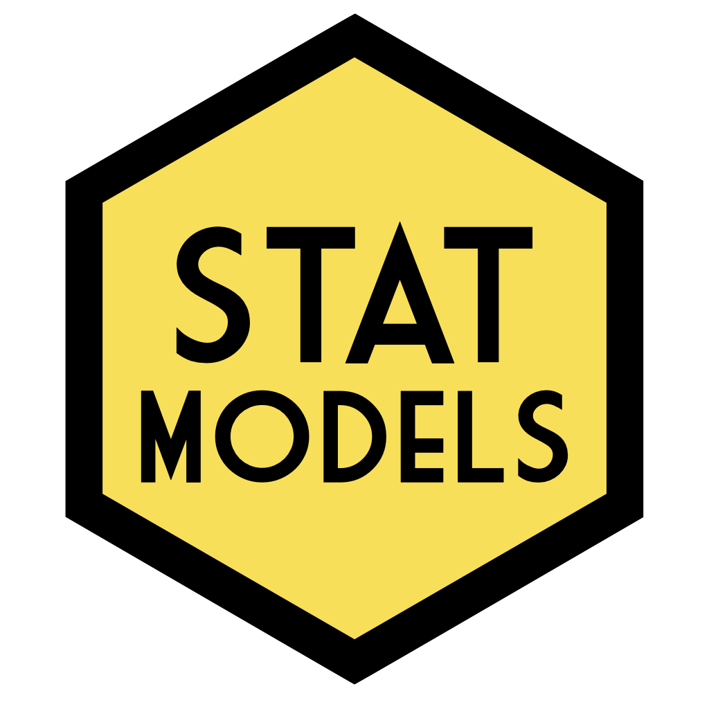

# 概述 {-}

本教材采用在R语言环境下模拟广义线性模型(General Linear Model, GLM)的方法来介绍统计分析。总体目标是教会学生如何将研究设计的描述转化为线性模型，来分析该研究的数据。重点是分析心理学实验数据所需的技能。

本教材包括以下内容：

* 线性模型工作流程;
* 方差-协方差矩阵;
* 多元回归;
* 交互效应(连续与分类; 分类与分类);
* 线性混合效应模型;
* 广义线性混合效应模型。

本课程的内容构成了[格拉斯哥大学心理学院](https://www.gla.ac.uk/schools/psychologyneuroscience/)(University of Glasgow School of Psychology)由[Dale Barr](https://www.gla.ac.uk/schools/psychologyneuroscience/staff/dalebarr/)讲授的大学三年级一学期课程的基础。这也是由格拉斯哥大学心理学院工作人员开发的[PsyTeachR](https://psyteachr.github.io/)系列课程材料的一部分。

与你可能遇到的其他教材不同，这是一本**互动教材**。每一章都包含嵌入式练习和网页应用来帮助学生更好地理解内容。你只有通过浏览器访问这些材料，这些互动内容才能正常工作。因此，不建议打印这些材料。如果你希望在没网的情况下访问教材或保存本地版本以防止网站变化或迁移，可以[下载离线使用版本](https://psyteachr.github.io/stat-models-v1/offline-textbook.zip)。只需要从ZIP压缩包中提取文件，在`docs`目录中找到`index.html`文件，然后使用浏览器打开这个文件即可。

## 译者按 {-}

对于线性混合效应模型的关注起源于本科毕业论文最初的研究设计，但因为各种原因，最终未采用混合线性模型进行研究。但在查阅资料的过程中对线性混合效应模型产生了一定兴趣，可之后没有进行深入探索。直到2024年初，阅读 @Fraley_et_al_2021 的研究时又遇到了线性混合效应模型，而且还必须理清研究方法(如果你的研究领域是依恋关系，可以考虑阅读该论文，挺漂亮一论文)。幸运的是论文给出了相关R代码，不幸的是代码“充满”错误(也许是我理解不够深入，少量错误在我眼里被放大了)。这使得我下定决心跟线性混合效应模型死磕到底。

对于线性混合效应模型，网上并没有找到系统、免费、不太老旧的中文资料(反正我没找到，如知道欢迎推荐)。查阅R的`lme4`包(这应该是用R做GLMM最常用的包)相关资料时，发现了R包作者提供的[GLMM FAQ](https://bbolker.github.io/mixedmodels-misc/glmmFAQ.html)中推荐了这篇教材，我就想着反正自己要看，干脆翻译一遍也当是为枯燥的生活添加一些小乐趣吧。

该教材相关信息在概述里面已经讲解，不再赘述。翻译的版本是公开的最新版本，应该是2023年进行微调后的版本(也可能就是2021版)，符合系统、免费、不太老旧三个要求，中文这个要求我尽量解决。本人非统计、英语相关专业，翻译习惯为：尽可能直译，实在无法翻译清楚的会根据自己的理解意译，对于自己想补充说明的地方会用“注”标识。这是本人第一次使用R书写材料，对`bookdown`十分不熟，只能尽可能还原原教材里的内容，如有条件建议阅读原教材。

希望这份译文对大家有所帮助，如发现错误或有修改建议，欢迎提交到[github](https://github.com/zhoubolin0404/Learning_Statistical_Models_Through_Simulation_in_R/issues)，或联系邮箱 zhoubolin0404@126.com。

## 如何引用本书 {-}

Barr, Dale J. (2021). *Learning statistical models through simulation in R: An interactive textbook*. Version 1.0.0. Retrieved from <https://psyteachr.github.io/stat-models-v1>.

## 发现问题？ {-}

如果你发现错误或书写错误，有问题或建议，请在<https://github.com/psyteachr/stat-models-v1/issues>提交问题。谢谢！

## 教育者需知 {-}

您可以根据自己的需求免费重复使用和修改本教材中的材料，但需要注明原作出处。请注意关于重复使用本材料的 [Creative Commons CC-BY-SA 4.0](https://creativecommons.org/licenses/by-sa/4.0/) 许可证的其他条款。

本书是使用R [**`bookdown`**](https://bookdown.org)包构建的。源文件可在[github](https://github.com/psyteachr/stat-models-v1)上获得。
